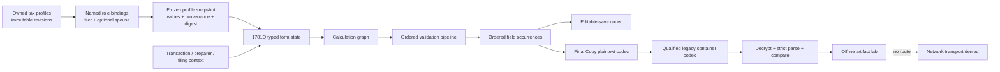

# Grounded form core, composable tax profiles, and offline artifact lab

Status: approved planning baseline for the Windows port and the first exact
form implementation.

This plan deliberately separates three things that the legacy desktop package
mixes together:

1. reusable taxpayer facts;
2. exact-revision form rules and byte serialization; and
3. encryption and transport.

The first implementation target is **BIR Form 1701Q, January 2018 ENCS, as
shipped in Offline eBIRForms 7.9.6**. No second form is to be promoted until
1701Q passes the gates in this document.

## 1. Current-state conclusion

The tax-profile merge at `6df69fc` is a sound foundation:

- profiles are reusable rather than owned by a form;
- form contracts request explicit subsets through named roles;
- revisions are append-only and effective-dated;
- drafts copy immutable profile snapshots with provenance; and
- 1701Q already supports one required filer and one optional, distinct spouse.

It is not yet a grounded filing core:

- current `FormRevision` identity is only form code plus revision label;
- 1701Q accepts externally calculated tax values instead of implementing the
  official calculation and validation sequence;
- no exact editable/final payload parser or serializer exists in `main`;
- no legacy container encryption/decryption exists in `main`;
- Priority 1 editors are layout/profile projections with disabled save and
  filing actions, despite being labelled complete in the roadmap; and
- only 2551Q and 1701Q have recurring draft persistence.

The exact Desktop audit is strong enough to be an oracle. The 7.9.6 snapshot
was independently verified at 938/938 files with no SHA-256 mismatch. The
1701Qv2018 HTA has complete script dependency closure.

## 2. Scope and non-goals

### In scope

- Windows ARM64 development setup for Native SDK 0.6.1 and Zig 0.16.0.
- A reusable exact-form engine, instantiated only for 1701Q in the first goal.
- Typed calculations and ordered validation grounded in exact Desktop source,
  official PDF/guide, and controlled synthetic oracle captures.
- Composable, effective-dated tax profiles and immutable draft snapshots.
- Exact ordered editable-save and Final Copy plaintext representations.
- A local artifact lab that can display, with explicit reveal:
  - ordered field occurrences;
  - canonical plaintext bytes and SHA-256;
  - encrypted bytes in Base64/hex and SHA-256 when qualified;
  - decrypted plaintext; and
  - byte and semantic round-trip differences.
- Decryption of controlled official test artifacts.
- Official-compatible outbound encryption only after the Windows build passes
  all 67 private known-answer vectors.
- Save, close, reopen, migration, null-platform, Windows GUI, and packaging
  tests.

### Explicitly out of scope

- Any live BIR/eFPS/SFTP/HTTP submission.
- Authentication, receipt handling, or reuse of legacy transport helpers.
- Treating a rendered form as file-ready.
- Copying legacy HTA/VBScript/FSL-covered implementation source into product
  code without provenance and license review.
- Committing raw or decrypted XML, taxpayer values, credentials, protocol
  secrets, endpoints, or value-bearing screenshots.
- Priority 3-5 or deferred forms.
- Starting 1601EQ, or any other form, before 1701Q is promoted.

The application must have no reachable transport transition during this work.
Existing queue lifecycle types may remain for future design, but the product
UI and the 1701Q artifact service must not instantiate them.

## 3. Ground-truth and evidence policy

Use this precedence for every rule:

1. byte-verified exact Offline eBIRForms package source and controlled runtime
   observation;
2. exact official BIR form PDF and guide;
3. paired synthetic editable/Final Copy captures from the official package;
4. the value-free research manifests and occurrence/rule catalogs;
5. explicit, reviewed inference.

Every rule, mapping, calculation, option domain, serializer branch, and test
fixture must record its evidence ID. Do not silently fill gaps from a visually
similar form.

### Exact identity

Retain `FormRevision` as the semantic identity, but add an immutable exact
package identity:

```text
ExactFormPackageKey {
  revision: FormRevision
  locale
  offline_package_version
  payload_schema_or_form_token
  primary_source_sha256
  dependency_manifest_sha256
  official_pdf_sha256?
  official_guide_sha256?
  codec_version
}
```

A draft and every generated artifact store this key. Two packages may share a
printed revision while differing in behavior; they must not be treated as the
same executable contract.

For the first package:

- form: `1701Q`;
- printed revision: January 2018 ENCS;
- offline package: 7.9.6;
- verified launcher SHA-256:
  `de8ef0815509d65189e6794e1f8135a5ecf5f2800005d1fc5c87043efd96dbca`;
- HTA:
  `source-snapshot/unpacked-v7.9.6/forms/BIR-Form1701Qv2018.hta`;
- HTA SHA-256:
  `5f164dde6154b96f28e23656ed2ef29406010ee3f94333e88ea6eb107fe589a0`.

The exact dependency manifest must include the nine referenced JS/VBS files
and their hashes, not only the primary HTA hash.

### Evidence states

Track readiness as separate facts, not one `complete` boolean:

```text
identity_resolved
dependency_closure
profile_mapping_reviewed
calculation_reconciled
validation_reconciled
editable_serializer_exact
final_plaintext_serializer_exact
decrypt_codec_qualified
encrypt_codec_qualified
persistence_integrated
ui_integrated
offline_package_verified
transport_enabled   // must remain false in this program
```

Promotion fails if a required fact is false or evidence is unavailable. Tests
must not convert a missing private fixture vault into a skipped passing gate.

## 4. Target architecture



### 4.1 Module boundaries

Add a form engine outside UI and tax-profile storage:

```text
src/form_engine/
  identity.zig
  evidence.zig
  occurrence.zig
  value.zig
  calculation.zig
  validation.zig
  artifact.zig
  codec_registry.zig
  security.zig
  forms/
    form_1701q_2018/
      definition.zig
      profile_mapping.zig
      transaction.zig
      calculations.zig
      validations.zig
      occurrences.zig
      editable_codec.zig
      final_copy_codec.zig
      filename.zig
      fixtures.zig
src/container_codec/
  decrypt.zig
  encrypt.zig
  zlib_compat.zig
  qualification.zig
src/artifact_lab/
  service.zig
  model.zig
```

Names may change to fit the codebase, but these ownership boundaries may not
collapse into `.native` markup or `main.zig`.

### 4.2 Occurrence-first representation

The official code serializes `frmMain.elements` in live DOM order, applies
legacy escaping selectively, and can contain repeated serialized identifiers.
A map is lossy.

```text
FieldOccurrence {
  ordinal
  canonical_field_id
  serialized_key
  same_key_occurrence
  dynamic_instance_id?
  control_id?
  origin
  raw_value
  normalized_value
  emitted_value
  emitted_codec
  included_in_editable
  included_in_final
  evidence_id
}

Origin =
  profile(role, profile_id, revision_id, sequence)
  | transaction
  | preparer
  | filing_context
  | external_evidence
  | derived
  | system
```

The ordered slice is the serialization authority. Indexes and maps may be
derived for lookup only.

### 4.3 Calculation and validation

Model calculations as a dependency-ordered graph with explicit decimal scale,
rounding, and evidence. Do not use binary floating point for tax amounts.

Model validation as ordered rules:

```text
ValidationRule {
  id
  phase                 // edit, validate, save, final-copy
  source_order
  predicate
  first_error_message
  focus_target?
  evidence_id
}
```

The result must preserve the first failing rule and side effects/focus behavior
for the exact entry point. `initialValidateBeforeSave()` and full `validate()`
are different official workflows and must not be merged accidentally.

### 4.4 Artifact lifecycle

Use distinct types:

```text
Editing
  -> Calculated
  -> Validated
  -> EditableSave
  -> FinalCopyPlaintext
  -> EncryptedContainerCandidate
  -> DecryptedAndCompared
```

There is no `Queued` or `Submitted` transition in this program.

Each artifact carries:

- exact package key;
- profile snapshot digest;
- transaction-state digest;
- ordered occurrence digest;
- serializer/codec version;
- byte length and SHA-256;
- qualification status; and
- creation time.

Artifact bytes containing values remain memory-owned or in an explicitly
selected secure local file. Logs and Markdown receive only status, lengths,
hashes, rule IDs, and value-free differences.

## 5. Tax-profile evolution policy

### 5.1 What a profile represents

`ProfileId` represents one legal taxpayer. It is not a mutable business label
and is not owned by a form.

Add an immutable identity anchor:

```text
TaxpayerIdentityAnchor {
  jurisdiction
  authority
  canonical_taxpayer_identifier
  legal_person_class      // natural, juridical, estate, trust, reviewed other
}
```

An ordinary revision must not change the canonical TIN or broad legal-person
class. A correction requires an audited identity-correction event with old/new
values, reason, actor, recorded time, and provenance.

### 5.2 Examples

- **Single to married:** append an effective-dated civil-status revision and,
  when known, an effective-dated spouse relationship to another natural-person
  profile. A form still asks the user to bind the spouse role explicitly.
- **Individual starts/stops sole proprietorship:** model the business
  registration/activity as effective-dated facts on the same natural-person
  profile when the legal taxpayer/TIN is unchanged.
- **Sole proprietor creates/converts to a corporation:** when the corporation
  is a distinct juridical taxpayer, create a new profile. Link the profiles
  with an effective-dated `predecessor_of`, `successor_of`, or
  `business_converted_to` relationship. Never rewrite the old filer.

These are data-integrity rules, not a substitute for BIR/legal review. The UI
must route ambiguous changes through an explicit review path.

### 5.3 Multiple profiles per form

The account owns many profiles. A draft binds profiles only through roles
declared by its exact form definition.

Extend role bindings to support `(role, instance_id)` and cardinalities:

```text
exactly_one
zero_or_one
one_or_many
zero_or_many
```

1701Q remains exactly one filer and zero/one distinct spouse.

If the user wants multiple saved scenarios for the same filer/period, add a
separate random `DraftWorkspaceId`. Keep a canonical filing business key for
duplicate detection; do not make one deterministic ID prohibit alternate
drafts.

### 5.4 Snapshot refresh

A saved draft keeps its original projected values forever. When a newer
profile revision becomes effective:

1. show a field-level, value-masked provenance diff;
2. require explicit acceptance;
3. create a new draft snapshot/version; and
4. retain the old snapshot and audit event.

Never silently refresh a historical or prepared artifact.

## 6. Persistence changes

Add forward-only SQLite migrations and fixtures for every prior schema.

Required changes:

- domain schema version and deterministic upcasters;
- immutable taxpayer identity anchor;
- effective-dated profile relationships and civil status;
- identity-correction/successor audit events;
- `(role, instance_id)` draft bindings;
- `DraftWorkspaceId` plus canonical filing business key;
- exact form-package key and codec version on drafts/artifacts;
- ordered occurrences and value provenance;
- artifact metadata/hashes, with value-bearing blobs separated;
- one application transaction for profile revision plus Forms Set changes;
- effective-date-aware profile listing;
- semantic repository APIs that prevent untyped direct row writes.

Create migration tests for:

- clean databases at every historical version;
- rollback after every statement/failure injection point;
- repeated idempotent startup;
- inconsistent legacy identity histories;
- future-dated revisions;
- alternate drafts and duplicate filing-key detection; and
- immutable snapshot behavior after profile changes.

Local SQLite currently stores TIN, address, and draft values in plaintext.
Submission-container encryption does not solve encryption at rest. Record a
separate key-custody decision before production taxpayer data is accepted.

## 7. Container codec and offline lab

The researched legacy container is:

1. exact Final Copy plaintext bytes;
2. zlib compression;
3. SHA-256-derived AES-256 key;
4. AES encryption of a zero block for the initial chaining value;
5. a legacy CBC-like full-block transform and CFB-like partial tail;
6. no padding and no authentication tag.

The protocol secret must not be committed, printed, logged, passed on a command
line, or embedded in screenshots. Product code receives it through an approved
local secret-provider boundary. Public tests use fixture-only secrets.

### Qualification boundary

Existing research proves 67/67 decryptions and 67/67 byte-identical
re-encryptions with a specific compatible zlib profile. The Zig research port
deliberately keeps outbound encryption disabled because no Windows target has
yet passed those 67 exact ciphertext vectors.

The first goal must:

1. reimplement or provenance-review the codec for `main`;
2. pin a permissively licensed, exact compressor implementation/profile
   (first candidate: zlib 1.2.12 built by Zig);
3. run all 67 private known-answer decrypt and encrypt vectors on Windows
   ARM64;
4. record only value-free counts, component hashes, and qualification status;
5. keep encryption fail-closed if any fixture is unavailable, skipped, or
   mismatched.

Because the legacy container has no authentication tag, successful decryption
must also require:

- complete zlib consumption with no trailing bytes;
- size limits before allocation/decompression;
- Adler/checksum validity;
- strict UTF-8;
- strict lossless payload parsing; and
- exact expected form-package identity.

### Lab UI

The diagnostic screen is development-only and masked by default. It shows:

- qualification banner: `decrypt verified`, `encrypt qualified`, or
  `encrypt disabled`;
- exact form package/evidence IDs;
- profile role/revision provenance;
- ordered occurrence table;
- plaintext length/hash and opt-in reveal;
- ciphertext length/hash plus opt-in Base64/hex;
- decrypted length/hash and opt-in reveal;
- byte equality and a value-masked structural diff;
- a permanent `Network transport: disabled` indicator.

No value-bearing artifact is written unless the user chooses an explicit local
export path.

## 8. Windows ARM64 bootstrap

Use a Windows-specific checkout/worktree and caches. Never share these derived
directories with macOS:

- `node_modules`;
- `.native`;
- `.zig-cache`;
- `zig-out`.

The checked-in/current derived artifacts are macOS ARM64 and cannot run here.

Bootstrap in this order:

1. Install Git for Windows and a normal Node.js installation meeting
   `Node >= 22.15`; verify `node -p process.arch`.
2. Download the official Zig 0.16.0 Windows AArch64 archive, verify its
   signature/hash, unpack to an explicit toolchain directory, and verify
   `zig version`.
3. Set `NATIVE_SDK_ZIG` to the absolute `zig.exe` path.
4. Run a clean `npm ci` and confirm
   `@native-sdk/cli-win32-arm64@0.6.1` is selected.
5. Run `native version`, `native doctor`, and manifest validation.

Pinned Native SDK 0.6.1 cannot manage-download Zig on Windows:
`src/tooling/toolchain.zig` only defines macOS/Linux downloads and its managed
path omits `.exe`. `NATIVE_SDK_ZIG` is therefore required for a deterministic
setup.

Port the application before the first GUI build:

- add Windows to `app.zon`;
- replace manifest and runtime Metal-only surfaces with a tested
  software/cross-platform scene;
- keep the app native-only; WebView2 is installed but is not a current
  blocker;
- install Visual Studio Build Tools/Windows SDK only if a real Zig/Native SDK
  compile proves they are needed.

Run both direct Zig and Native SDK gates because Zig analyzes lazily:

```text
npm run generate
npm run check:tax-catalog
zig build
zig build test
npx native test --yes -Dplatform=null
npx native check . --strict
npx native build . --yes
```

Then run a Windows GUI smoke test and Native automation snapshot/assertions.

### Markup size

Generated `src/app.native` is already close to the Native runtime watcher's
256 KiB limit. Before adding another form, prove a modular view strategy:

- keep the shell in one small generated file;
- generate/embed one bounded markup document per form/revision;
- select the active form view through a typed registry; and
- enforce the size ceiling per generated document.

Do not keep appending forms to the current monolith.

## 9. First-form execution: 1701Q

### Phase A - platform and evidence baseline

- Create the Windows-specific worktree/caches and install pinned prerequisites.
- Make the existing app build and launch on Windows software rendering.
- Run and record the existing 180-test baseline; investigate any discrepancy.
- Freeze the 1701Q exact package/dependency manifest and official PDF/guide.
- Establish a value-free provenance/license ledger.
- Ensure the official helper/HTA oracle is isolated from the network and uses
  synthetic data only.

Exit: clean baseline tests/build on Windows and exact 1701Q evidence identity.

### Phase B - lossless form schema

- Inventory every 1701Q control and dynamic occurrence in DOM order.
- Reconcile canonical field IDs with current catalog/persistence IDs.
- Classify every occurrence as profile, transaction, preparer,
  filing-context, external evidence, derived, or system.
- Author the exact profile role subset for filer and spouse.
- Add typed transaction values and explicit raw/normalized/emitted states.

Exit: no unmapped serialized occurrence and no namespace drift.

### Phase C - calculations and ordered validation

- Trace event call chains and mutation order from the HTA.
- Implement decimal calculations and exact rounding/formatting rules.
- Implement separate edit, validate, save, and Final Copy validation pipelines.
- Preserve first alert, focus target, and conditional/dynamic branches.
- Reconcile current `external_policy_result` placeholders with grounded rules;
  remove them from file-ready state.

Exit: controlled synthetic differential scenarios match official behavior.

### Phase D - editable and Final Copy codecs

- Capture paired synthetic official artifacts in one controlled session.
- Implement exact filenames, byte encoding, line endings, selective legacy
  `escape()` behavior, duplicate occurrences, page reset, amended/final flags,
  and final sentinel.
- Implement strict lossless parsing and byte round-trip tests.

Exit: exact editable and Final Copy plaintext bytes for the approved fixture
matrix.

### Phase E - container codec

- Integrate a clean-room/provenance-approved decrypt implementation.
- Reject malformed, oversized, trailing, corrupt, or wrong-form payloads.
- Qualify pinned Windows zlib and encryption against all 67 private vectors.
- If qualification fails, ship the lab with decryption and plaintext preview
  but keep the encryption action disabled with the precise reason.

Exit: 67/67 decrypt and 67/67 exact encrypt vectors, or a documented
fail-closed decryption-only result.

### Phase F - persistence and profile evolution

- Migrate identity anchors and enforce natural/juridical invariants.
- Add civil status, spouse/successor relationships, and audited corrections.
- Add alternate draft workspace IDs and exact package identity.
- Persist/reopen 1701Q raw state, profile snapshots, ordered occurrences, and
  value-free artifact metadata.
- Add explicit snapshot refresh with diff/acceptance.

Exit: migration, rollback, save/reopen, concurrent revision, effective-date,
and immutable-snapshot tests pass.

### Phase G - artifact lab and promotion

- Wire 1701Q UI to the typed engine; keep business logic out of markup.
- Add Validate and Offline Artifact Lab actions.
- Show qualification, hashes, values only on reveal, and exact differences.
- Assert no queue transition, endpoint, SFTP helper, or network attempt.
- Run null-platform interaction tests, Windows automation, print/preview/PDF
  checks, offline restart, and packaging.

Exit: all promotion gates below pass and a review report is produced.

## 10. Test matrix and promotion gates

### Required automated tests

- exact identity/dependency hash drift;
- profile identity evolution and correction invariants;
- role/cardinality/distinct-profile composition;
- profile effective dates and immutable snapshot refresh;
- every calculation branch and decimal/rounding boundary;
- every ordered validation failure and success path;
- event-mutation parity;
- duplicate occurrence/order preservation;
- selective encoding, Unicode, empty, and long-value cases;
- editable/final byte golden tests;
- strict parser malformed/trailing/duplicate cases;
- 67 private decrypt known answers;
- 67 private exact encrypt known answers before enabling encryption;
- cipher full blocks and 1/15/16/17-byte tails;
- wrong secret, corruption, truncation, invalid zlib/UTF-8/structure;
- SQLite migration/rollback/idempotence/concurrency;
- save, close, reopen, and value/provenance equality;
- Native model/tree interactions and accessibility;
- Windows launch, automation assertions/screenshots, print/PDF, and packaging;
- network denial and value-free logging scans.

Property/fuzz tests should cover ordered parser/serializer round trips,
calculation invariants, and malformed unauthenticated containers. Repository
fixtures must be synthetic and value-safe.

### 1701Q promotion requires

- exact identity and complete dependency closure;
- reviewed profile and field occurrence mappings;
- reconciled calculations and ordered validations;
- exact paired editable and Final Copy plaintext fixtures;
- save/reopen and immutable profile snapshot parity;
- strict decrypt/parse/compare;
- encryption either 67/67 qualified or visibly unavailable (never a false
  compatibility claim);
- all existing and new tests passing;
- strict Native markup/model check;
- Windows ARM64 ReleaseFast build and GUI automation;
- packaged offline restart with zero network;
- value-free evidence and license review;
- user review before starting another form.

## 11. Priority 1 and 2 rollout after 1701Q

One exact form revision is active at a time.

1. **1701Q** - reference vertical slice and engine extraction.
2. Re-certify the existing Priority 1 layouts against the new filing gates:
   **1601C**, **0619E**, **0619F**.
3. Resume Priority 2: **1601EQ**, **1702Q**, **1601FQ**, **1603Q**.

The backfill after 1701Q is intentional: Priority 1 is visually present but
not currently file-ready. The engine should first be proven on the repository's
explicit next form, then applied to those mislabeled completions.

Known evidence blockers:

- 1601EQ has five genuinely absent active scripts plus two path-placement
  variants; do not claim runtime parity until recovered or independently
  reconstructed with provenance.
- 1603Qv2018 lacks `tax-rate-helper.js`; calculation promotion is blocked.
- 1601Cv2018 and 1601FQ have intact script closure but a missing print/jurat
  image that must be recovered for visual/print promotion.
- 0619E, 0619F, 1702Qv2018C, and 2551Qv2018 have complete local references in
  the audited package.

Every later form receives its own exact package key, occurrence model,
profile subset, calculation/validation review, paired artifacts, codec proof,
and promotion report. Shared engine code may be reused; tax rules may not be
copied across forms merely because field labels look similar.

## 12. Stop conditions

Stop and report rather than infer when:

- an exact source dependency is missing;
- official and source behavior conflict without a reviewed resolution;
- paired artifacts are not demonstrably from the same synthetic capture;
- a rule has no evidence and changes a filing result;
- private vector access is unavailable;
- any encryption known answer mismatches;
- protocol secret handling would expose it in git, logs, commands, or UI;
- a migration would silently merge/split taxpayer identities;
- Windows build requires a new privileged/system dependency not yet justified;
- license/provenance for copied code is unclear; or
- work would cross into live transport.

These conditions block the affected promotion gate, not unrelated safe
research or tests.

## 13. Authoritative references

Official:

- BIR Form 1701Q, January 2018:
  <https://bir-cdn.bir.gov.ph/local/pdf/1701Q%20Jan%202018.pdf>
- BIR Form 1701Q guide, January 2018:
  <https://bir-cdn.bir.gov.ph/local/pdf/1701Q%20Guide%20Jan%202018.pdf>
- BIR RMC No. 32-2018:
  <https://bir-cdn.bir.gov.ph/local/pdf/RMC%20No%2032-2018.pdf>
- BIR NewBizReg taxpayer categories:
  <https://web-services.bir.gov.ph/newbizreg/>
- Native SDK Windows/Node/Zig prerequisites:
  <https://native-sdk.dev/quick-start>
- Native SDK package/platform distribution:
  <https://native-sdk.dev/packages>
- Zig 0.16.0 official Windows AArch64 download:
  <https://ziglang.org/download/>

Local byte-grounded evidence:

- `C:\Users\uriah\Desktop\eBIRForms-Core-Logic-Audit-2026-07-30`
- `W:\Projects\ebirforms-form-payload-research\research\bir-form-payloads`
- `W:\Projects\ebirforms.0\docs\tax-profile`

