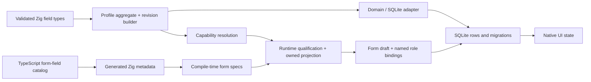

# Tax-profile architecture

> TIN/branch target notice (2026-08-07): the
> [multi-branch guide](TIN_BRANCH_PROFILE_AND_FILING_GUIDE_2026-08-07.md) and
> [revised implementation plan](TIN_BRANCH_IMPLEMENTATION_PLAN_2026-08-07.md)
> supersede any profile-per-branch, generated Branch Code, or
> Forms-Set-as-obligation assumption. This document remains the contract for
> currently implemented reusable-field ownership, form-role projection, and
> immutable draft snapshots. A bounded, explicit session-only fixture-preview slice now
> implements canonical Taxpayer/Registration Unit identity, evidence-gated
> confirmation, fail-closed 2550Q planning, and a read-only resolved preview.
> It does not implement reviewed legacy cutover/rollback, production filing
> policy, fileable drafts, or submission; the full target is not implemented
> merely because it is documented.

> Current execution contract (2026-08-05): the current sections of the
> [Form-profile ownership matrix](FORM_PROFILE_OWNERSHIP_MATRIX_2026-08-04.md)
> and this document define the simplified Base Tax Profile, exact Tax Form
> Profiles, owned projections, and draft snapshots. Registration activity and
> obligation architecture survives only at explicit historical migration and
> read-only provenance boundaries; it is not a current readiness source.

## Purpose

A tax profile is the reusable union of taxpayer facts found across the form
catalog. A concrete form revision consumes only the subset it declares for
each named profile role, then combines that snapshot with filing-specific and
derived values.

The design has four non-negotiable outcomes:

1. Taxpayer facts are entered once and reused across recurring filings.
2. A form may bind one or more profiles through explicit roles such as
   `filer` and `spouse`; binding order has no meaning.
3. A draft owns an immutable copy of projected values and their provenance.
   Appending a profile revision never rewrites an existing draft.
4. Values that belong to a filing, schedule row, policy calculation, payment,
   or external document are not promoted into the profile merely because they
   appear in a form control.

## Rust concepts translated to Zig and TypeScript

| Rust reference | This codebase |
|---|---|
| Validated newtypes | Bounded Zig field types with `parse` constructors |
| Fine-grained capability traits | Exhaustive `ReusableField` union, `FieldSet`, and typed `valueFor` resolver |
| Requirement supertraits | Compile-time-validated `FormSpec` and one `RoleSpec` per named role |
| Concrete profile compositions | `Subject` tagged union plus cohesive identity, contact, accounting-basis, EOPT-tier, and Primary-Line-of-Business fields |
| Runtime adapter boundary | SQLite rows are decoded through the domain builder before use |
| Typestate builder | `editor.Start -> editor.Ready -> ProfileRevision` and coarse filing lifecycle types |
| Multi-role generics | Named role bindings checked for cardinality, subject type, capability, and distinct-profile constraints |
| GAT borrowed prefill view | Deliberately replaced by an owned `Snapshot`; a filed draft must outlive and remain independent of the source revision |
| Runtime/config form layer | TypeScript catalog authoring and deterministic Zig metadata generation |

Zig does not need one declaration per Rust trait. The closed reusable-field
enum preserves exhaustiveness, while a form's compile-time requirements name
the exact subset. Runtime-loaded revisions are then qualified honestly:
missing facts produce domain issues, never placeholders.

## Dependency direction

Dependencies remain one-way: form definitions depend on the reusable
vocabulary, while profiles never depend on concrete forms.

## Profile aggregate

Each immutable revision consists of:

- stable opaque profile and revision IDs plus a monotonically increasing
  sequence;
- an effective period and source (`manual_entry`, `imported`, or `migrated`);
- identity (`TIN`, `RDO code`);
- registered contact;
- accounting-period basis and fiscal year-end month when applicable;
- one EOPT tier and one Primary Line of Business, each explicitly reviewable
  when legacy migration cannot prove an unambiguous value;
- exactly one truthful subject variant:
  - individual,
  - sole proprietor with an optional separate trade name, or
  - legal entity with an explicit legal kind.

Current setup, projection, and readiness consume this one Base revision. Legacy
Registration activities and obligations are not selectable current profile
components; ambiguous migrated values remain review-required until explicitly
confirmed in the Base Tax Profile.

## Form composition

A static form revision declares:

- its stable code and revision;
- its named profile roles;
- role cardinality;
- permitted subject kinds;
- each reusable source field, stable form target, and required/optional
  presence; and
- cross-role rules, such as requiring filer and spouse to be different
  profiles.

The compiler rejects malformed specifications such as duplicate roles,
duplicate targets, or duplicate sources within a role. At runtime, profile
revisions are checked for effective date, subject kind, and every required
capability. An omitted `zero_or_one` role contributes no targets, and a
missing optional/applicability-dependent capability contributes no entry.
Neither case is populated from a default. Accepted composition produces an
owned snapshot with:

- form target and semantic reusable-field type;
- copied validated value;
- role;
- profile ID, revision ID, revision sequence, and revision source; and
- exact Tax Form Profile identity and form-specific setup value provenance
  where the generated form contract requires yearly setup.

## 2551Q boundary

The January 2018 2551Q taxpayer-header projection is exactly:

- TIN;
- RDO code;
- taxpayer name;
- registered address;
- ZIP code;
- contact number; and
- email address.

Schedule 1 ATC is a repeated filing row, not a singleton profile header.
Its tax base and rate are filing/policy inputs. No percentage-tax rate is
hardcoded in the profile or form domain. The current editor persists two
stable Schedule-row identities and recomputes their derived due amounts from
the explicitly supplied rates.

Item 13's income-tax-rate election is not a Registration fact or a generic
Taxpayer-Year value. It is owned by the exact 2551Q Tax Form Profile for the
selected profile, tax year, form revision, and generated setup specification;
the UI labels it with that selected year.

Calendar-quarter filing is supported. Fiscal selection is visibly disabled
and rejected by the transaction domain for now because a fiscal period needs a
different effective profile date and draft identity; persisting it against a
calendar-quarter snapshot would be dishonest.

## 1701Q boundary

The January 2018 1701Q binds:

- exactly one `filer`; and
- zero or one independently selected `spouse`.

The filer and spouse cannot be the same profile. The optional spouse role is
not inferred by mirroring fields into a filer record. Filing calculations
remain transaction data and use a tagged union so the graduated and
eight-percent input sets cannot disagree.

Date of birth, citizenship, and foreign tax number are optional profile
targets for the filer because they do not apply to estate or trust filers.
Citizenship and foreign tax number are also optional for the spouse. All other
1701Q profile targets remain required when their role is bound.

The filing state keeps the graduated and eight-percent branches mutually
exclusive, preserves policy-produced results without inventing a rate, and
models up to four payments as stable repeated rows. Changing Q1/Q2/Q3 reopens
and requalifies the complete form-profile context before any transaction state
is reset or hydrated, so the profile date, draft key, and filing quarter cannot
drift.

## Persistence invariants

- Profile revisions are append-only and use optimistic sequence checks.
- SQLite row IDs are internal implementation details.
- Public bindings and provenance use stable opaque revision IDs.
- A first profile and its first revision commit atomically.
- Subject variants, Base identity/contact/classification values, effective
  periods, and source references round-trip without flattening or loss.
- Historical Registration rows remain readable for migration/export
  provenance but cannot drive new setup, projection, or readiness.
- Draft creation atomically persists draft identity, named role bindings,
  profile snapshots, and initial transaction values.
- The persistence boundary independently validates the exact role constraints
  and complete required/optional snapshot shape for each supported revision;
  public callers and malformed stored rows cannot bypass composition.
- Stored snapshots are never refreshed from a newer profile revision.
- A nonempty transaction value set must match its exact canonical active
  branch, IDs, provenance, and derived values before it can resume. Only a
  deliberately empty legacy draft receives the blank compatibility path.
- Lifecycle transitions are checked; prepared/queued historical artifacts
  are not silently mutated.
- Tax-profile migrations use a namespaced migration ledger and do not claim
  the calendar store's `PRAGMA user_version`.

## Forms Set policy

Forms Set configuration is profile- and tax-year-specific:

- `needs_configuration` means a newly created profile has not confirmed any
  Forms Set yet;
- `proposal_pending` is reserved for staged or imported suggestions that are
  not authoritative;
- `active_nonempty` is an explicitly confirmed non-empty set;
- `active_empty` is an explicitly confirmed zero-form set; and
- `legacy_catalog_default` is the compatibility state for existing profiles
  that still depend on the historical catalog fallback.

New profiles must remain `needs_configuration` until the user confirms a
Forms Set. Selecting zero forms creates `active_empty` and must never widen
back to the catalog. The legacy catalog fallback is an explicit compatibility
behavior, not the default for newly created profiles.

Forms Set currently feeds the Tax Form Library, editor availability, and the
profile calendar. The profile Calendar year picker exposes only explicitly
configured, non-future years; each deadline is then filtered against the Forms
Set for its own taxable year. The Global Dashboard and Global Tax Calendar
remain unfiltered. Calendar export retains a separate legacy-store fallback so
an old profile is not silently narrowed before it is configured.

## Catalog coverage

The generated catalog is the source of truth for current UI coverage:

- 51 registered form codes;
- 10 exact Native editor revisions;
- 41 codes explicitly marked `calendar_only`;
- 299 Native input controls;
- 63 meaningful static-table fields; and
- 16 canonical reusable profile keys.

`calendar_only` is an explicit absence of an editor contract. It must not be
reported as implemented filing support.

## Verification gates

The feature is complete only when all of these pass in the isolated worktree:

1. deterministic catalog generation and drift check;
2. TypeScript strict type-check;
3. Zig/domain/store/UI tests through the Native test root;
4. Native model-contract and strict markup analysis;
5. Native release build and strict doctor;
6. SQLite round-trip, revision-conflict, snapshot-immutability, multi-role,
   explicit-empty Forms Set, and recurring-period tests; and
7. generated `app.native` below the Native runtime watcher's 256 KiB limit,
   plus a clean isolated data-directory restart; and
8. a clean `git diff --check`.
