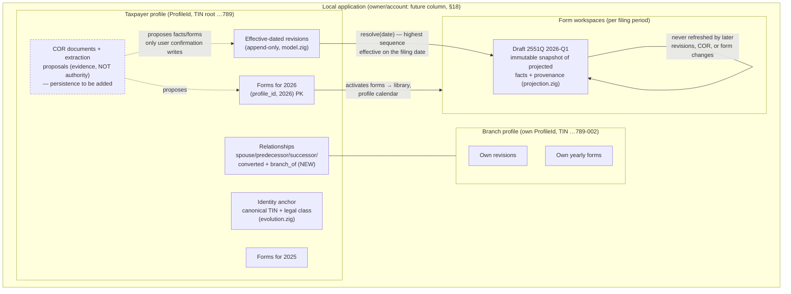

# Taxpayer Setup UX Specification

Date: 2026-08-04
Status: decision-ready design; no implementation
Prompt: `docs/tax-profile/CLAUDE_FABLE_5_TAXPAYER_SETUP_UX_PROMPT_2026-08-04.md`
Repository baseline: branch `gol/taxpayer-setup-ux-153451` at `2ff21cb`

Scope note: the two running-app screenshots referenced by the prompt were not
readable from this environment (macOS per-app temp directories). Their content
is treated exactly as the prompt's verified findings describe it: the Add flow
accepted 2026 while a 2026 card existed and opened a blank 2026 manager. This
document treats that as a required failure state to design out, not as an
accepted behavior.

---

## 1. Executive recommendation

Adopt the **reactive year workspace** (Model 2). One compact, right-aligned
year combobox is the single entry point for yearly forms setup. Selecting a
configured year opens that year's saved setup for editing. Selecting an
allowed missing year opens an in-memory draft that offers `Start empty` or
`Use setup from <year>`; nothing exists in the database until an explicit
Save. The `New tax year` input, the `Add yearly form set` button, and the
stack of per-year cards are removed from the primary surface. A compact
`All configured years` disclosure (borrowed from Model 3) preserves
at-a-glance history without making year cards the primary navigation.

Around that workspace:

- Profile settings collapses from four tabs to three: **Profile**,
  **Registration & Forms**, and **Email Settings**. The standalone COR tab is
  removed; COR evidence upload and review become a compact card inside
  Registration & Forms, because a COR interaction happens at most a few times
  a year and its only consumers are registration facts and form activation.
- Taxpayer facts stay effective-dated history, presented in plain language:
  a per-year facts summary ("Using facts effective Jan 1, 2026 ·
  No changes from 2025"), a `Record a change` action with an effective date,
  and a history disclosure. Saving with nothing changed appends nothing.
- `Add branch` becomes a first-class flow (sidebar + Profile section) that
  creates an isolated profile sharing only the 9-digit TIN root, with a
  review matrix that copies safe facts, requires review of branch-specific
  facts, and never copies evidence, drafts, filings, or secrets.
- Filing-level exceptions get provenance (`From profile`,
  `Changed for this filing`, `Suggested from COR`) and a
  `Use profile value` reset. No new persistent year-scoped per-form override
  layer is introduced — the existing three layers (effective profile
  revisions, yearly form activation, filing transaction values) cover every
  required scenario (see §13).

Why Model 2: it is the only model that simultaneously (a) makes duplicate
years structurally impossible in the UI rather than guarded by a button
predicate, (b) reuses an interaction the app already ships (the profile
calendar's filterable year picker, `src/pages/taxpayer-dashboard.native:90`),
(c) keeps first-run to two decisions (pick year → pick forms), and (d) maps
1:1 onto the store's existing `createFormSet` / `updateFormSet` split without
new persistence. Model 1 is the current screen and is the source of the
observed failure; Model 3 (timeline-first) is the right *history* view but a
poor *primary* view, because first-time users have no history yet.

## 2. Terms and mental model

User-facing vocabulary. Every screen, notice, and dialog uses these names and
no others.

| Concept (internal) | User-facing name | Notes |
|---|---|---|
| Taxpayer profile / `ProfileId` | **Taxpayer profile** ("taxpayer" in running copy) | "Profile" alone acceptable inside profile settings |
| Branch registration (TIN branch segment) | **Branch** | Head office = branch code `000` or a 9-digit TIN |
| Yearly Forms Set (`tax_profile_form_sets` row) | **Forms for {year}** / **{year} forms** | Never "Forms Set" in UI copy |
| `active_nonempty` | **Configured · N active forms** | |
| `active_empty` | **Configured · no active forms** | Deliberate zero is a real configuration |
| `needs_configuration` (no row) | **Not set up** | |
| `legacy_catalog_default` | **Original catalog default** | Only in the compatibility reset control |
| `ProfileRevision` append | **Change**, "recorded effective {date}" | "Update" acceptable; never "revision" |
| Correction (same period, higher sequence) | **Fix a mistake** | Distinct from a real-world change |
| COR document + extraction | **Certificate of Registration (COR)**, "COR document", "COR suggestions" | |
| Draft snapshot value | (invisible; provenance chip **From profile**) | |
| Filing-scoped exception | **Changed for this filing** | Reset: **Use profile value** |
| Staged (unsaved) selection | **Unsaved changes** | |

Internal terms that must never appear in end-user copy: *insert, upsert,
revision, sequence, snapshot, projection, qualification, staged, Forms Set,
legacy_catalog_default, needs_configuration, persistence, SQLite*.

Two current strings violate this and are rewritten by this design
(`src/tax_profile/ui_state.zig:1064` "Forms Set saved for this profile and
tax year.", `ui_state.zig:1814` "That tax year already has a Forms Set…";
replacement copy in §16).

Mental model taught by the UI, top to bottom:

> **You** manage one or more **taxpayer profiles** (a head office and its
> **branches** are separate profiles that share a TIN root). Each taxpayer
> has **facts** that change over time (address, RDO, contact…), a set of
> **active BIR forms per year**, and **COR documents** as evidence. Each
> filing you open takes its own copy of the facts as they were on that date.

## 3. Repository-grounded findings

What exists, what is placeholder, and what is missing. All statements below
were verified against source in this worktree.

### Implemented and sound

- **Append-only effective-dated profile history.** `ProfileRevision` and
  `History.resolve` select the highest-sequence revision effective on a date
  (`src/tax_profile/model.zig:220`, `model.zig:344`); SQLite enforces
  append-only via trigger (`src/tax_profile/store.zig:7380`). Corrections are
  modeled as overlapping higher-sequence revisions (test
  "retroactive overlap resolves to the highest effective sequence",
  `model.zig:443`).
- **Identity safety.** Ordinary transitions cannot change the canonical TIN
  or legal-person class (`src/tax_profile/evolution.zig:88`
  `validateOrdinaryTransition`); audited TIN corrections have both a domain
  event (`evolution.zig:103` `IdentityCorrectionEvent`) and store support
  (`store.zig:308` `IdentityCorrectionWrite`). Profile relationships persist
  via `store.zig:295` `ProfileRelationshipWrite` with kinds
  `spouse_of`, `predecessor_of`, `successor_of`, `business_converted_to`
  (`evolution.zig:203`) — **no `branch_of` kind exists yet**.
- **TIN value object preserves the branch segment.**
  `Tin.root()` / `Tin.branch()` (9 digits + optional 3–5,
  `src/tax_profile/field.zig:88`).
- **Yearly Forms Set persistence is duplicate-safe at the store.**
  `createFormSet` is insert-only inside an immediate transaction and maps the
  uniqueness violation to `FormSetAlreadyExists`
  (`src/tax_profile/store.zig:2315`); `updateFormSet` rejects a missing year
  with `NotFound` (`store.zig:2369`); PK is `(profile_id, tax_year)`
  (`store.zig:7454`). `resolveFormSet` distinguishes all four states
  including explicit-empty (`store.zig:2477`).
- **Staged vs saved selection with leak guards.** `formsDirty()` blocks
  profile switching (`src/tax_profile/ui_state.zig:990`, `selectSlot` at
  `ui_state.zig:446` returns `UnsavedFormSetChanges`); manage-mode statuses
  `Inactive / Active / Will activate / Will deactivate`
  (`ui_state.zig:71`); browse mode never reflects staged toggles
  (`ui_state.zig:1005` `persistedFormSelected`).
- **A compact filterable year picker already ships.** The profile calendar
  year control is a 176-px `select` + dropdown with a digits query, only
  configured non-future years, and a recent-5 window unless filtered
  (`src/pages/taxpayer-dashboard.native:90`, `src/main.zig:3517`
  `profileCalendarYearOptions`). The proposed combobox is this component's
  pattern, extended with missing-year rows.
- **Missing-fact routing exists.** `profileCompletionTarget` +
  `profileCompletionMessage` produce "Complete {field} in Tax Profile before
  opening BIR Form {code}" (`src/main.zig:2477`).
- **Catalog authority.** 51 codes, 10 editors, 41 explicit `calendar_only`,
  16 canonical reusable keys; per-form declared profile subsets
  (`src/forms/generated/catalog.zig:39` `FormDefinition`,
  `docs/tax-profile/FORM_FIELD_CATALOG.md` projection matrix).
- **Responsive predicates.** `phoneLayout` (<600), `constrainedLayout`
  (<768), `desktopLayout` (≥1320) (`src/main.zig:89`).

### Implemented but the interaction is the problem

- `src/pages/profile-setup.native:391-405` renders a grow-to-full-width
  `New tax year` input plus `Add yearly form set` button;
  `profile-setup.native:432-453` renders one card per configured year with a
  per-card edit button. Three controls compete for the same job.
- `Model.profileFormsAddYearDisabled` (`src/main.zig:2355`) disables Add for
  a future year or an already-configured year — but it reads
  `hasExplicitFormSet`, which checks the **in-memory summary cache**
  (`ui_state.zig:805`), and it returns *enabled* when the input fails to
  parse. The `.profile_forms_add_year` handler (`src/main.zig:5841`)
  re-validates and `beginManageFormsForYear(year, creating=true)`
  (`ui_state.zig:838`) then **wipes the staged selection to empty** before
  any store read. The prompt's screenshots show the failure this
  architecture permits: with a stale or unrefreshed summary cache the guard
  passes, Create mode opens a blank manager for a year that already exists,
  and only the final `createFormSet` insert stands between the user and a
  perceived data loss. **Required failure state for implementation:** the
  design below never opens a create-mode workspace from a cached predicate;
  opening a year always resolves against the store first, and Save of a
  draft that collides converts to a recoverable conflict (§8, §9, scenario 2).
- Every profile Save appends a new revision unconditionally
  (`ui_state.zig:564` `saveFallible` computes `observed_sequence + 1`; save
  label "Save New Revision", `src/main.zig:2159`). There is no diff check,
  so the current UI *encourages* meaningless duplicate revisions — the exact
  anti-goal of prompt task 4.
- Unsaved **fact** edits are not guarded the way staged forms are: switching
  profiles calls `loadSelectedRevision(true)` which overwrites the editor
  buffers; only `formsDirty()` blocks the switch. Scenario 13 requires
  closing this gap.
- The dashboard header hardcodes `Non-VAT` in markup
  (`src/pages/taxpayer-dashboard.native:616`, `:636`) — false for VAT
  taxpayers; registration facts exist to render this truthfully.
- The single-activity editor cannot revise repeated-component revisions
  (`ui_state.zig:1822` `editorSupports`; failure notice at
  `ui_state.zig:1650`). The design keeps this constraint visible rather than
  hiding the whole editor.

### Placeholder only

- **COR tab**: static text + permanently disabled `Attach COR evidence`
  button (`src/pages/profile-setup.native:460-470`). No upload, storage,
  extraction, or review exists. The COR pipeline is design-only
  (`docs/tax-profile/TAX_FORM_LIBRARY_AND_COR_ARCHITECTURE.md`, proposed
  tables `cor_documents` … `profile_form_set_entries`).
- **Email Settings tab**: disabled placeholder
  (`profile-setup.native:472-481`).

### Missing domain/persistence work (details in §18)

- No owner/account column on `tax_profiles` (`store.zig:7301`) — the app is
  currently single-user-local; branch grouping and duplicate-TIN rules must
  therefore be scoped to the local database now and to an owner later.
- No uniqueness on canonical TIN across profiles; no `branch_of`
  relationship kind; no branch-aware profile listing.
- No effective intervals on yearly form sets (one row per year); mid-year
  form activation changes are out of scope for the first slice and the UI
  must not pretend otherwise.
- No COR persistence at all.
- No standalone-window/process concurrency signal other than the store
  constraints (sufficient, but the UI must surface them as recoverable
  states rather than raw failures).

### Adjacent paused work honored, not redesigned

`docs/calendar/PROFILE_CALENDAR_REMEDIATION_EXECUTION_PLAN_2026-08-04.md`
(PAUSED) fixes the taxpayer page as three tabs — `Calendar`,
`Tax Form Library`, `Profile Settings` — mounting `profile-setup-content`
inline. This specification adopts that page contract as given and designs
the *content* of Profile Settings. Nothing here changes the calendar lanes,
its filter, or the global calendar.

## 4. Alternative decision table

Scores: ● strong ◐ adequate ○ weak.

| Criterion | 1 · Add-input + year cards (current) | 2 · Reactive year workspace | 3 · Timeline-first |
|---|---|---|---|
| First-time comprehension | ○ three competing controls; "Add yearly form set" reads as creating a form | ● one control, one workspace, explicit `Set up forms for 2025` | ○ empty timeline on first run; history vocabulary before any history exists |
| Duplicate/error prevention | ○ predicate-guarded button; observed runtime failure | ● configured years can only open Edit; create exists only inside a missing-year draft; store remains final guard | ◐ create is an event on a timeline; ambiguity between "new period" and "edit" |
| Speed: new (current) year | ◐ type year, press Add | ● year is preselected; one click on `Use setup from 2026` or `Start empty` | ○ must create a timeline entry first |
| Speed: historical year | ◐ same, plus scroll through cards | ● type 4 digits → `Set up forms for 2023` | ◐ scroll timeline to insertion point |
| Visibility of existing configuration | ◐ cards always visible but push actions below the fold | ◐ status line + combobox metadata + `All configured years` disclosure | ● entire history is the screen |
| Mid-year fact changes | ○ not represented | ◐ facts summary + `Record a change` (effective date) | ● native |
| Branch creation | ○ unrelated to card stack | ◐ clean insertion point in Profile header/sidebar | ◐ same |
| Auditability | ◐ cards show state only | ◐ per-year facts provenance + history disclosure | ● |
| Desktop/phone responsiveness | ○ full-width input + button row wraps poorly | ● 176-px control, already proven by the calendar picker | ○ timelines are hostile at 600 px |
| Accessibility | ◐ | ● maps to APG combobox; existing `dropdown-menu` dismissal | ○ custom timeline semantics |
| Implementation fit | ● it is the current code | ● reuses `beginManageFormsForYear`, `createFormSet`/`updateFormSet`, calendar-picker pattern | ○ needs new timeline components + interval queries |

**Selected: Model 2**, with Model 3's history contributed as two secondary
disclosures (`All configured years` in Registration & Forms, `View history`
in Profile). No third variant is offered.

## 5. Information architecture

```
Sidebar (shell.native)
├─ TAXPAYER PROFILES  [+ ▾]              ← "+" opens a 2-item menu:
│    ├─ New taxpayer profile             ←   (existing new_taxpayer_profile)
│    └─ New branch of {selected}…        ←   NEW (§12); disabled when no selection
├─ Search profiles
├─ Profile rows, grouped by TIN root     ← head office row; indented branch rows (§12)
└─ …dock actions (unchanged)

Taxpayer page (per paused calendar plan)
├─ Tab: Calendar                         ← unchanged by this design
├─ Tab: Tax Form Library                 ← Browse mode, unchanged
└─ Tab: Profile Settings
     ├─ Section: Profile
     │    ├─ Facts-for-year summary card ("Using facts effective … · No changes from 2025")
     │    ├─ Shared facts editor (identity, contact, capabilities, business registration)
     │    │    └─ per-field "Used by 2551Q, 1701Q" hints (§13)
     │    ├─ Actions: Record a change · Fix a mistake · View history (N)
     │    ├─ Add branch (header action, natural persons/juridical alike)
     │    └─ Advanced (disclosure): revision source, effective-until, TIN correction entry
     ├─ Section: Registration & Forms          ← THE year workspace (§8)
     │    ├─ Header row: "Registration & Forms"  [Year ▾ 2026]   ← compact, right-aligned
     │    ├─ COR evidence card (upload / review / status)         ← replaces COR tab (§11)
     │    ├─ Year status line: "Configured · 1 active form" / draft banner
     │    ├─ Forms manager (existing 51-form staged manager, unchanged internals)
     │    └─ All configured years (disclosure): compact rows "2026 · 1 form · Configured"
     └─ Section: Email Settings          ← unchanged placeholder; operational secrets stay out
```

Placement decisions the prompt asked for explicitly:

- **COR** lives at the top of Registration & Forms as a one-line card; the
  standalone tab is removed. No frequent workflow justifies a tab: upload
  and review happen at registration time and on re-registration — the same
  moments the user is configuring forms. (A tab whose steady state is one
  attachment row fails the prompt's own emptiness test; the current tab is
  literally a disabled button.)
- **Email Settings** remains its own section: credentials are operational
  secrets with different sensitivity and no interaction with tax facts
  (`profile-setup.native:472`).
- **Add Branch** lives in the sidebar "+" menu and as a Profile-section
  header action.
- **Profile history** is a disclosure inside Profile, not a tab.
- **Yearly form setup** is the Registration & Forms section body.
- The standalone profile-setup page (`page-profile-setup`) is kept for
  creating a brand-new taxpayer and for `Complete profile` routing; it hosts
  the same three sections.

## 6. Domain-to-UI separation diagram



UI surfaces map onto exactly one box each: the shared facts editor writes
`REV` (append), the year workspace writes `FS{year}` (create/update), the
COR card writes `COR` and *proposes* into `REV`/`FS`, form editors read
`DRAFT`. No surface writes two boxes implicitly; the only two-box write is
the COR "Apply" transaction, which is explicit and reviewed.

## 7. Primary flows

Each flow lists trigger → steps → persistence effect. Copy in §16.

1. **First profile.** Sidebar `+` → New taxpayer profile → standalone setup,
   Profile section (TIN, RDO, subject kind, name, address; effective-from
   defaults to today, hidden under Advanced) → `Create Profile` →
   `createProfileWithRevision` (revision 1) → Registration & Forms opens with
   the current year selected and status `Not set up`, seed chooser visible
   (`Start empty` / no source years yet ⇒ only `Start empty`) → user picks
   forms → `Save setup for 2026` → `createFormSet`.
2. **Configure the current year (existing profile).** Profile Settings →
   Registration & Forms. Year combobox already shows the current year. If
   `Not set up`: draft chooser; else Edit mode.
3. **Configure an older year.** Open combobox → type `2023` →
   row `2023 · Not set up — Set up forms for 2023` → Enter → draft mode with
   facts-for-2023 panel resolving history as of 2023 (§9, §10). Save →
   `createFormSet(profile, 2023, …)`; 2026 untouched.
4. **Use another year's setup.** In any missing-year draft: seed chooser
   defaults to `Use setup from 2026` (most recent configured year) with
   `Change source ▾` listing all configured years. Copies the source year's
   active selection into the staged draft only. Banner `Starting from 2026`
   until Save.
5. **Edit an existing year.** Select configured year → manager opens with
   saved selection; toggles show `Will activate`/`Will deactivate`;
   `Save changes` → `updateFormSet`. Cancel restores persisted.
6. **Record a mid-year fact change.** Profile → `Record a change` →
   effective-date field ("When did this take effect?", default today) →
   edit fields → `Save change` → append revision (sequence+1, optimistic
   check). Drafts created before keep their snapshots; the facts summary
   shows `Effective Jul 1, 2026` (§10).
7. **Upload/review a COR.** Registration & Forms → COR card → `Upload COR`
   → local extraction (progress) → review screen: two sections (Profile
   facts / Suggested forms), per-candidate accept-edit-reject, evidence
   locations → `Apply accepted` (one transaction) (§11). TIN mismatch fails
   closed before review.
8. **Add a branch.** Sidebar `+` → `New branch of MARIA SANTOS…` → 3-step
   sheet (identity → what to reuse → review summary) → `Create branch`
   (§12). New isolated profile; optional forms copy for one chosen year.
9. **Resolve missing form facts.** Library card `Complete profile` →
   Profile section with the missing field focused and a banner
   `Missing for 2551Q: Email address` listing every form that uses the field
   → save change → return to the form (existing `profileCompletionTarget`
   routing, extended with the used-by list).
10. **Add/remove a form later.** Same as flow 5 — there is no separate
    "amend" concept for form membership within a year (effective intervals
    are a later phase, §18); deactivating a form never deletes drafts
    (existing store behavior).

## 8. Year combobox specification

The single entry point of Registration & Forms.

**Anatomy.** `[ Registration & Forms ……………………  (Tax year ▾) 2026 ]` — a
`select`-style trigger inside a `stack width="176"`, right-aligned in the
section header row, identical skeleton to the proven profile-calendar picker
(`taxpayer-dashboard.native:90-120`): trigger opens a `dropdown-menu`
(anchor below, stretch, offset 4) containing a digits-only filter input and a
scrollable option list. Trigger accessible name: `Tax year for forms setup`.

**Width and placement.** Fixed 176 px on desktop and compact (fits `8888` +
chevron + padding; matches the sibling calendar picker for visual rhythm).
Never grows. Phone: the header stacks — title row first, then the control at
full width (§14). The trigger shows only the committed year (`2026`); status
lives in the status line below, so the closed control never truncates.

**Input rules.**
- Filter field accepts digits only: non-digit keys are ignored; paste is
  stripped to digits; max length 4. (Native `input` + handler-side
  filtering, as `profile_calendar_year_query` does today.)
- Commit requires exactly four digits or an explicit row activation.
- Maximum year = the app's current date year (`model.calendarToday.year`).
  No future rows are ever rendered and a typed future year offers no create
  action.
- **Minimum supported year: 2000** (typed). Rationale: the storage layer's
  `1…9999` (`store.zig` CHECK, `parseTaxYear` at `ui_state.zig:1876`) is a
  data bound, not a product promise; the oldest catalog revision is
  1999-07-ENCS and BIR record-keeping obligations make >25-year-old setup
  noise. The floor is a UI/product constant, marked **Assumption A1** (§20)
  for confirmation, and is not a schema change.

**Unfiltered option list (in order).**
1. Current year — always present, configured or not.
2. Every other configured year, descending
   (`listFormSetSummaries` is already `ORDER BY tax_year DESC`,
   `store.zig:2389`).
3. The last five calendar years that are neither configured nor the current
   year, merged into the same descending order, each as a `Not set up` row.
   Older years are reachable only by typing — rendering 26 rows of dead
   history would bury the real choices (this mirrors the calendar picker's
   recent-window rule, `main.zig:3527-3533`).

**Row anatomy and differentiation.**

| Row kind | Primary text | Secondary text | Accessible name |
|---|---|---|---|
| Configured, nonempty | `2026` | `1 active form` | `2026, configured, 1 active form` |
| Configured, empty | `2025` | `No active forms` | `2025, configured, no active forms` |
| Not set up | `2024` | `Set up forms for 2024` (accent color, plus icon) | `2024, not set up. Set up forms for 2024` |
| Selected row | adds check mark + `selected` state | | |

Configured and missing rows differ by secondary text *and* icon (check-circle
vs plus), never by color alone.

**Type-to-filter.** Prefix match on the year digits ("20" → all 20xx rows;
"202" → 2020–2026 rows). While a filter is active the same three row kinds
render; a fully typed allowed year that has no row (older than the recent
window) renders a synthesized row: `2003 · Not set up — Set up forms for
2003`.

**No-match behavior.**
- Typed year > current: static helper row, non-interactive:
  `2027 hasn't started. You can set up years through 2026.`
- Typed year < 2000: `Years before 2000 aren't supported.`
- Otherwise no-match cannot occur (any 2000–current year yields a row).

**Keyboard contract (APG combobox, editable-with-list).**
- Trigger: Enter/Space/↓ opens popup, focus moves to filter input, current
  committed year is the highlighted option.
- ↓/↑ move highlight through rows (wrap: no); Home/End first/last.
- Enter activates the highlighted row (or the single visible row when the
  filter narrows to one). Activating a configured row loads it; activating a
  `Not set up` row opens the draft (§ below). Both are pure navigation —
  **no save, no write**.
- Escape closes the popup, discards the filter, restores focus to the
  trigger, committed year unchanged.
- Tab from the filter input commits nothing, closes the popup (same as
  Escape), moves focus onward.
- Click-away = Escape (`on-dismiss` already provides this).
- After activation, focus returns to the trigger; the workspace below
  updates; a polite live region announces `Showing 2025 · Not set up`.

**Guarded switching.** If the workspace has unsaved changes (staged forms or
an unsaved draft), activating another year does not discard them: a dialog
`Unsaved changes for 2026` offers `Keep editing` (default) and
`Discard changes`. No auto-save ever occurs on year selection.

**Open-time resolution (kills the screenshot bug class).** Activating any
row triggers `resolveFormSet(profile, year)` against the store *before* the
workspace renders, not a cached-summary check:
- Resolved configured (any state incl. empty) → Edit mode.
- Resolved `needs_configuration` → Draft mode.
- Resolution failure → the workspace shows the read-failure state (below)
  and **no create action is offered** — an unknown year must not be treated
  as missing.
The summary cache (`form_set_summaries`) feeds only the option list, never
the create/edit decision.

**Loading / failure / staleness states.**
- Loading: trigger disabled, label `Loading…`; skeleton status line.
- Read failure (list): popup shows one non-interactive row
  `Couldn't load your years` + `Try again` button; trigger stays enabled.
- Read failure (workspace open): status line
  `Couldn't open 2025. Nothing was changed.` + `Try again`.
- Staleness: the option list refreshes every time the popup opens; the
  workspace refreshes on year activation; a concurrent create surfaces at
  Save as the §9 conflict, never as silent data movement.

**Copy decision.** Action copy is `Set up forms for {year}` — confirmed over
`Create tax forms` (implies authoring a BIR form definition) and
`Add yearly form set` (storage vocabulary). The verb pair everywhere is
**Set up** (first time) / **Save changes** (thereafter).

### Create-versus-edit state machine

States of the Registration & Forms workspace. "Primary" = the single
primary-variant button visible in that state.

| # | State | Entry | Visible status | Primary action | Notes |
|---|---|---|---|---|---|
| S1 | Viewing configured year (clean) | activate configured row; after successful save | `Configured · N active forms` (or `· no active forms`) | `Save changes`, **disabled** | manager shows saved selection; `profileFormsSaveDisabled` already implements disabled-until-dirty (`main.zig:2392`) |
| S2 | Editing configured year (dirty) | any toggle in S1 | `Configured · N active · M unsaved changes` | `Save changes`, enabled | `updateFormSet`; Cancel reverts to S1 |
| S3 | Draft: seed choice | activate `Not set up` row (store-resolved) | banner `Setting up 2025 — nothing is saved yet` | `Save setup for 2025`, **disabled** | chooser: `Start empty` / `Use setup from 2026 ▾` (recommended, preselected visually but not committed) |
| S4 | Draft: empty start | chose `Start empty` | banner + `0 forms selected` | `Save setup for 2025`, enabled | saving zero forms is deliberate → `active_empty`; helper text states the consequence |
| S5 | Draft: seeded | chose `Use setup from {src}` | banner `Starting from 2026 · 3 forms copied` + `Change source` | `Save setup for 2025`, enabled | staged only; fully editable before save |
| S6 | Invalid/incomplete year input | filter text ≠ 4 digits | popup helper only | — | workspace unchanged |
| S7 | Future year typed | filter = future year | popup helper `2027 hasn't started…` | — | no create affordance exists |
| S8 | Switching year with unsaved changes | year activation from S2/S4/S5 | dialog `Unsaved changes for {year}` | `Keep editing` (default) / `Discard changes` | no third "save and switch" (prevents accidental saves) |
| S9 | Conflict: year created elsewhere | Save in S4/S5 → `FormSetAlreadyExists` | conflict card `2025 was set up in another window while you were working.` | `Review saved 2025 setup` / `Discard my draft` | staged selection preserved; Review loads persisted set as the new baseline, user's picks become pending `Will activate`/`Will deactivate` marks, primary becomes `Save changes` (S2) |
| S10 | Save failure (I/O, validation) | any Save error other than S9 | failure notice with reason | previous primary re-enabled | staged state untouched |
| S11 | Save success | store commit | success notice `Forms for 2025 saved · 3 active forms.` | → S1 | combobox metadata + `All configured years` refresh |
| S12 | Read failure on open | `resolveFormSet` error | `Couldn't open 2025. Nothing was changed.` + `Try again` | — | never falls back to Draft |

Explicitly rejected: an `Add` button anywhere; auto-saving on year change;
treating S3 with zero interaction as savable (the user must choose empty or
seeded — this is what makes `active_empty` an intent, not an accident).

## 9. Copy-from-year specification

A first-class speed path inside the missing-year draft (S3→S5), never a
hidden clone.

**Source selection.** Default source = most recent configured year (by year,
descending — matches summary order). `Change source ▾` lists every
configured year with metadata (`2026 · 3 forms`, `2024 · no active forms`).
Choosing a different source replaces the staged selection after a
confirmation only if the user already modified the staged set
(`Replace your 4 edited selections with the 2024 setup?`).

**Preview (always visible while the banner shows).** Three fixed groups:

- **Copied into this draft** — `Active forms (3): 2551Q, 1701Q, 0605` —
  the source year's saved selection, staged for the target year, editable.
- **Carried forward automatically** — `Taxpayer facts as they were in 2025`
  with the resolving revision named:
  `Using the change recorded effective Mar 15, 2024` — facts are
  *referenced by date*, never duplicated. Copy explains it without database
  words: `Your taxpayer details aren't copied — this year simply uses
  whatever was true during 2025.`
- **Never copied** — static line:
  `Filings, drafts, payments, deadlines, COR files, and email settings
  never copy between years.`

**Include/exclude rules (normative).**

| Item | Behavior |
|---|---|
| Source year's active form selection | copied into the staged target selection |
| Explicit-empty source | copyable; preview reads `No active forms — you can add some before saving` |
| Profile facts | inherited by effective-date resolution for the target period; **no revision is appended by seeding** |
| Facts edited inside the draft flow | appended as a revision at Save, effective-dated (below), only if actually different |
| Filing drafts, filed artifacts, payments, statuses | never |
| Deadlines | never stored per-year; derived from the saved selection |
| Email credentials | never |
| COR documents/extractions/unconfirmed proposals | never; existing COR remains attached to the profile as historical evidence and is shown read-only (`COR on file — uploaded Mar 2026`); setting up an old year neither requires nor fabricates evidence for it |
| Immutable snapshots | never |

**Historical effective-date behavior.** For target year Y:
- The facts panel resolves history *within Y*: latest revision effective at
  Y-01-01, plus a count when further revisions took effect inside Y
  (`Facts changed during 2023: 1 change in July`).
- If no revision is effective at any point in Y
  (`History.resolve → NoEffectiveRevision`), Save is blocked by a
  requirement card: `No taxpayer details exist for 2023 yet. Record what was
  true then — today's details won't be copied backward.` → `Record 2023
  details` opens the facts editor prefilled from the *nearest later*
  revision as a starting point, requires explicit review, effective-from
  defaulting to 2023-01-01. This appends a reviewed retroactive revision;
  fabrication-by-copy is impossible.
- Facts edited in a draft for a historical year get effective-from defaulted
  to Y-01-01 with the date visible and editable — never silently today.

**Save semantics.** One explicit `Save setup for {Y}`:
1. If draft facts changed → append the effective-dated revision first
   (optimistic sequence check as today).
2. `createFormSet(profile, Y, staged)` — insert-only; collision → S9.
Order matters: a facts append without the year save leaves valid history; a
year save without facts is equally valid. No cross-year write ever occurs —
the source year is opened read-only by the copy.

**Exact banner copy.** `Starting from 2026` (title) ·
`3 forms copied · you can change anything before saving` (body) ·
`Change source` (link) · dismiss ✕ collapses the banner to a one-line chip
`From 2026` until Save.

## 10. Profile history specification

A simple year-context UI over real effective-dated history — never one
mutable row per year.

**Facts-for-year summary card** (top of Profile; also mirrored condensed in
a Registration & Forms sidebar-free layout):

- One revision covering the whole viewed year:
  `Using facts effective Jan 1, 2026` + (when the resolving revision is the
  same one that covered the prior year) the carry-forward line
  `No changes from 2025`. "Same" is computed by revision identity
  (`RevisionId`), not field comparison — identity is what proves nothing was
  duplicated.
- Mid-year change(s): `2 changes during 2026 · latest effective Jul 1, 2026`
  with the segments listed on expand
  (`Jan 1 – Jun 30 · address: Quezon City`, `Jul 1 → · address: Makati`).
- Actions: `Edit details` (opens editor), `Record a change`,
  `View history (4)`.

**Record a change vs Fix a mistake.** Two entry points, one editor, one
switch at the top:

| | Record a change | Fix a mistake |
|---|---|---|
| Question asked | `When did this change take effect?` (date, default today, past allowed) | `Which period was recorded wrong?` (defaults to the currently shown revision's effective date) |
| Domain effect | append, new effective-from | append, same effective period, higher sequence supersedes (supported: `model.zig:443` overlap test) |
| Helper copy | `Earlier periods keep their old details.` | `This replaces what's shown for that period. Forms you already prepared keep the values they were prepared with.` |

**Diff-before-append.** `Save change` with zero effective differences →
neutral notice `No changes to save.` and no revision. This replaces today's
unconditional `observed_sequence + 1` append (`ui_state.zig:564`) at the UI
layer; the domain stays append-only.

**History disclosure.** `View history` opens a list (newest first):
`Effective Jul 1, 2026 · Address changed · recorded Jul 1, 2026 · Manual
entry`. Source badges reuse `manual_entry / imported / migrated` labels
already in the editor. Rows are read-only; a row action `Fix a mistake in
this period` pre-fills the correction flow. History is never shown during
first-run (nothing to show; the disclosure renders only when >1 revision).

**TIN and legal-class boundaries.**
- TIN and subject kind render as locked identity rows in change mode:
  `Taxpayer identity — TIN 123-456-789-000 · Sole proprietor` with a lock
  icon and helper `Identity doesn't change with ordinary updates.`
- `Correct TIN…` (under Advanced) starts the audited correction:
  reason + reference required, confirmation restates the before/after masked
  TIN (`***-***-789` → `***-***-321`), writes `IdentityCorrectionWrite`
  (already in `store.zig:308`). Not a revision.
- Changing subject kind across the natural/juridical/estate/trust boundary
  in the editor is rejected with:
  `A different kind of taxpayer needs its own profile. Create a new taxpayer
  profile and link it to this one.` + `Create linked profile` (uses
  `predecessor_of`/`business_converted_to` relationships,
  `evolution.zig:203`). Within-class changes (individual ↔ sole proprietor)
  remain ordinary revisions, as `validateOrdinaryTransition` permits.

**Effective-period plumbing moved to Advanced.** `Revision source`,
`Source reference`, and `Effective until` (all currently top-level inputs,
`profile-setup.native:319-372`) move under an `Advanced` disclosure with
defaults (manual entry, open-ended). First-run users never see them.

**IA evaluation (asked in prompt §4).** Chosen: **`Profile` +
`Registration & Forms`** (+ existing Email Settings). The three-way
`Overview / Profile history / Registration & Forms` split was rejected:
"Overview" duplicates the dashboard header, and a history *tab* is an empty
room on day one — history earns only a disclosure. The COR tab does not
survive; no recurring workflow justifies it (§5).

## 11. COR specification

COR is evidence, never authority. All states live in one card inside
Registration & Forms.

**Compact default states.**

| State | Card content |
|---|---|
| None | `Certificate of Registration` · `No COR on file. Upload it to check your details and suggested forms against it.` · `[Upload COR]` |
| Processing | filename + `Reading document…` progress; `Cancel` |
| Needs review | filename, uploaded date, badge `Suggestions ready` · `[Review suggestions]` `[Dismiss]` |
| Reviewed | filename, uploaded date, badge `Reviewed Mar 3, 2026` · `[View]` `[Add updated COR]` |
| Failed | filename, badge `Couldn't read` · `You can still pick forms manually.` · `[Try again]` `[Choose forms manually]` (scrolls to manager) |

**Upload flow.** `Upload COR` → file picker (PDF/image; type, signature,
size, page-count validation) → original stored immutably with hash →
embedded-text extraction first, OCR only for image pages → deterministic
label parsing → candidates. **Cloud/AI is opt-in and off by default**: if
local extraction is ambiguous, an inline consent step appears before any
network call: `Send this document to {provider} to improve reading? The
document leaves this device. {provider} {does not retain / retains} it.` +
`Use cloud processing` / `Continue locally`. Declining keeps the manual
path; the pipeline and provider-independent interfaces follow
`TAX_FORM_LIBRARY_AND_COR_ARCHITECTURE.md` (§"COR-assisted setup").

**Review screen.** Two independently selectable sections:
1. **Profile details** — one row per candidate:
   current value ⇄ proposed value, evidence link `Page 1`, per-row
   `Accept / Edit / Skip`. Unreadable candidates simply don't appear.
2. **Suggested forms** — rows with form code/title, reason
   (`Listed on the COR` / `Matches your VAT registration`), per-row accept.

Footer: `Apply 2 detail changes and 3 forms` (count updates live) +
`Cancel`. Apply is **one transaction**: retain provenance, append at most
one profile revision for accepted facts, create/update the target year's
forms, link both to the document, leave every draft snapshot untouched. If
only forms are accepted, **no profile revision is created**. If nothing is
accepted, Apply is disabled.

**TIN/branch mismatch — fail closed.** Checked before the review screen:
`This COR belongs to TIN ***-***-321-000, not this taxpayer
(***-***-789-000).` Options: `Create a new taxpayer profile from this COR` ·
`Review the mismatch` (side-by-side masked comparison; no apply possible) ·
`Cancel`. The selected profile cannot be mutated from this path at all.
A root match with a different branch segment gets the same treatment with
branch-aware copy (`…belongs to branch 002 of this TIN`), offering
`Create branch from this COR` (§12).

**Replace / add-new semantics.** `Add updated COR` uploads a new document;
the old one remains as historical evidence with its dates. Documents are
never edited in place. Deleting a document is allowed only when no confirmed
decision references it; otherwise the action reads
`This COR backs recorded changes and can be removed only after those records
are deleted` (retention policy = **Assumption A5**, §20).

**Provenance visibility.** Facts accepted from a COR show
`Suggested from COR (page 1) · confirmed Mar 3, 2026` in the history
disclosure and the `Suggested from COR` chip at the field level until edited
again.

**No automatic anything.** No auto-activation of suggested forms, no silent
profile overwrite, no background re-extraction after profile edits. The
placeholder promise already in the tab copy — evidence stored separately
from facts, filed snapshots never change — is kept verbatim as helper text.

## 12. Branch specification

**Placement.** Sidebar `+` becomes a two-item menu (§5); Profile section
header gets `Add branch`. Both open the same 3-step sheet. The menu item is
disabled with helper `Select a taxpayer first` when no profile is selected.

**Grouping and switching.** Sidebar rows group by TIN root: the head office
(9-digit TIN or branch `000`) renders as today; branch profiles render
indented beneath it with `Branch 002 · RDO 040` secondary text. Grouping is
presentation-only in phase 1 (computed from `Tin.root()` across loaded
rows); a persisted `branch_of` relationship kind is the durable mechanism
(§18) and required before search/sort can rely on it. Switching between
branches uses the existing `select_taxpayer` path and its staged-state
guards — a branch is an ordinary isolated profile.

**Step 1 · Identity (minimum information).**
- TIN root: prefilled from the source, **locked** (`123-456-789`).
- Branch code: required, 3–5 digits, digits only
  (`Tin.parse` already enforces 12–14 total, `field.zig:107`).
- Duplicate check: full TIN compared against every profile in the database
  (case: two windows — the same check re-runs inside the create transaction;
  see gap G3). Error: `Branch 002 already exists for this TIN — open MARIA
  SANTOS (Branch 002) instead.` with a link.
- Registered/taxpayer name: prefilled from source, editable.
- Subject kind: inherited and **locked** — a branch is the same legal
  person; the field renders as text with a lock, helper
  `A branch registration belongs to the same taxpayer.`
- RDO code: empty input with a suggestion chip `Same as head office: 040`
  (one tap to accept) — required, because branch RDOs commonly differ.

**Step 2 · What to reuse.** A review matrix, three fixed groups:

| Group | Fields | Default |
|---|---|---|
| Copied unless unchecked (safe) | contact number, email address, trade name | checked |
| Suggested, must be confirmed per field | registered address, ZIP, line of business + ATC, tax type, withholding-agent status, special-rate basis | shown as prefill chips; each requires an explicit `Use` tap or new input |
| Never copied (static text) | canonical TIN, COR documents and suggestions, filings/drafts/payments, email credentials, calendar/export state | — |

Plus one optional block: `Also copy active forms` — year selector over the
source's configured years (`2026 · 3 forms`), unchecked by default. Copying
stages a forms save executed after the branch profile commit (two writes,
surfaced as one flow; partial failure leaves a valid branch with `Not set
up` + notice).

**Step 3 · Review.** An unmistakable summary before the only write:

```
Create branch of MARIA SANTOS
TIN 123-456-789-002 · RDO 043 · Sole proprietor
Copied: contact number, email, trade name
Entered: address (Makati), line of business (Retail)
Forms: 2026 setup copied from head office (3 forms)
No COR on file yet — upload one after creating.        [Back] [Create branch]
```

`Create branch` → `createProfileWithRevision` (revision 1, effective today
by default) → optional `createFormSet` → sidebar regroups → the new branch
becomes the selected taxpayer → Registration & Forms opens showing the COR
card's empty state.

**COR interaction.** A branch never inherits the source's COR. Uploading a
COR to a branch validates root **and** branch segment (§11 mismatch rules).
Missing COR is a neutral empty state, never a blocker.

**Isolation rules.** The sheet holds all state locally; closing it discards
everything with a confirm when dirty. Existing guards
(`UnsavedFormSetChanges`, snapshot immutability) apply unchanged after
creation. No cross-profile staged state exists at any point.

**Acknowledged gaps (not promised in UI).** No organization-wide
inheritance is offered or implied — facts do not sync between branches after
creation, and the UI says so in step 2 helper copy: `Copying is one-time.
Later changes to the head office don't update this branch.` The persistence
work required for grouping/uniqueness is listed in §18; until G3 lands the
duplicate check is best-effort in the create transaction.

## 13. Form requirement and override specification

**Layers (exhaustive).** Every value a form shows comes from exactly one:

| Layer | Authority | Example | UI provenance chip |
|---|---|---|---|
| L1 Effective profile revision | shared facts editor | TIN, address, email | `From profile` |
| L2 Year-scoped setup | Registration & Forms | which forms are active in 2026 | (none — it's membership, not a value) |
| L3 Form/role selection | form workspace | which business activity feeds 2551Q's ATC row; spouse binding on 1701 | `Selected for this form` |
| L4 Filing transaction values | form workspace | quarter amounts, payments | (none) |

**Verdict on year-scoped per-form profile overrides: not necessary — do not
build them.** Every prompt scenario resolves inside L1–L4: real change →
effective revision; wrong data → correction; one-off value → filing-scoped
exception (below); form-specific fact variant → role/selection (L3). A
persistent `(year, form, field)` override table would be a fourth source of
truth that drifts from history, complicates COR review, and answers no
scenario the cheaper layers miss. This is the recommendation the prompt
asked for explicitly.

**Shared facts editor is authoritative for L1.** One editor; no per-form
profile copies, ever. Each field shows a muted used-by hint derived from the
catalog projection matrix (`FORM_FIELD_CATALOG.md`), filtered to the
profile's *active* forms for the viewed year: `Used by 2551Q, 1701Q`.
Fields no active form consumes show no hint and are never demanded.

**Missing-fact tasks.** A `Complete profile` task appears only when an
*active* form's declared required subset (`RoleSpec.requiredFields`,
`src/forms/spec.zig:35`; runtime issues from `projection.qualify`,
`src/tax_profile/projection.zig:82`) is unsatisfied. Library card:
`Complete profile` (existing). Focused view — `Missing for 2551Q` — lists
only the missing fields with their used-by lists and one `Fix` action per
field routing into the editor (extends the existing
`profileCompletionTarget` mechanism, `main.zig:2473`). The user is never
shown all 16 canonical fields as a checklist.

**Filing-scoped exception (L4-resident).** In a form workspace,
profile-derived controls render read-only with the `From profile` chip.
An `Edit` affordance opens a scope choice:

- `Only this filing` — the control becomes editable; chip flips to
  `Changed for this filing`; a `Use profile value` link restores the
  snapshot value and removes the exception. The exception is stored with the
  draft's transaction values; the immutable snapshot keeps the original
  projected value + provenance, so audit shows both.
- `Update the taxpayer profile…` — routes to `Record a change` (effective
  date). The current draft is **not** rewritten (persistence invariant:
  stored snapshots are never refreshed — `docs/tax-profile/ARCHITECTURE.md`
  §Persistence invariants); helper copy states it:
  `This filing keeps the details it was started with. New filings will use
  the updated profile.`

COR-sourced values show `Suggested from COR` until confirmed (then
`From profile`, since confirmation appends a revision).

**Reset behavior.** `Use profile value` always restores the value from the
draft's own snapshot (not from the live profile) — restoring must not
smuggle in a newer revision.

## 14. Desktop / compact / phone wireframes

Annotated low-fidelity. D = desktop (≥1320), C = compact (600–768 shell
range), P = phone (<600). Padding/reflow uses the existing
`desktopLayout` / `constrainedLayout` / `phoneLayout` predicates only.

### 14.1 Registration & Forms — default (configured year) — D

```
┌────────────────────────────────────────────────────────────────────────┐
│ Registration & Forms                                    ┌──────────┐   │  header row;
│                                                         │ 2026   ▾ │   │  combobox 176px,
│                                                         └──────────┘   │  right-aligned
│ ┌────────────────────────────────────────────────────────────────────┐ │
│ │ 📄 Certificate of Registration                                     │ │  COR card (§11)
│ │ COR-2026.pdf · uploaded Mar 3, 2026 · Reviewed    [View] [Add new] │ │
│ └────────────────────────────────────────────────────────────────────┘ │
│ Configured · 1 active form                                             │  status line
│ ┌────────────────────────────────────────────────────────────────────┐ │
│ │  (existing 51-form manager: search · filters · Select all · cards) │ │
│ └────────────────────────────────────────────────────────────────────┘ │
│ ▸ All configured years (3)                                             │  disclosure:
│                                                  [Cancel] [Save changes]│  compact rows on expand
└────────────────────────────────────────────────────────────────────────┘
```

### 14.2 Missing-year draft (S3→S5) — D

```
│ Registration & Forms                                    │ 2025   ▾ │   │
│ ┌────────────────────────────────────────────────────────────────────┐ │
│ │ Setting up 2025 — nothing is saved yet                          ✕  │ │  draft banner
│ │ ( ) Start empty          (•) Use setup from 2026 ▾  3 forms copied │ │  seed chooser
│ │ Your taxpayer details aren't copied — this year uses whatever      │ │
│ │ was true during 2025.  Using change effective Mar 15, 2024.        │ │  facts inheritance line
│ └────────────────────────────────────────────────────────────────────┘ │
│ 3 forms selected · 0 unsaved changes                                   │
│ [ manager, staged selection editable ]                                 │
│                                            [Cancel] [Save setup for 2025]
```

Combobox open (over 14.1/14.2), showing row kinds:

```
┌ 2026 ────────▾┐
│ [ 2025      ] │ ← digits-only filter
│ ✓ 2026  1 active form            │  configured (current year first)
│   2025  Set up forms for 2025  + │  missing (accent + plus)
│   2024  No active forms        ✓ │  configured-empty
│   2023  Set up forms for 2023  + │
└──────────────────────────────────┘
```

### 14.3 Forms manager — P (<600)

```
┌──────────────────────────────┐
│ Registration & Forms         │   ← title on its own row
│ ┌──────────────────────────┐ │
│ │ Tax year         2026  ▾ │ │   ← full-width control, 44px
│ └──────────────────────────┘ │
│ 📄 COR · Reviewed   [View]   │   ← COR card condensed to one line
│ Configured · 1 active form   │
│ [Search forms............ ]  │
│ [Filters ▾]                  │
│ [Select all 51] [Clear all]  │   ← stacked, existing pattern
│ ┌──────────────────────────┐ │
│ │ ☑ 2551Q  Active          │ │   ← 1-column cards
│ │  Quarterly Percentage…   │ │      (profileFormCardColumns=1)
│ └──────────────────────────┘ │
│ ┌──────────────────────────┐ │
│ │ ☐ 1701Q  Will activate   │ │
│ └──────────────────────────┘ │
│ …                            │
│ ┌──────────────────────────┐ │
│ │ [Cancel]                 │ │   ← stacked actions; content keeps
│ │ [██ Save changes ██]     │ │      bottom padding ≥ action height,
│ └──────────────────────────┘ │      actions never overlay cards
└──────────────────────────────┘
```

C (600–768): same order as P but year control right-aligned at 176 px on the
title row when it fits the 44-px row with ≥8 px gap; otherwise the P
stacking applies. Search + filter share one row.

### 14.4 Add branch — D (sheet) and P

```
D ┌─ Create branch of MARIA SANTOS ────────────────── step 2 of 3 ─┐
  │ Reused unless unchecked      Confirm for this branch           │
  │ ☑ Contact number             RDO      [___]  (Use 040 — HQ)    │
  │ ☑ Email address              Address  [_________] (Use HQ addr)│
  │ ☑ Trade name                 Line of business [____] (Use …)   │
  │ Never copied: TIN, COR files, filings, drafts, email settings  │
  │ ☐ Also copy active forms:  [2026 · 3 forms ▾]                  │
  │ Copying is one-time. Later head-office changes don't update    │
  │ this branch.                                [Back]  [Continue] │
  └────────────────────────────────────────────────────────────────┘

P: the sheet becomes a full-screen page; the two columns stack (reused
group first, confirm group second); footer actions stacked full-width.
```

Global responsive rules (restating prompt §8 as commitments): the page
title always owns its row below desktop; the year control never stretches on
desktop; controls reflow, never shrink below 44 px targets; the year +
status line stay visible on phone above the manager; COR upload and Save are
reachable without horizontal scroll at 320-px content width; the 51-form
manager is one column on phone; bottom actions are in-flow (not floating)
so they cannot cover content.

## 15. Component/state matrix

| Component | default | hover | focus | expanded | filtered | loading | empty | disabled | invalid | unsaved | conflict | success | read failure |
|---|---|---|---|---|---|---|---|---|---|---|---|---|---|
| Year combobox trigger | year text + chevron | surface tint | 2px focus ring | popup open, aria-expanded | — | `Loading…`, disabled | n/a (current year always exists) | during workspace save | n/a (input lives in popup) | dot marker + tooltip `Unsaved changes` | — | — | enabled; popup shows retry row |
| Year filter input | placeholder `Type a year` | — | ring, caret | — | list narrows per prefix | — | helper rows (§8 no-match) | — | non-digits ignored (no error styling) | — | — | — | — |
| Year option row | year + metadata | tint | highlight follows ↑↓ | — | visible subset | skeleton rows ×3 | — | future rows never rendered | — | — | — | check on selected | error row + `Try again` |
| Workspace status line | `Configured · N active forms` | — | — | — | — | skeleton | `Not set up` | — | — | `· M unsaved changes` suffix | conflict card replaces line | success notice 4s | `Couldn't open {year}…` + retry |
| Draft banner | title + chooser | — | chooser radio focus order | source dropdown | — | — | — | — | — | always (it *is* unsaved) | swaps to S9 card | removed on save | — |
| Seed source dropdown | `Use setup from 2026` | tint | ring | list of configured years | — | — | hidden when no configured years (only `Start empty`) | — | — | — | — | — | inherits combobox failure row |
| Forms manager card | existing | existing | existing | — | search/filters | — | existing empty states | calendar-only rows never claim editors | — | `Will activate/deactivate` badges | — | — | — |
| Save (primary) | `Save changes` / `Save setup for {Y}` | — | ring | — | — | spinner + `Saving…`, disabled | — | disabled until dirty (S1) or until seed choice (S3) | — | enabled | disabled while conflict card open | flashes success then S1 | re-enabled |
| COR card | per §11 table | — | ring on actions | review screen | — | progress bar + `Reading document…` | `No COR on file…` | upload disabled during processing | unsupported file: inline `This file type isn't supported (PDF or image).` | — | TIN mismatch dialog | `Reviewed {date}` badge | `Couldn't read` + retry |
| COR review row | current ⇄ proposed | tint | per-row focus | evidence popover (`Page 1`) | section filters none | — | section hidden when no candidates | apply disabled at 0 accepted | edit validates by field type | accepted count in footer | — | applied summary | — |
| Branch sheet | step 1 | — | first invalid field focused on Continue | steps 2–3 | — | create spinner | — | Create disabled until required confirmed | dup-TIN inline error with link | dirty-close confirm | dup detected at commit → same inline error | created toast + switch | — |
| History list | rows newest-first | tint | row focus | `Fix a mistake` per row | — | skeleton | hidden when <2 revisions | — | — | — | — | — | inline `Couldn't load history` + retry |
| Facts summary card | effective line + carry-forward | — | action focus | segments on expand | — | skeleton | `Not recorded for {year}` + record action | — | — | `Unsaved change` chip when editor dirty | revision conflict notice (existing copy) | `Change saved · effective {date}` | fail-closed: actions hidden, retry |

## 16. Content design table

Exact strings. `{…}` are live values. No string says "Invalid input" or
"An error occurred"; none uses internal vocabulary (§2).

| Key | Context | Text |
|---|---|---|
| yr.label | combobox accessible name | `Tax year for forms setup` |
| yr.placeholder | filter input | `Type a year` |
| yr.row.setup | missing-year row | `Set up forms for {year}` |
| yr.row.active | configured row metadata | `{n} active form` / `{n} active forms` |
| yr.row.empty | configured-empty metadata | `No active forms` |
| yr.help.future | future typed | `{year} hasn't started. You can set up years through {current}.` |
| yr.help.floor | below floor | `Years before 2000 aren't supported.` |
| yr.help.load | list failure | `Couldn't load your years.` + button `Try again` |
| ws.status.configured | status line | `Configured · {n} active forms` |
| ws.status.configuredEmpty | status line | `Configured · no active forms` |
| ws.status.notSetup | status line | `Not set up` |
| ws.status.unsaved | suffix | ` · {m} unsaved changes` |
| ws.openFail | workspace open failure | `Couldn't open {year}. Nothing was changed.` + `Try again` |
| draft.banner.title | S3 | `Setting up {year} — nothing is saved yet` |
| draft.choice.empty | chooser | `Start empty` |
| draft.choice.seed | chooser | `Use setup from {source}` |
| draft.seed.copied | banner detail | `{n} forms copied · you can change anything before saving` |
| draft.facts.inherit | banner detail | `Your taxpayer details aren't copied — this year uses whatever was true during {year}.` |
| draft.facts.revision | banner detail | `Using the change recorded effective {date}` |
| draft.facts.missing | requirement card | `No taxpayer details exist for {year} yet. Record what was true then — today's details won't be copied backward.` + button `Record {year} details` |
| draft.neverCopied | preview | `Filings, drafts, payments, deadlines, COR files, and email settings never copy between years.` |
| draft.replaceSeed | change-source confirm | `Replace your {n} edited selections with the {source} setup?` · `Replace` / `Keep mine` |
| save.setup | S3–S5 primary | `Save setup for {year}` |
| save.changes | S1/S2 primary | `Save changes` |
| save.zeroForms | helper near Save when 0 staged | `Saving with no forms keeps {year} configured but empty — no forms in the library and no deadlines on the calendar.` |
| save.success | notice | `Forms for {year} saved · {n} active forms.` (empty: `Forms for {year} saved · no active forms.`) |
| switch.dialog.title | S8 | `Unsaved changes for {year}` |
| switch.dialog.body | S8 | `You have {m} unsaved changes. Switching years won't save them.` |
| switch.keep / switch.discard | S8 actions | `Keep editing` / `Discard changes` |
| conflict.title | S9 | `{year} was set up in another window while you were working.` |
| conflict.body | S9 | `Your choices are still here. Review the saved setup, then keep or change it.` |
| conflict.review / conflict.discard | S9 actions | `Review saved {year} setup` / `Discard my draft` |
| conflict.profile | revision conflict (existing, kept) | `This profile changed elsewhere. Reload it before saving a new revision.` |
| history.carry | facts summary | `No changes from {prior year}` |
| history.effective | facts summary | `Using facts effective {Mon D, YYYY}` |
| history.midyear | facts summary | `{n} changes during {year} · latest effective {Mon D, YYYY}` |
| change.date.label | record-change | `When did this change take effect?` |
| change.help | record-change | `Earlier periods keep their old details.` |
| fix.date.label | correction | `Which period was recorded wrong?` |
| fix.help | correction | `This replaces what's shown for that period. Forms you already prepared keep the values they were prepared with.` |
| change.none | diff-empty save | `No changes to save.` |
| identity.locked | TIN/kind rows | `Identity doesn't change with ordinary updates.` |
| identity.newProfile | class-boundary attempt | `A different kind of taxpayer needs its own profile. Create a new taxpayer profile and link it to this one.` |
| cor.empty | card | `No COR on file. Upload it to check your details and suggested forms against it.` |
| cor.processing | card | `Reading document…` |
| cor.ready | badge | `Suggestions ready` |
| cor.reviewed | badge | `Reviewed {Mon D, YYYY}` |
| cor.failed | card | `Couldn't read this document. You can still pick forms manually.` |
| cor.fileType | validation | `This file type isn't supported. Upload a PDF or an image.` |
| cor.consent | cloud opt-in | `Send this document to {provider} to improve reading? The document leaves this device. {retention sentence}.` · `Use cloud processing` / `Continue locally` |
| cor.apply | review footer | `Apply {a} detail changes and {b} forms` |
| cor.mismatch | fail-closed dialog | `This COR belongs to TIN {masked}, not this taxpayer ({masked}).` · `Create a new taxpayer profile from this COR` / `Review the mismatch` / `Cancel` |
| cor.mismatch.branch | branch variant | `This COR belongs to branch {code} of this TIN.` · `Create branch from this COR` / … |
| branch.menu | sidebar | `New branch of {name}…` |
| branch.dup | validation | `Branch {code} already exists for this TIN — open {name} (Branch {code}) instead.` |
| branch.kind.locked | step 1 | `A branch registration belongs to the same taxpayer.` |
| branch.suggest | step 2 chips | `Use {value} — head office` |
| branch.oneTime | step 2 helper | `Copying is one-time. Later changes to the head office don't update this branch.` |
| branch.create | step 3 primary | `Create branch` |
| branch.created | notice | `Branch {code} created. Upload its COR and set up its forms when ready.` |
| missing.banner | completion routing | `Missing for {form}: {field}` |
| missing.usedBy | field hint | `Used by {form list}` |
| chip.fromProfile / chip.filing / chip.cor | provenance | `From profile` / `Changed for this filing` / `Suggested from COR` |
| chip.reset | exception reset | `Use profile value` |
| scope.title | exception scope | `Where should this new value apply?` |
| scope.filing / scope.profile | options | `Only this filing` / `Update the taxpayer profile…` |
| scope.snapshotNote | after profile update | `This filing keeps the details it was started with. New filings will use the updated profile.` |
| years.disclosure | history of years | `All configured years ({n})` |

## 17. Accessibility and responsive acceptance criteria

Keyboard and focus
1. The combobox implements the APG combobox pattern (§8): trigger
   Enter/Space/↓ opens; ↑/↓/Home/End navigate; Enter activates; Escape and
   click-away close without mutation; focus returns to the trigger on close.
2. Tab order in Registration & Forms: section tab → year trigger → COR card
   actions → status/disclosure → manager search → filters → bulk actions →
   form cards (grid order) → Cancel → primary Save. No focus trap outside
   open popups/dialogs.
3. Every popup (`dropdown-menu`) dismisses on Escape via existing
   `on-dismiss`; dialogs (S8, S9, COR mismatch) trap focus, initial focus on
   the safe action (`Keep editing`, `Cancel`).
4. After Save success, focus stays on the Save button (now disabled) and the
   notice is announced politely; after year activation, the live region
   announces `Showing {year} · {status}`.
5. The draft banner's chooser is a radio group with arrow-key movement; the
   seed source is a nested disclosure reachable by Tab when its radio is
   selected.

Names and state
6. Every option row exposes year + status in its accessible name (§8 table);
   selected rows expose `selected`; the trigger exposes the committed year
   as its value and `aria-expanded` equivalents via Native `selected`/state.
7. Provenance chips are text, not color/icon alone; configured vs missing
   rows differ by icon + text, not color alone.
8. All interactive targets are ≥44×44 px (`height="44"` house style; the
   COR card's compact `View` link included).
9. Contrast: status/metadata text uses `text_muted` only when ≥4.5:1 on
   `surface`; the accent `Set up forms for {year}` row text must also pass
   4.5:1 (validate both themes; failing that, use weight instead of color).

Responsive
10. At 320–599 px (phone): no horizontal scroll on any state in §14; title
    row alone; year control full-width; manager one column; bottom actions
    stacked and in-flow.
11. At 600–767 px (compact): year control 176 px right-aligned on the title
    row iff the row height stays 44 px; otherwise phone stacking.
12. At ≥1320 px (desktop): year control never grows past 176 px; manager
    grid columns per existing `profileFormCardColumns`.
13. Dialogs and the branch sheet render full-screen on phone, centered
    ≤560 px otherwise.
14. Every acceptance test in §20 runs at all three widths through the
    project app's own layout predicates (no OS/device branches).

## 18. Data / API / schema gaps

**UI-only (no schema change):**
- Year combobox, workspace states S1–S12, draft/seed staging (staged
  selection already exists), open-time `resolveFormSet` resolution, seed
  copy (reads source year via `getFormSet`, stages only).
- Facts diff-before-append (compare editor buffers against loaded revision).
- Unsaved-fact-edit guard on profile switch (extend `formsDirty()`-style
  gate to the profile editor buffers).
- Used-by hints and `Missing for {form}` view (catalog + existing
  qualification issues).
- Copy rewrites (§2, §16), removal of hardcoded `Non-VAT`
  (`taxpayer-dashboard.native:616`) in favor of the effective tax-type
  registration fact.
- `All configured years` disclosure (existing summaries).

**Domain/persistence work required (blocking the marked features):**

| # | Gap | Needed by | Sketch |
|---|---|---|---|
| G1 | COR storage: `cor_documents`, `cor_extraction_runs`, `cor_extraction_candidates`, `cor_review_decisions` + encrypted storage reference, hashing, owner/profile scoping | §11 entirely | proposed shapes already in `TAX_FORM_LIBRARY_AND_COR_ARCHITECTURE.md`; fail-closed key-custody gate must be satisfied before any claim of production-safe storage |
| G2 | COR apply transaction (facts revision + year forms + provenance links, atomic) | §11 Apply | application-service layer over existing `appendRevision` + `createFormSet`/`updateFormSet` |
| G3 | Branch grouping + duplicate prevention: `branch_of` `RelationshipKind`, persisted via existing `ProfileRelationshipWrite`; uniqueness of canonical TIN per owner (partial unique index on active profiles' TIN) | §12 durable grouping, dup checks | today `tax_profiles` has no TIN column at all (TIN lives on revisions) — uniqueness needs either a denormalized anchor column or an anchor table; recommend an `tax_profile_identity_anchors(profile_id, canonical_tin, legal_person_class)` table maintained by create/correction paths |
| G4 | Owner/account scoping column | multi-user future; G1 references it | additive, defaulted, out of first slice |
| G5 | Effective-interval Forms Set revisions (`profile_form_set_revisions`) | mid-year form activation changes | explicitly deferred; UI copy in this design never promises mid-year form effectivity |
| G6 | Retroactive-revision affordance needs no schema (append with past effective-from is supported) but the store-side `NoEffectiveRevision` probe per year must be exposed to the UI | §9, §10 | small query helper: earliest effective_from per profile |
| G7 | Identity-correction UI is new; persistence exists (`IdentityCorrectionWrite`) | §10 Correct TIN | wire-up only |

Nothing in §8–§9 (the core year workspace) waits on G1–G7 — that is the
point of the phasing below.

## 19. Phased implementation recommendation

Smallest safe vertical slices, dependency-ordered. No code here.

1. **Phase A — Year workspace (removes the failure class).**
   Replace the Tax Forms tab body: combobox + S1–S12 + seed/copy path +
   `All configured years` disclosure; delete Add-input/button and year
   cards; rewrite the §2-violating notices. Store API unchanged. Exit:
   scenarios 1–4, 7, 13(f-forms), 14 pass.
2. **Phase B — Facts over time.** Facts summary card, Record a
   change / Fix a mistake, diff-before-append, Advanced disclosure,
   unsaved-fact guard, retroactive requirement card (G6 helper). Exit:
   scenarios 4–6, 13 complete.
3. **Phase C — Profile Settings IA.** Three sections; COR card placeholder
   (real states behind G1) mounted in Registration & Forms; COR tab
   removed; `Non-VAT` hardcode replaced. Depends on the paused calendar
   plan's tab mount or ships in the standalone page first.
4. **Phase D — Branch flow.** Sheet + presentation grouping + best-effort
   dup check; then G3 for durable grouping/uniqueness. Exit: scenario 10.
5. **Phase E — COR ingestion & review.** G1 → upload/extract/review/apply
   (G2), mismatch fail-closed. Exit: scenarios 8, 9.
6. **Phase F — Filing exceptions.** Provenance chips + scope chooser +
   `Use profile value` in the two recurring editors first (2551Q, 1701Q).
   Exit: scenarios 11, 12.

Each phase independently passes the repository's verification gates
(catalog drift, Native tests, strict markup/model, release build,
`app.native` size budget).

## 20. Decision log for Codex

### Approved defaults (implement as stated unless overridden)

| ID | Decision |
|---|---|
| D1 | Model 2 reactive year workspace; no Add button; year cards removed; `All configured years` is a disclosure, not navigation |
| D2 | Combobox: 176 px, right-aligned, digits-only, 4-digit commit, max = current year, floor 2000 (A1), current year first then descending, recent-5 window + typed older years |
| D3 | Action copy `Set up forms for {year}`; primaries `Save setup for {year}` / `Save changes` |
| D4 | Opening a year always resolves against the store; caches never decide create-vs-edit |
| D5 | Draft requires an explicit seed choice (`Start empty` / `Use setup from …`) before Save enables |
| D6 | Seeding copies form selection only; facts are inherited by effective-date resolution; facts edits append one effective-dated revision at Save, only when different |
| D7 | Save-with-zero-forms produces `Configured · no active forms` and says so beside Save |
| D8 | Concurrent duplicate → S9 conflict; staged work is never discarded automatically |
| D9 | Profile Settings = Profile · Registration & Forms · Email Settings; COR tab deleted; COR card at top of Registration & Forms |
| D10 | History: summary card + Record a change / Fix a mistake + disclosure; no history tab; diff-empty saves append nothing |
| D11 | TIN + legal class locked in ordinary edits; audited correction flow (existing store support); class-boundary change → new linked profile |
| D12 | Branch = separate profile; TIN root locked; subject kind locked; safe-copy vs confirm-first matrix per §12; one-time copy, said explicitly |
| D13 | No year-scoped per-form profile override layer; filing exceptions live with the draft, with provenance and `Use profile value` |
| D14 | No auto-save on any navigation (year, tab, profile, branch) |
| D15 | Cloud COR processing opt-in per document; local path always available |
| D16 | Responsive per §14/§17 using existing layout predicates only |

### Unresolved questions (product confirmation needed)

| ID | Question | Default until answered |
|---|---|---|
| A1 | Minimum typed year floor 2000? | 2000 |
| A2 | Recent-window size in the unfiltered list (5)? | 5 |
| A3 | Should `Discard my draft` in S9 require a second confirm? | no second confirm (draft is recoverable by re-seeding) |
| A4 | Cloud OCR/AI provider allowed at all, and which? | none; local only |
| A5 | COR evidence retention/deletion policy | keep until user deletes; block deletion while referenced |
| A6 | Branch display: is TIN-root presentation grouping acceptable before G3 lands? | yes, with flat search preserved |
| A7 | Should `Fix a mistake` be exposed to first-run users or only under history? | only under history |

### Explicit non-goals

Global calendar and profile-calendar remediation (separate paused plan);
implementation code; editing `src/app.native`; mid-year Forms Set
effectivity (G5); org-wide branch inheritance/sync; submission/e-filing;
production-safe COR storage claims before the key-custody gate; editors for
the 41 `calendar_only` codes; collapsing facts/forms/filings/evidence into
one record.

### Testable acceptance criteria — required scenario walkthroughs

1. **2026 exists; user types/selects 2026.** The 2026 row reads
   `2026 · 1 active form`; activation resolves `resolveFormSet` →
   `active_nonempty` → S1 Edit. No path renders a create action for a
   configured year (create exists only inside S3, reachable only from a
   store-resolved `needs_configuration`). Overwrite requires S2 →
   `Save changes` → `updateFormSet`. ✔ blank-create bug class removed.
2. **Concurrent 2026 creation with an unsaved local 2026 draft.** Save →
   `createFormSet` → `FormSetAlreadyExists` → S9 card; staged selection
   intact; `Review saved 2026 setup` rebases picks as pending changes
   (`Will activate/Will deactivate`), primary flips to `Save changes`.
   Nothing was silently lost or written.
3. **2025 missing → `Use setup from 2026` → remove one form → save.**
   S3 → S5 stages 2026's selection; unchecking marks it locally;
   `Save setup for 2025` → `createFormSet(2025)`. 2026's row is never
   opened for write; its combobox metadata is unchanged after refresh.
4. **Facts unchanged 2025→2026.** Facts summary shows
   `Using facts effective Mar 15, 2024 · No changes from 2025` via revision
   identity; no save path appends without a diff (`No changes to save.`).
5. **Address changes Jul 1, 2026.** `Record a change`, date 2026-07-01 →
   append revision. Existing drafts keep snapshots (store invariant +
   `projection.zig` owned copies); facts summary shows two 2026 segments;
   new drafts after Jul 1 project the new address.
6. **Retroactive 2023 setup.** If no revision is effective in 2023, Save is
   blocked by `draft.facts.missing`; `Record 2023 details` appends a
   reviewed revision effective 2023-01-01; only then can forms save. 2026
   facts are never copied silently (seeding copies no facts at all).
7. **Deliberate zero forms.** S4 requires choosing `Start empty`; helper
   `save.zeroForms` states the consequence; result state
   `Configured · no active forms`; the combobox row keeps `No active
   forms` metadata; nothing ever widens it to the catalog (existing
   `active_empty` semantics).
8. **COR proposes address + three forms; user accepts only forms.** Review
   sections are independent; Apply with 0 accepted facts creates no profile
   revision, one forms write, provenance recorded.
9. **COR TIN mismatch.** Fail-closed dialog before review; no control in
   that dialog can write to the selected profile; options limited to new
   profile / review / cancel (branch-segment variant per §11).
10. **Add a branch seeded from HQ.** Step 1 locks root + kind, requires
    branch code + RDO review; step 2 copies name/contact suggestions and
    a chosen 2026 forms year; step 3 summary; result is an isolated
    `ProfileId` with own revisions/forms; no COR, drafts, or secrets moved.
11. **Missing 2551Q field.** Library shows `Complete profile`; focused view
    lists `Missing for 2551Q: Email address` + `Used by 2551Q` (and any
    other active consumers); fix routes to the shared editor — no separate
    2551Q profile form exists anywhere.
12. **One-off filing contact value.** In the draft: `Edit` → scope
    `Only this filing` → chip `Changed for this filing` → `Use profile
    value` restores the snapshot value. Historical snapshots and the base
    profile are untouched; scope `Update the taxpayer profile…` routes to
    Record a change and leaves the current draft as-is (stated in copy).
13. **Switching year/profile/branch with unsaved changes.** Year: S8
    dialog. Profile/branch: existing `UnsavedFormSetChanges` guard extended
    to unsaved fact edits; the switch is blocked with keep/discard, and a
    failed switch leaks nothing (existing fail-closed cache invalidation,
    `ui_state.zig:446`).
14. **All widths.** Every flow above passes at phone/compact/desktop per
    §14/§17 with no horizontal overflow and all targets ≥44 px.

---

**Handoff contract.** The screen model is: *one year combobox → one
year-scoped workspace with explicit Draft/Edit modes → shared facts with
effective-dated changes → COR as an evidence card inside Registration &
Forms → branches as isolated sibling profiles.* Codex should turn §19's
phases into an execution plan, starting with Phase A, treating §20's
defaults as approved, the A-questions as the only open inputs, and the 14
walkthroughs as the acceptance suite.
