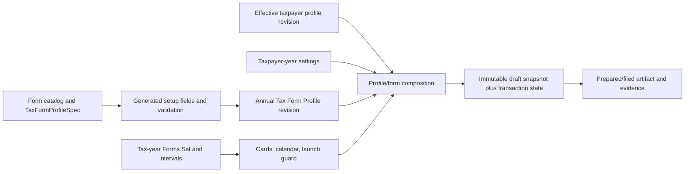

# Tax Profile and Tax Form Profile execution plan

- Date: 2026-08-04
- Starting revision: `abd45c6` on `main`
- Companion audit:
  [`TAX_PROFILE_AND_REGISTRATION_AUDIT_2026-08-04.md`](TAX_PROFILE_AND_REGISTRATION_AUDIT_2026-08-04.md)
- Status: implementation and Milestone 12 workflow acceptance complete on the
  execution branch; the bounded Registration segmented-history P1 and named
  official filing/legal gates remain open

## Document status and precedence

This plan is the execution authority for the work in scope. It deliberately
preserves compatible architecture while superseding older product decisions
that conflict with the user's current direction.

| Document | Status for this work |
| --- | --- |
| This plan | Current milestone order, product contract, acceptance gates, and stop conditions. |
| [Companion audit](TAX_PROFILE_AND_REGISTRATION_AUDIT_2026-08-04.md) | Current defect/evidence baseline at `abd45c6`, including installed build-25 and later `/bir` evidence. |
| [Taxpayer Setup UX Specification](TAXPAYER_SETUP_UX_SPEC_2026-08-04.md) | **Partially superseded.** The §13 verdict, decision D13, and later statements that reject a persistent year-scoped per-form setup layer do not govern this work. Its non-conflicting historical implementation evidence remains useful. |
| [Tax-profile architecture](ARCHITECTURE.md) | Retained. Canonical taxpayer facts, named roles, owned projections, and immutable draft snapshots remain invariants. A Tax Form Profile selects/binds annual setup; it does not duplicate the taxpayer profile. |
| [Earlier implementation plan](IMPLEMENTATION_PLAN.md) | Historical implementation baseline. This plan governs remaining/replacement slices, current gates, and completion claims where scope overlaps. |
| [Tax Form Library, Forms Set, and COR architecture](TAX_FORM_LIBRARY_AND_COR_ARCHITECTURE.md) and [interaction audit](TAX_FORM_LIBRARY_INTERACTION_AUDIT.md) | Retained as domain/history evidence. This plan governs the replacement Tax Profile view/edit, Registration browse/manage, and Tax Form Profile interactions. |

No tax-profile docs index or README exists at the starting revision. These two
paired documents are therefore the canonical entry point; this bounded
Milestone 0 does not create an index or rewrite unrelated historical docs.

## Purpose

Deliver a trustworthy taxpayer setup workflow with:

- a read-only Tax Profile and explicit dirty-aware editor;
- subject/classification-correct fields;
- a read-only Registration & Forms page and explicit Manage Forms mode;
- per-tax-year activation/deactivation;
- a generated Tax Form Profile contract/page for every active, supported editor
  revision and tax year, while persisting a revision stream only when its
  contract contains actual setup values or selections;
- correct ownership of base, annual, form-specific, transaction, and calculated
  values; and
- immutable filing snapshots that record exactly which profile revisions and
  bindings produced a return.

The precedence table above supersedes the old “do not build year-scoped
per-form profiles” decision without discarding the useful architecture already
implemented by PR #14.

## Recorded Milestone 0 baseline

The companion audit recorded the following baseline on clean `main` at
`abd45c6` after generation and a fresh automation-enabled rebuild/relaunch.
These are revision-specific results, not permanent frozen counts:

| Command | Recorded result |
| --- | --- |
| `rtk npm run generate` | deterministic output already current |
| `rtk npm run check:tax-catalog` | passed: 51 codes, 10 editors, 41 `calendar_only` forms, 299 inputs, 72 profile targets |
| `rtk npx native test --yes -Dplatform=null` | passed: 1054 tests, 4 skipped |
| `rtk npx native check . --strict` | passed: 28 markup files and manifest |
| `rtk npx native build . --yes -Dautomation=true` | ReleaseFast automation build passed |

Before each implementation slice, rerun the relevant baseline gates. Stop that
slice when a gate is red for an unrelated reason; report the failure instead of
weakening the gate. If counts change intentionally, the same change must explain
the source/catalog/test delta. A green mechanical baseline does not close any
live interaction defect in the audit.

## Current-branch implementation disposition — 2026-08-04

This section records the implementation now present on
`codex/tax-profile-form-profile-execution`. It is an additive disposition of
the work that followed the `abd45c6` Milestone 0 baseline; it does not rewrite
that baseline or make the original defects disappear retroactively. “Present
in source" below means the behavior and focused contracts exist in the current
working tree. Milestone 12 now records the final full-gate and fresh packaged-app
replay; official/legal gates and the bounded P1 remain separate.

### R1–R14 disposition

| ID | Current source disposition | Milestone 12 proof / residual gate |
| --- | --- | --- |
| R1 | Present: saved Tax Profile opens as semantic read-only values with one `Edit Tax Profile` action; create, view, and edit are distinct modes. | Fresh packaged desktop replay. |
| R2 | Present: existing-profile edits capture a baseline, normalized no-op edits stay clean, clean Save/Cancel are disabled, dirty Cancel restores in place, successful Save returns to view, and dirty navigation uses an explicit Stay/Discard guard. | Full Native suite plus packaged clean/dirty/save/failure/navigation replay. |
| R3 | Present: universal identity/contact values remain base-profile facts; `src/tax_profile/applicability.zig` centrally drives subject/classification visibility and validation, while typed Registration facts are independent effective streams. | Final subject × classification matrix and live visibility replay; official legal requiredness remains evidence-gated. |
| R4 | Present: natural-person classification separates pure compensation, self-employed, and mixed income; Trade Name and personal/business sections are conditional, and business activity is available to self-employed/mixed/business taxpayers. | Packaged self-employed, pure-compensation, and entity replay. Registration currently has the bounded same-anchor limitation described below. |
| R5 | Present: the aggregate active-form warning was removed from Tax Profile. Cards now distinguish missing base facts, Taxpayer-Year settings, Tax Form Profile setup/review, editor availability, and fileability, and route repair to the owning surface. | Packaged navigation replay for each repair route. |
| R6 | Present: Registration & Forms opens in browse mode; only explicit Manage Forms exposes all forms, effectivity, checkboxes, bulk actions, and dirty-aware Save/Cancel. | Packaged browse/manage clean/dirty/Cancel/Save replay. |
| R7 | Present: append-only Forms Set decisions and intervals are tax-year/date scoped. `src/tax_profile/forms_set_resolver.zig` supplies the shared applicability resolver used by card/period availability and filing launch guards; history is retained across deactivation. | Final cross-surface calendar/export/launch replay and 2025/2026 isolation evidence. |
| R8 | Present: normal browse uses active forms; calendar-only forms state that no editor or Tax Form Profile exists; activation, setup readiness, editor availability, and fileability are separate statuses. | Final card census and packaged replay. |
| R9 | Present: the generated catalog emits a deterministic `TaxFormProfileSpec` for all 10 editor revisions, with `setup` versus explicit `no_setup`; non-empty setup revisions are append-only by profile/year/form/revision and empty `no_setup` streams are not manufactured. | Final catalog hash/generation gates and packaged page replay. |
| R10 | Present: Taxpayer-Year settings and Tax Form Profile values are separate append-only domains. The generated consumer contract makes 1701/1701Q share the annual rate/deduction settings and keeps filing/calculated values outside both streams. | Full composition suite; official evidence remains required before adding any new yearly key. |
| R11 | Present: Taxpayer-Year and Tax Form Profile provide explicit prior-year copy, review/confirmation, optimistic conflict handling, history, same-year reactivation review, and exact-year isolation. The schema v20 migration repairs copied Tax Form Profile provenance so its foreign key names the retained source form revision, not the target revision. | Migration/full-suite result and packaged copy/review/reactivation replay. |
| R12 | Present: generic draft provenance records exact taxpayer, year, form-profile, Forms Set, component, catalog, and copied-value identities. Exact 1701Q saves require a frozen v19 provenance sidecar; resume reconstructs the historical taxpayer projection from the named immutable revisions/components and rejects missing or mismatched history instead of substituting current profile state. | Full linked-storage/exact counts, encrypted production key-custody gate, and packaged fresh-save/resume replay. |
| R13 | Present: the sidebar no longer renders RDO; subject buttons use persisted selected semantics rather than a hover-only state. | Desktop and constrained-width visual/accessibility replay. |
| R14 | Present: generation covers 51 codes, all 10 supported editor revisions, 41 explicit calendar-only forms, 325 inputs, and 91 direct profile targets (34 optional). Twenty-six inherited header controls were restored from reviewed source evidence. | Final deterministic catalog gate and signed review of any still evidence-gated official requiredness. This does not establish print or filing parity. |

The third column names the Milestone 12 proof target or a residual external
gate. Workflow proof targets are satisfied by the final evidence table below;
official requiredness, filing, and legal-policy entries remain open exactly
where named.

### Milestone disposition

| Milestone | Current disposition on the branch |
| --- | --- |
| 0 | Baseline/audit contract recorded at `abd45c6`; retained below as historical evidence. |
| 1 | Source-backed ownership census and 91-target generated repair are present. Ambiguous official requiredness remains explicitly gated instead of guessed. |
| 2 | Tax Profile view/edit/dirty navigation and sidebar correction are present in source. |
| 3 | Central applicability, classification, stable activities, and the typed append-only Registration domain are present; the schema v16 migration establishes Registration history independently from profile revisions. |
| 4 | Browse/manage Forms Set interaction, exact-year/date decisions, retained inactive history, and shared availability resolution are present. Registration view/edit also projects components intersecting the selected tax year rather than only those effective on 31 December. |
| 5 | Deterministic generated Tax Form Profile setup contracts, semantic keys, source kinds, validation rules, revision, and SHA are present for all 10 editors. |
| 6 | Append-only Taxpayer-Year settings, effective resolution, read-only/edit modes, copy/review, and optimistic conflict flows are present. |
| 7 | Append-only Tax Form Profile persistence, exact stream identity, activation guards, stable anchor references, history, copy provenance, and v20 source-revision migration are present. |
| 8 | The year/form/revision-scoped Tax Form Profile page, inherited read-only facts, generated selectors, history, readiness, inactive-history handling, and Registration repair/return path are present. |
| 9 | Source-aware draft provenance is present, including the schema v19 exact 1701Q sidecar migration, annual-election validation, immutable historical projection reconstruction, and fail-closed resume. Pre-v19 workspaces retain an explicit legacy path; no provenance is invented for them. |
| 10 | All 10 editors have generated setup-or-`no_setup` contracts and the reviewed recurring-header repairs; all other 41 forms remain explicit calendar-only entries. This milestone does not claim artifact or filing support for those forms. |
| 11 | Prior-year copy/review, same-year reactivation, compatible history, retained inactive history, and optimistic conflict UX are present; schema v20 corrects cross-form-revision copy provenance. |
| 12 | **Verified for the scoped workflow.** Final full gates, exact fresh package identity, desktop and 408×800 Native replays, and Computer Use accessibility inspection are recorded below. This is not a production filing/release claim. |

**P1 — open and bounded: same stable anchor with multiple effective segments
inside one year.** Registration's selected-year projection has one deliberate bounded limitation:
it can preserve and display part-year activity and obligation anchors whose
intervals intersect the chosen year, including a January–June component that
is not effective on 31 December. The current editor does not yet materialize
multiple separately editable segments when the *same stable anchor* changes
more than once inside that year. That case requires a segmented-history editor;
it must not be collapsed, silently overwritten, or described as complete.

### Final workflow acceptance evidence — 2026-08-04

Source under test: working tree on
`codex/tax-profile-form-profile-execution`, based on `abd45c6`. The package
below supersedes every earlier acceptance package. It was produced after the
Registration keyed-loop fix, Tax Form Profile status-tone fix,
`hasValue`/`pickerOpen` edit/picker renderer fix, and exact launch-origin return
context fix.

| Gate | Exact result |
| --- | --- |
| `rtk npm run generate` | Passed; the catalog remained deterministic and `src/app.native` regenerated from 30 ordered sources at 261,427 bytes with 717 bytes free. |
| `rtk npm run check:tax-catalog` | Passed: 51 codes, 10 editors, 41 `calendar_only` forms, 325 owned Native inputs, 91 profile targets (34 optional), 2 visible taxpayer-year targets, 3 consumer forms / 5 consumptions, 4 form-policy targets, 7 `setup` contracts, 3 `no_setup` contracts, and 12 setup values (5 evidence-required). |
| `rtk npx native test . --yes` | Passed: 1,381 of 1,385 tests, 4 intentional skips. Breakdown: 751 application/model passed + 4 skipped; 267 linked profile-store passed; 363 exact-1701Q persistence passed; the model contract executed successfully. Renderer coverage enters Tax Profile view/edit, Registration browse/manage, Tax Form Profile view/edit/picker, and launch-origin Back. |
| `rtk zig build model-contract --summary all` | Passed 5/5 steps. |
| `rtk npx native check . --strict` | Passed 29 markup files plus `app.zon`. The CLI still prints a nonfatal stale `model contract: not yet built` detection warning even beside the successful direct typed contract; structural and markup checks pass. |
| `rtk npx native build . --yes -Dautomation=true` | Passed; `zig-out/bin/ebirforms-zero` built ReleaseFast. |
| `rtk git diff --check` | Passed. |
| Fresh package | `/private/tmp/ebirforms-profile-accepted.yK3m5r/eBIRForms-Acceptance.app`; latest `zig-out/bin/ebirforms-zero` installed into the bundle before signing; `codesign --verify --deep --strict` passed. |
| Packaged executable | `/private/tmp/ebirforms-profile-accepted.yK3m5r/eBIRForms-Acceptance.app/Contents/MacOS/ebirforms-zero`; arm64 Mach-O, 14,758,304 bytes; SHA-256 `5522f810c1b26a364e2f298cf470a890432e68d6ad0a48d2892c67b7aed69cb6`. |
| Launch identity | Exact app PID `67861`; `EBIRFORMS_DATA_DIR=/private/tmp/ebirforms-profile-data.M3NwMd`; cwd `/private/tmp/ebirforms-profile-accepted.yK3m5r/eBIRForms-Acceptance.app/Contents/Resources`; Native publisher PID `67861`. The exact process was stopped after evidence capture and verified absent. |
| Desktop replay | Passed with `dispatch_errors=0`: saved Tax Profile semantic view; clean and dirty Tax Profile actions/Cancel; Registration browse versus Manage; active 1601C readiness; Tax Form Profile inherited facts, edit, opened picker, selected/saved activity, revision history, and Back returning to Registration & Forms. 2025 showed no activity and an unsaved empty year; returning to 2026 restored Consulting, one active form, and ready setup. Capture: `/private/tmp/ebirforms-profile-accepted.yK3m5r/tax-form-profile-desktop-900x1129.png`. |
| 408×800 replay | Passed with `dispatch_errors=0`: phone shell/navigation, stacked inherited values and selector controls, opened picker, history, and clean disabled Cancel/Save remained reachable by scrolling without footer overlap. Capture: `/private/tmp/ebirforms-profile-accepted.yK3m5r/tax-form-profile-compact-408x800.png`. |
| Computer Use | The exact package was inspected through macOS Computer Use at 408×800. Its accessibility tree named `Back to Registration & Forms`, exact 1601C revision/year/effectivity, inherited base facts, the saved Consulting activity, and the clean edit state. Native framebuffer captures were used for visual proof because the deep GPU surface can appear blank to ordinary macOS screenshots. |
| Live regressions closed | Registration loops formerly used dynamic method keys; Tax Form Profile badges emitted invalid variants; edit-only row bindings lacked `hasValue`/`pickerOpen`; Back lost its dashboard sub-section. Each was reproduced in a fresh package, fixed in source fragments/model state, covered by renderer/navigation tests, and replayed in the final package. |
| Residual scope | Registration same-anchor multi-segment editing remains the explicit bounded P1 below. Official PDF/XML fidelity, calculation, submission, signing/key custody, notarization, and distribution remain separate gates. |

The disposition above proves neither legal fileability nor production
readiness. Official PDF/XML parity, calculated/form validation, submission,
signing/key custody, notarization, and distribution remain independent gates.

## Requirement traceability

This table is the handoff from the user's request and supplied screenshots to
an implementation owner and an observable completion gate. Milestones may add
tests, but they may not remove or silently reinterpret a row.

| ID | Requirement/evidence | Audit finding | Owning milestone(s) | Completion evidence |
| --- | --- | --- | --- | --- |
| R1 | Saved Tax Profile is read-only by default with one Edit Tax Profile action | A | 2 | Existing profile opens `viewing`; semantic values, not disabled inputs, render before Edit. |
| R2 | Save and Cancel are disabled when clean; dirty Cancel restores in place; navigation cannot silently discard | A and screenshot 4:24 | 2, 12 | Unit state transitions plus packaged live replay show clean/dirty, Cancel, Save, failure, and leave/discard behavior. |
| R3 | Universal base fields are stored once; personal/entity/business fields follow one subject/classification policy | D and screenshots 4:24/4:26 | 1, 3 | Approved ownership/requiredness matrix and exhaustive subject × classification tests. |
| R4 | Line of Business is available for self-employed/mixed/business subjects; Trade Name is conditional; pure compensation has no irrelevant business section | D and legacy-policy distinction | 1, 3 | Approved evidence rows, hidden inaccessible sections, and round-trip tests without destructive clearing. |
| R5 | Remove the aggregate active-form missing-details warning from Tax Profile and route each issue to its true owner | E and screenshot 4:20 | 8 | Every supported card has persisted-year readiness; missing base facts link to Edit Tax Profile; form setup links to its annual page. |
| R6 | Registration & Forms opens in browse mode; only explicit Manage Forms exposes checkboxes/bulk actions/Save/Cancel | B and screenshot 4:22 | 4 | Browse/manage clean/dirty/Save/Cancel tests and packaged replay. |
| R7 | Activation/deactivation is scoped by tax year and, if exposed, one effective interval drives cards, launch, calendar, and export | G | 4, 11 | 2025/2026 isolation and one date-aware resolver produce identical downstream availability. |
| R8 | Only active forms are normally shown/actionable; calendar-only and unsupported forms remain truthful | B, C, F | 4, 5, 8, 10 | Active browse cards only; 41 calendar-only entries expose no editor/profile action; deactivation preserves history. |
| R9 | A supported form revision gets a generated annual setup contract; non-empty setup is stored by profile/year/form/revision, while `no_setup` creates no empty stream | C and F | 5, 7, 8 | Deterministic setup spec, append-only isolation tests, 2551Q `no_setup`, and at least one evidence-approved non-empty vertical slice. |
| R10 | Shared taxpayer-year elections, form-specific annual setup, and filing transaction/calculated values remain separate | C and F | 1, 5, 6, 10 | Ownership drift checks reject duplicates; 1701/1701Q share one approved yearly election; schedules/amounts stay filing-owned. |
| R11 | Prior-year membership/setup reuse is explicit and reviewable; different years and form revisions never silently mutate each other | C | 6, 7, 11 | Copy/review provenance, optimistic conflict, year isolation, and form-revision compatibility tests. |
| R12 | New drafts snapshot exact effective taxpayer, taxpayer-year, annual setup, selected components, and catalog/form provenance; later edits never rewrite them | C and legacy 2551Q pattern | 9 | 2551Q/1701Q vertical-slice persistence and rehydration tests prove immutable provenance and legacy compatibility. |
| R13 | Remove selected-row RDO leakage and retain/strengthen real selected subject state | I, J, and screenshots 4:26/4:38 | 2, 12 | Sidebar contains no RDO; persistent selected semantics/contrast pass accessibility and packaged visual replay. |
| R14 | Audit all 10 supported editors; keep all 41 catalog-only forms honest | F | 1, 5, 10, 12 | Signed ownership report for every editor control, generated setup-or-`no_setup` contract for all 10, and final catalog drift gate. |

## Working product and architecture contracts

These combine the user's directed behavior with safety constraints from the
current architecture. Exact field ownership and classification details that
still require source evidence are gated explicitly below.

1. **Tax Profile defaults to view mode.** Existing saved facts render as
   read-only values. The only mutation entry point is Edit Tax Profile.
2. **Clean existing-profile edit actions are disabled.** Both Save and Cancel
   are disabled until the draft differs truthfully from its captured baseline.
   Create mode keeps an enabled Cancel action because it exits creation rather
   than reverting a saved baseline.
3. **Cancel never changes the active page.** It restores the baseline and
   returns to the corresponding view mode.
4. **Navigation never silently loses dirty edits.** Leave/discard is explicit.
5. **Profile label and legal name are distinct.** A local label identifies the
   row in the app and defaults to the legal/registered name. It is not filed,
   not the relational key, and does not replace the legal name.
6. **Universal base facts are stored once:** TIN, RDO, subject kind,
   taxpayer/legal registered name, registered address, ZIP, contact number,
   and registered email. Universal ownership does not by itself decide
   requiredness: a reviewed matrix must distinguish new-profile requirements,
   migrated missing values, and active-form readiness without fabricating data.
7. **Self-employed is a natural-person classification.** The canonical stored
   representation is natural person + classification + optional trade/business
   name and activities. `Sole proprietor` may remain a UI shortcut, but not a
   competing persisted legal-person truth.
8. **Conditional sections are hidden when inapplicable.** They are not shown as
   disabled clutter.
9. **Line of Business is available for self-employed and mixed-income users.**
   It is also available to applicable legal/business subjects and hidden for a
   pure-compensation individual with no activity.
10. **Trade/business name is conditional.** It is allowed for applicable
    self-employed/sole-proprietor and legal/business subjects, not universally.
11. **Registration & Forms defaults to browse mode.** Browse shows active cards
    without checkboxes. Manage Forms is an explicit action.
12. **Forms Set is the canonical user-confirmed product activation state.** It
    controls availability in this application but is not legal authority to
    file and cannot bypass validation or registration evidence. Inference and
    COR extraction may propose changes but never silently activate/deactivate.
13. **Activation is tax-year scoped and date-aware.** If the existing `From a
    date` control remains, the same effective interval must drive library,
    editor launch, calendar, export, and new-draft guards.
14. **Only active forms are actionable.** Deactivation blocks new setup edits
    and new filings but preserves historical setup and drafts.
15. **Every supported editor revision receives a generated setup contract.** A
    `no_setup` contract creates no empty revision stream and shows no Edit
    action. The 41 `calendar_only` forms can be active and appear in browse
    mode, but must say that no editor/profile is available.
16. **Annual setup is typed, not a free-form override map.** A Tax Form Profile
    stores only catalog-declared bindings and reusable form/year defaults.
17. **Canonical taxpayer facts are inherited, never copied into Tax Form
    Profile values.** The form page may display them read-only and link to Edit
    Tax Profile.
18. **Shared annual elections live once per taxpayer/year.** If 1701 and 1701Q
    consume the same election, it is not duplicated in each form profile.
19. **Transaction facts stay with the return.** Amounts, schedules, filing
    period, amendment state, payments, penalties, attachments, and calculated
    values are never profile data.
20. **Prior-year setup is never silently carried forward.** Membership seeding
    and per-form `Copy setup from …` are separate, explicit, reviewable actions.
21. **A draft freezes provenance.** Creating a filing snapshots the exact
    applicable taxpayer, taxpayer-year, Tax Form Profile,
    activity/obligation/role, and catalog/form revisions. A `no_setup` form
    does not manufacture a Tax Form Profile revision. Later edits cannot mutate
    the draft.

### Evidence-gated decisions

Milestone 1 must resolve these from official/current/legacy form evidence before
their schema or UI is committed:

- the final natural-person classification enum and migration mapping;
- exact requiredness of ZIP, contact, email, and each conditional base field;
- the precise pure-compensation/business-section applicability matrix;
- which taxpayer-year elections really exist and which forms consume them;
- which forms need spouse, activity, obligation, or other annual bindings;
- which values are genuinely form-specific yearly settings or safe convenience
  defaults; and
- which supported editors have a non-empty setup contract.

Until that evidence is approved, those items are candidates described by the
architecture, not permission to persist guessed values.

## Non-goals

- Do not turn all 41 calendar-only forms into editors in this project.
- Do not claim filing or print/file parity from profile work.
- Do not copy the legacy flat JSON or key relationships by TIN.
- Do not store credentials, email settings, COR binary content, signatures, or
  submission receipts inside tax-profile values.
- Do not refresh existing filing snapshots automatically.
- Do not infer missing annual setup values merely to make a card appear Ready.
- Do not add representative/preparer bindings until an effective-dated party
  and credential aggregate exists; those parties are not necessarily taxpayer
  profiles.
- Do not equate four distinct statuses: product activation, annual-setup
  support/readiness, editor availability, and legal/fileability support.

## Target architecture



The dependency remains one-way: forms declare what they need; taxpayer
profiles never depend on concrete forms. Annual form setup narrows or selects
among truthful reusable components but cannot overwrite canonical identity.

## Ownership model

### Layer 0 — local profile metadata

- stable opaque `profile_id`;
- local display label;
- branch/head-office relationship metadata; and
- archive state.

The local label is editable without creating a tax-fact revision unless the
same edit also changes legal facts.

### Layer 1 — effective taxpayer revision

- universal identity/contact fields;
- truthful subject variant;
- conditional natural-person/entity/estate/trust facts;
- repeated business activities with stable IDs; and
- repeated typed registration obligations with stable IDs and effective
  periods.

Each activity and obligation needs a profile-scoped stable anchor. Effective
revision rows reference that anchor; a Tax Form Profile references the anchor,
not a revision-scoped component row. This permits current effective facts to be
resolved later without pinning annual setup to one taxpayer revision.

Ordinary revisions preserve canonical TIN and broad legal-person class rules
already enforced by
[`src/tax_profile/evolution.zig`](../../src/tax_profile/evolution.zig).

### Layer 2 — taxpayer-year settings

Use for values shared by more than one form in one tax year, such as a legally
recorded annual income-tax election or taxpayer-wide accounting basis. This is
not a form-specific override.

### Layer 3 — Forms Set

Stores active/inactive membership, effective interval, decision source,
evidence references, review state, and append-only decision history for each
taxpayer/year/form revision. All downstream availability consumes the same
resolver. Milestone 4 must add any missing metadata/schema rather than treating
these properties as already implemented.

### Layer 4 — Tax Form Profile

For a non-empty generated setup contract, zero or more append-only annual setup
revisions form a stream keyed by:

```text
(profile_id, tax_year, form_code, form_revision)
```

It stores only generated setup keys such as:

- selected business-activity ID;
- selected registration-obligation ID;
- spouse or other named-profile binding;
- stable form-specific classification; and
- a catalog-approved reusable default or transaction seed.

It does not pin itself to one taxpayer revision. When a filing starts, current
effective facts are resolved and the exact selected component IDs must still
qualify. The draft then records both exact revisions.

### Layer 5 — filing transaction and immutable snapshot

The filing owns period-specific data and copied transaction defaults. It also
owns an immutable projection containing exact source IDs, revision sequences,
catalog keys, and provenance.

### Layer 6 — artifact and evidence

Prepared, queued, submitted, or filed artifacts keep their exact content,
authorizations, receipts, and lifecycle evidence. Profile changes never
rewrite them.

## State machines

### Tax Profile

| State | Visible content | Allowed actions |
| --- | --- | --- |
| `creating` | empty required editor | Save when valid; Cancel exits creation |
| `viewing` | saved values as text | Edit Tax Profile |
| `editing_clean` | inputs equal captured baseline | Save disabled; Cancel disabled |
| `editing_dirty` | changed inputs and field errors | Save if valid; Cancel enabled |
| `saving` | editor locked with progress | no duplicate action |
| `save_failed` | draft retained with error | retry or Cancel |

Transitions:

```text
viewing -> Edit -> editing_clean -> first change -> editing_dirty
editing_dirty -> Cancel -> viewing (baseline restored)
editing_dirty -> Save -> saving -> viewing (new revision visible)
editing_dirty -> navigate -> Discard or Stay
```

Changing subject/classification does not delete saved conditional data in the
draft immediately. On Save, validation explains which components will become
inactive or requires explicit confirmation where data loss would occur.

### Registration & Forms

| State | Visible content | Allowed actions |
| --- | --- | --- |
| `needs_configuration` | neutral empty state | Configure Forms |
| `browsing` | active cards only | Manage Forms; open supported Tax Form Profile |
| `managing_clean` | all catalog cards with staged checkboxes | Save disabled; Cancel disabled |
| `managing_dirty` | staged membership/effectivity | Save; Cancel |
| `saving` | locked manager | no duplicate action |

Opening a configured year must never set `managing_forms = true`. Use the
existing `beginManageForms()` and `cancelManageForms()` APIs, correct their
call sites, and make visibility depend on the actual mode rather than merely
on an open workspace.

### Tax Form Profile

| State | Visible content | Allowed actions |
| --- | --- | --- |
| `calendar_only` | support explanation | no editor/profile action |
| `inactive` | historical summary if one exists | no new edit or filing |
| `inherited_only` | base-fact readiness for a `no_setup` editor | Edit Tax Profile when a shared fact is missing; start/resume when otherwise allowed |
| `needs_setup` | inherited base facts and missing setup | Edit Tax Form Profile |
| `viewing_ready` | inherited facts plus saved setup | Edit Tax Form Profile; start/resume return |
| `editing_clean` | annual setup inputs equal baseline | Save disabled; Cancel disabled |
| `editing_dirty` | changed annual setup | Save if valid; Cancel |
| `saving` / `save_failed` | progress or retained draft | retry or Cancel after failure |

## Data and catalog design

### Subject/classification policy

Add one closed policy module, for example
`src/tax_profile/applicability.zig`, that is consumed by:

- editor section visibility;
- field validation and requiredness;
- subject-change impact preview;
- domain builder acceptance;
- storage adapter decoding; and
- form qualification/projection.

Avoid separate ad-hoc predicates in `main.zig` and markup. Tests must enumerate
every field group across every subject kind and individual classification.

Recommended natural-person classifications:

- pure compensation;
- self-employed/professional;
- mixed income; and
- other/unspecified only when truthful migration requires it.

Do not make a database migration silently reinterpret existing `Individual`
or `Sole proprietor` rows. Migrate to an explicit `classification_unknown`
review state where the source cannot prove the answer.

### Base requiredness and migration

Ownership and requiredness are separate. Every universal field appears on Tax
Profile, but Milestone 1 must assign one evidence-backed rule:

- required to create a new profile;
- required when saving any profile revision;
- conditionally required by an active form/as-of date; or
- optional but base-owned.

Existing null ZIP/contact/email values remain null through migration. The
read-only profile shows `Not recorded`; form readiness links back to Edit Tax
Profile when one is required. Never invent a ZIP, phone, or email. A local
profile label may be backfilled from the existing saved legal/registered name
because that is known local metadata, while the legal value stays unchanged.

### Registration structures

Expand the current narrow registration-fact representation into typed,
repeatable components rather than booleans on one giant struct. At minimum,
model:

- repeatable `RegistrationObligation` kinds for registered tax types,
  VAT/percentage-tax obligations, and withholding obligations;
- a separate agent classification/designation;
- EOPT tier;
- registration activity status;
- special-law/treaty basis; and
- stable business activities/ATCs without collapsing several activities into
  one Line of Business string.

VAT, percentage-tax, and withholding summaries are derived from the obligation
set unless official evidence proves a distinct independently recorded fact.
Do not store the same truth once as an obligation and again as an unrelated
status boolean.

Legacy/COR import can create sourced proposals. User-confirmed values remain
authoritative and reconciliation must preserve manual decisions.

### Generated `TaxFormProfileSpec`

Extend
[`scripts/tax-catalog/catalog.ts`](../../scripts/tax-catalog/catalog.ts#L163)
with a separate setup contract rather than overloading `ReusableField`.

Each setup field declares:

```text
semantic key
value type
named role
required / optional / conditional policy
validation rule
setup ownership
form revision
source evidence
```

Allowed ownership kinds:

- `binding_selection`: stable reference to a named taxpayer-profile role or a
  profile-scoped activity/obligation anchor;
- `yearly_value`: genuinely form-specific annual setting; and
- `transaction_default`: copied as editable seed data when a new return starts.

`transaction_default` is convenience only: its absence never blocks readiness.
A legally required yearly choice belongs to `yearly_value` or taxpayer-year
settings. Amounts, rates, schedules, elections, payments, and calculated values
cannot be transaction defaults. A copied default keeps immutable seed
provenance while the resulting draft value becomes editable filing data.

Generation must emit:

- Zig metadata and typed keys;
- form-profile validation tables;
- a human-readable ownership report;
- drift checks that fail on undeclared setup controls; and
- compatibility metadata used when a form revision changes.

`ReusableField` remains the canonical taxpayer-fact union in
[`src/tax_profile/field.zig`](../../src/tax_profile/field.zig#L345).

### Typed profile projection sources

The current catalog bridge maps a small scalar `ReusableField` vocabulary
one-to-one. Add a typed `ProfileSourceKey` (or equivalent) before expanding
projection. It must distinguish:

- reusable scalar facts;
- subject/classification-derived values;
- business-activity facts selected through stable anchors;
- registration-obligation facts selected through stable anchors; and
- taxpayer-year settings.

These are profile-side sources, not Tax Form Profile setup keys. Composition
uses a setup selection to choose a source; it does not reclassify or copy that
source as annual form data.

### Persistence

Add append-only tables after the current tax-profile schema version 10.
Names may follow repository convention, but the data contract is:

#### `tax_form_profile_revisions`

- stable revision ID;
- owning stable profile ID;
- tax year;
- form code and exact form revision;
- setup-spec revision/hash;
- monotonically increasing sequence with optimistic expected sequence;
- effective-from/effective-until constrained to the tax year;
- source/provenance;
- confirmation timestamp; and
- optional prior-year or prior-form-revision source revision.

#### `tax_form_profile_values`

- owning annual profile revision ID;
- named role;
- semantic setup key;
- value type;
- typed scalar or stable component/profile reference;
- source/provenance; and
- uniqueness on revision/role/key.

#### `taxpayer_year_setting_revisions` and values

Use a separate append-only stream for taxpayer/year elections consumed by
multiple forms. Do not hide these inside an arbitrary “primary” form.

#### Forms Set relationship

Tax Form Profile history is not deleted on deactivation. A write/new-draft
guard must resolve the Forms Set interval first. Referential integrity prevents
cross-profile component bindings.

Every annual setup stream has an `effective_on` resolver. Intervals for the
same stream cannot overlap, and every setup interval must be covered by an
active Forms Set interval for the exact form revision. The page route carries
the activation interval/as-of date being viewed; readiness and launch actions
must display and resolve that same date.

#### Stable component anchors

Add profile-scoped activity and obligation anchor tables. Effective taxpayer
revision components reference those anchors. Tax Form Profile values reference
the anchors and are requalified against the taxpayer revision effective on the
filing date. Existing revision-scoped component IDs remain migration evidence;
they cannot be used as annual references without an explicit anchor mapping.

#### Draft provenance

Do not add annual tags to the existing taxpayer snapshot rows. Those rows
require taxpayer-profile revision and role-binding foreign keys. Keep them
unchanged and add either:

- separate immutable draft tables for taxpayer-year and Tax Form Profile
  snapshots; or
- a normalized snapshot-source table with source-specific foreign keys and
  constraints.

Store copied transaction-default seed provenance separately from the editable
draft value. Existing drafts remain readable; migration must not rewrite their
payload, invent annual-profile provenance, or claim filing overrides are
already supported.

## Page and interaction design

### Tax Profile view

Render semantic value rows, not disabled inputs. Suggested grouping:

1. Identity and registration: local label, TIN, RDO, subject/classification,
   legal/registered name.
2. Registered contact: address, ZIP, contact, email.
3. Subject-specific details: only applicable natural-person/entity/estate/
   trust group.
4. Business activities and registration obligations: only applicable groups,
   with effective dates and source.
5. Revision history/effectivity: collapsed advanced/history area.

Top/right action: Edit Tax Profile. Do not show the aggregate active-form
missing-details card.

### Registration & Forms browse

Header actions:

- tax-year selector;
- Manage Forms; and
- Attach/View COR as evidence, without making COR a save blocker.

Each active card shows:

- form code, title, cadence, and activation interval;
- separate badges for activation, annual-setup support/readiness, editor
  availability, and fileability/support level;
- `Ready`, `Needs setup`, `Missing taxpayer details`, or `Calendar only`;
- View/Edit Tax Form Profile when its generated setup contract is non-empty,
  or a read-only inherited-details view for an explicit `no_setup` contract;
- filing-period actions only when active on the relevant date and setup gates
  pass.

No checkboxes, Select All, Clear All, or Save/Cancel appear in browse mode.

### Manage Forms

Show all 51 catalog codes with support status and staged active/inactive state.
Activation never implies editor support. Search and bulk actions operate only
on the staged set. Dirty count derives from a normalized snapshot, not UI
events.

Deactivation confirmation must state:

- new setup edits and new filings will be blocked for the inactive interval;
- existing drafts and annual profiles are retained; and
- reactivation can reuse compatible setup only after review.

Inactive forms remain absent from normal browse. Manage Forms (or a dedicated
History filter) exposes a read-only View History action when an inactive form
has annual setup or drafts; it never exposes Edit Tax Form Profile or Start
Return for an inactive period.

### Tax Form Profile page

Header:

- form code and title;
- exact form revision;
- tax year;
- activation status/interval;
- support level; and
- readiness.

Sections:

1. `Inherited taxpayer details`: read-only canonical facts with source revision
   and Edit Tax Profile link.
2. `Saved setup for 2026`: generated bindings and annual form settings.
3. `Used when starting a return`: transaction defaults with explicit copy
   semantics.
4. `History`: prior annual setup revisions, source, and copy/review provenance.

View is the default. Edit Tax Form Profile enters a dirty-aware editor. Field
help must explain why the form needs a selection and whether it is inherited,
annual, or merely a new-return default.

## Validation ownership

| Validation | Owning surface | Blocks |
| --- | --- | --- |
| Universal taxpayer facts and subject truth | Edit Tax Profile | profile save |
| Registration/activity consistency | Edit Tax Profile | profile save and dependent form readiness |
| Taxpayer-year election | taxpayer-year settings editor | dependent form readiness |
| Forms Set membership/effectivity | Manage Forms | Forms Set save and launch availability |
| Form/year binding and setup | Tax Form Profile | annual profile save and new filing readiness |
| Period, amounts, schedules, attachments | filing editor | filing save/prepare according to existing gates |
| Calculated totals/rates | policy/form engine | full validation or artifact preparation |
| Submission/fileability | artifact lifecycle | queue/submission only |

A form card may aggregate issues, but every issue links to its owner. Never fix
a missing shared fact by storing a duplicate in the form profile.

## Activation and year lifecycle

### Activate

- Save explicit Forms Set decision and interval.
- A supported editor with a non-empty contract enters `Needs setup` unless a
  compatible confirmed annual profile exists. A `no_setup` editor resolves
  inherited-only base readiness and creates no annual rows.
- Do not invent or auto-confirm setup values.

### Deactivate

- Preserve form-profile revision history and all drafts.
- Block new annual edits and new filing drafts in the inactive interval.
- Existing drafts remain readable. A draft for a filing period that was inside
  the confirmed active interval when created may continue through its existing
  lifecycle; a later deactivation must not invalidate it silently. A retroactive
  decision covering that filing period places the draft in explicit review and
  blocks preparation until resolved. No path deletes it.

### Reactivate in the same year

- For a non-empty contract, find the latest compatible confirmed setup for the
  exact form/setup revision. Show a review screen; reuse only after
  confirmation. A `no_setup` contract has nothing to reuse.

### Start a new tax year

- Existing Forms Set seeding may propose membership only.
- Each supported form with a non-empty contract offers `Copy setup from 2025`
  when compatible.
- Copy creates a new 2026 revision with provenance and requires review.
- Taxpayer-year elections receive their own copy/review flow.

### New form revision

- New revision means a new setup contract.
- Generator emits compatible semantic-key mapping.
- Migration UI lists retained, transformed, and dropped keys.
- Never silently reuse incompatible values.

## Dependency-ordered milestones

### Milestone 0 — Supersede the old contract and lock baselines

Changes:

- establish document status and precedence in this plan and its companion
  audit;
- identify §13, decision D13, and the related rejection of persistent
  year-scoped per-form setup in the existing UX specification as superseded,
  without rewriting that historical document;
- record the exact baseline commands/results and the reproduced live failures;
- map every supplied screenshot and directed requirement to an owning
  milestone and observable completion evidence; and
- state the global and milestone-specific stop conditions. A reviewable commit
  is never left red.

Primary files:

- `docs/tax-profile/TAX_PROFILE_AND_REGISTRATION_AUDIT_2026-08-04.md`
- `docs/tax-profile/TAX_PROFILE_AND_FORM_PROFILE_EXECUTION_PLAN_2026-08-04.md`

There is no tax-profile index or README at the starting revision. Milestone 0
therefore does not create one, edit source/generated files, alter the ownership
matrix, or rewrite unrelated historical documents merely to add backlinks.

Acceptance:

- the paired audit and plan link to one another and state which earlier
  decisions are partially superseded;
- every baseline command has its exact recorded result and all current live
  defects remain explicitly distinct from the green mechanical gates;
- requirements R1–R14 map the user's request and screenshots to an owning
  milestone and completion proof;
- global and per-milestone stop conditions prevent guessed policy, weakened
  gates, or premature completion claims; and
- the Milestone 0 patch touches only the two documentation files named above,
  with no source, persistence, catalog, generated, ownership-matrix, or
  historical-doc changes attributed to this milestone.

Stop if resolving a contradiction would require rewriting an unrelated
historical document or source file inside this bounded milestone, if baseline
provenance cannot be reconciled, or if an evidence-gated decision would have to
be presented as approved fact.

Stop if the expected behavior cannot be expressed without weakening immutable
revision or draft invariants.

### Milestone 1 — Authoritative field ownership for all 10 editors

Compare current Native controls, the `/bir` constructors, installed behavior,
and official form evidence already held by the project. Produce one reviewed
matrix for every input and static recurring header.

Correct known gaps first, including 0605 ATC/tax-type misclassification. Mark
each value as:

- universal profile;
- subject-conditional profile;
- registration component;
- taxpayer-year setting;
- Tax Form Profile binding/yearly/default;
- filing transaction;
- calculated/display; or
- signature/evidence.

For every base/conditional value, also record create/save/form-conditional/
optional requiredness and migration behavior for an existing null.

Primary files:

- `scripts/tax-catalog/catalog.ts`
- `scripts/tax-catalog/generate.ts`
- `docs/tax-profile/FORM_FIELD_CATALOG.md` (generated)
- the 10 source fragments under `src/pages/forms/`

Acceptance:

- every supported editor control has one owner and evidence;
- undeclared or ambiguous controls fail generation;
- all 41 calendar-only entries remain explicit; and
- no annual-profile table is built from an unreviewed catalog.

Stop on any form field whose legal meaning cannot be established. Record it as
unsupported rather than guessing.

### Milestone 2 — Tax Profile view/edit and sidebar correction

Add the explicit profile mode and baseline fingerprint. Build a semantic
read-only view, dirty-aware editor footer, discard guard, and stable local
profile label. Remove RDO from the sidebar row.

Primary files:

- `src/tax_profile/ui_state.zig`
- `src/main.zig`
- `src/pages/profile-setup.native`
- `src/pages/taxpayer-dashboard-page.native`
- `src/components/shell.native`
- profile metadata/store adapter files if label persistence is added

Acceptance:

- existing profile opens read-only;
- Edit -> clean -> dirty -> Cancel/Save transitions match the state table;
- Cancel remains on Tax Profile;
- dirty navigation requires explicit discard;
- no-op Save cannot be invoked; and
- sidebar never shows RDO;
- local labels backfill from the saved legal/registered name when that source
  exists, without changing the legal value; and
- migrated missing ZIP/contact/email values remain explicitly `Not recorded`
  until entered—no placeholders are persisted.

### Milestone 3 — Subject/classification and repeatable registration domain

Add the central applicability policy, individual classification, conditional
Trade Name/Line of Business, repeatable activities, typed registration
obligations, profile-scoped component anchors, and safe migration/review
states.

Primary files:

- `src/tax_profile/model.zig`
- `src/tax_profile/editor.zig`
- new `src/tax_profile/applicability.zig`
- `src/tax_profile/capability.zig`
- `src/tax_profile/projection.zig`
- `src/tax_profile/persistence_adapter.zig`
- `src/tax_profile/store.zig`
- `src/pages/profile-setup.native`
- `src/main.zig`

Acceptance:

- every subject/classification matrix cell has a test;
- corporation hides individual capabilities;
- self-employed and mixed-income expose Line of Business;
- compensation-only hides business sections unless an activity exists;
- applicable business/legal profiles can hold Trade Name;
- multiple activities and obligations round-trip; and
- activity/obligation anchors remain stable across taxpayer revisions and
  resolve to the component effective on a requested date;
- changing classification does not silently erase data.

### Milestone 4 — Registration browse/manage and authoritative intervals

Make browse mode reachable, wire explicit Manage Forms actions, and use the
same date-aware Forms Set resolver everywhere. Add any missing append-only
decision source, evidence-reference, review-state, and inactive-history
storage required by the Layer 3 contract.

Primary files:

- `src/tax_profile/ui_state.zig`
- `src/tax_profile/store.zig`
- `src/main.zig`
- `src/pages/profile-setup.native`
- `src/pages/taxpayer-dashboard.native`
- calendar/library/export adapters consuming Forms Set

Acceptance:

- configured year opens browse mode;
- clean Manage Forms disables Save and Cancel;
- changed Cancel visibly returns to browse and restores membership;
- Save returns to browse with updated active cards;
- 2025 and 2026 remain isolated;
- active intervals agree across cards, editor launch, calendar, and export;
- decision source/evidence/review history round-trips and manual decisions
  survive reconciliation;
- Manage Forms/History can open retained inactive history read-only;
- explicit-empty Forms Set remains fail-closed; and
- R&F never infers activation silently.

### Milestone 5 — Generate the annual setup contract

Add `TaxFormProfileSpec`, setup keys, validators, compatibility metadata, and a
generated review report. Start with two vertical-slice forms:

- 2551Q, proving an explicit `no_setup` contract: its seven inherited header
  fields come from the taxpayer profile and Schedule 1 cannot enter annual
  setup; and
- 1701Q, proving only the spouse/activity/year-election separations established
  by Milestone 1 evidence. Select 1702RT/MX or 2550Q as the second persisted
  annual-setup example only if that audit confirms a genuine form-specific
  yearly value.

Primary files:

- `scripts/tax-catalog/catalog.ts`
- `scripts/tax-catalog/generate.ts`
- generated `src/forms/generated/catalog.zig`
- new generated annual-profile report under `docs/tax-profile/`
- new domain module such as `src/forms/tax_form_profile_spec.zig`
- `src/forms/catalog_projection.zig` and the new typed profile-source bridge

Acceptance:

- malformed/duplicate setup specs fail generation or compilation;
- no setup key duplicates or overrides a Layer 1/Layer 2 fact, derived profile
  value, activity fact, or registration obligation;
- 2551Q Schedule 1 keys cannot enter the annual spec;
- 1701Q annual election is taxpayer/year-owned, not copied per form; and
- setup-spec hash/revision is deterministic.

### Milestone 6 — Taxpayer-year settings

Implement the Layer 2 domain, append-only store, effective resolver, editor,
optimistic conflicts, and explicit copy/review flow before annual readiness or
draft composition consumes it. Only settings approved by Milestone 1 enter
this layer.

Primary files:

- new `src/tax_profile/taxpayer_year_settings.zig`
- `src/tax_profile/store.zig`
- `src/tax_profile/persistence_adapter.zig`
- `src/tax_profile/ui_state.zig`
- a focused Native page/section linked from Profile Settings
- projection/composition source-key modules

Acceptance:

- profile/year is the stable stream key;
- effective intervals do not overlap;
- 2025 and 2026 resolve independently;
- stale expected sequence conflicts preserve the user's draft;
- explicit prior-year copy records source revision and requires review;
- missing required settings appear only for consuming active forms; and
- no taxpayer-year setting is duplicated into a Tax Form Profile.

### Milestone 7 — Append-only Tax Form Profile persistence

Add migrations, domain types, optimistic append, owner isolation, activation
guards, and explicit prior-year/revision provenance.

Primary files:

- new `src/tax_profile/tax_form_profile.zig`
- `src/tax_profile/store.zig`
- `src/tax_profile/persistence_adapter.zig`
- linked store tests

Acceptance:

- exact key is profile/year/form/form-revision;
- two years can hold different values;
- duplicate semantic keys and overlapping effective periods fail;
- each interval is covered by the exact active Forms Set interval and resolves
  through `effective_on`;
- stale expected sequence conflicts;
- cross-profile component references fail;
- activity/obligation values reference profile-scoped anchors rather than
  revision-scoped component rows;
- deactivation preserves history and blocks new writes;
- explicit prior-year copy creates a new reviewed revision; and
- existing v10 stores migrate without mutating drafts.

### Milestone 8 — Tax Form Profile page and form-scoped readiness

Add navigation, read-only page, edit state, inherited base-fact panel,
generated annual fields, history, and card readiness. Remove the aggregate
warning from Tax Profile only after every supported editor card has at least
base-fact readiness, including explicit `no_setup` contracts.

Primary files:

- `src/main.zig`
- new `src/pages/tax-form-profile.native`
- `src/pages/taxpayer-dashboard.native`
- `src/pages/profile-setup.native`
- `src/tax_profile/ui_state.zig`
- form-profile domain/state modules

Acceptance:

- all 10 supported editor cards show truthful base-fact readiness;
- active 2551Q shows inherited-only `no_setup` behavior without empty rows or
  an Edit action;
- forms with non-empty contracts show the correct annual readiness state;
- inherited values are read-only and link to Edit Tax Profile;
- clean form-profile Save/Cancel are disabled;
- form-specific missing settings are fixed on this page;
- missing base facts link to their owner;
- inactive forms cannot edit;
- calendar-only forms do not claim a profile; and
- readiness uses the viewed tax year and persisted effective revisions.

### Milestone 9 — Draft composition and provenance vertical slice

Resolve Taxpayer Profile + applicable taxpayer-year settings + an optional
non-empty Tax Form Profile before creating 2551Q and 1701Q drafts. Snapshot
exact revisions and component bindings in source-appropriate immutable tables;
seed transaction defaults separately.

Primary files:

- `src/forms/compose.zig`
- `src/forms/ui_state.zig`
- `src/forms/persistence_adapter.zig`
- `src/forms/form_2551q.zig`
- `src/forms/form_1701q.zig`
- relevant exact form-engine adapters and draft streams

Acceptance:

- 2551Q does not require or manufacture an annual profile revision;
- a form with required annual setup refuses missing/incompatible setup;
- draft records all applicable exact revision IDs and sources without
  overloading taxpayer snapshot foreign keys;
- transaction defaults become filing-owned after copy;
- later profile/form-profile edits do not alter the draft;
- existing drafts rehydrate without annual-profile rows; and
- 1701Q annual provenance integrates into its exact `form_engine` draft stream
  and never creates a coarse legacy `tax_form_drafts` row; and
- submitted/prepared lifecycle invariants remain unchanged.

### Milestone 10 — Extend the remaining eight supported editors

Implement only after their Milestone 1 ownership rows are approved. Add annual
setup where the form genuinely needs it; otherwise show inherited details and
`Ready` without an empty form-profile editor.

Order by boundary value:

1. 0605, to prove payment-specific ATC/tax-type ownership;
2. 1601C and 0619E/F, to prove withholding obligation/activity selection;
3. 1701, to share taxpayer-year election with 1701Q;
4. 1702RT/MX, to prove entity/accounting setup;
5. 2550Q, to prove VAT/EOPT registration bindings.

Acceptance:

- all 10 editor revisions have generated setup or an explicit no-setup
  contract;
- full recurring base headers are projected;
- no transaction or calculated control is promoted; and
- the other 41 forms remain honestly calendar-only.

### Milestone 11 — Lifecycle, copy, and form-revision migration UX

Implement explicit prior-year copy, same-year reactivation review, form-spec
compatibility review, historical read-only views, and conflicts from concurrent
edits.

Acceptance:

- copy/reuse is always explicit and provenance is visible;
- incompatible form revisions never silently inherit;
- historical setup remains readable after deactivation or catalog upgrade;
- inactive history is reachable only through Manage Forms/History and remains
  read-only outside periods previously confirmed active;
- optimistic conflicts preserve the user's draft and offer reload/review; and
- no activation action deletes data.

### Milestone 12 — Full workflow acceptance and package evidence

Rebuild and relaunch the packaged application. Replay all screenshot scenarios
and every state/subject/year/activation path below with Computer Use and Native
automation at desktop and constrained widths.

This milestone proves the feature, not production filing readiness. Submission,
official print parity, signing, notarization, and distribution remain separate
release gates.

## Required test matrix

### Tax Profile state

- existing profile opens read-only;
- Edit starts clean with both actions disabled;
- normalized no-op input stays clean;
- one change enables Save and Cancel;
- Cancel restores every field and stays on Tax Profile;
- Save appends exactly one revision and returns to view;
- failed Save retains the draft;
- navigation offers Stay/Discard and never silently discards; and
- create mode has its own truthful cancel semantics.

### Field applicability

- every subject kind × classification × field-group cell;
- corporation hides birth/citizenship/foreign TIN;
- natural person exposes those fields;
- self-employed and mixed income expose Line of Business and applicable Trade
  Name;
- pure compensation hides business sections without activity;
- legal entities expose applicable business/entity fields;
- values survive a canceled subject/classification switch; and
- multiple activities/obligations are selectable and round-trip.

### Registration & Forms

- configured year opens browse mode;
- active cards only, no browse checkboxes;
- Manage Forms explicitly enters management;
- clean Save and Cancel disabled;
- activation/deactivation stages without immediate effects;
- Cancel restores and exits management;
- Save applies and exits management;
- 2025 changes do not alter 2026;
- explicit-empty remains empty;
- missing year remains unconfigured rather than falling back broad; and
- effective-date behavior matches library, launch, calendar, and export.

### Tax Form Profile

- inactive forms are absent from normal browse but retained history is
  read-only through Manage Forms/History; calendar-only forms reject profile
  access truthfully;
- active supported form enters inherited-only, Needs setup, or Ready according
  to its generated contract;
- clean/dirty/Cancel/Save state transitions;
- 2025 and 2026 values are independent;
- exact form revisions are independent;
- shared base facts cannot be persisted as annual values;
- component references are profile-owned and effective;
- deactivation preserves history but blocks new edits/drafts;
- same-year reactivation requires compatibility review;
- prior-year copy is explicit and records provenance; and
- missing readiness uses the open year and persisted revisions.

### Draft integration

- taxpayer and every applicable year/form profile revision are snapshotted in
  source-appropriate immutable tables;
- bindings snapshot exact activity/obligation/profile IDs;
- taxpayer-year settings snapshot exact revision;
- transaction defaults copy with seed provenance and then become filing-owned;
- existing draft is unchanged after any profile update;
- existing legacy draft rehydrates without fabricated annual setup;
- 2551Q Schedule 1 remains transaction-owned;
- 0605 ATC/tax type remain payment-owned;
- 1701Q spouse/activity roles remain explicit and exact 1701Q never writes a
  coarse legacy `tax_form_drafts` row; and
- form revision incompatibility fails closed.

### Visual/accessibility

- all five supplied screenshot scenarios replayed;
- selected subject has persistent selected semantics and sufficient contrast;
- entire inapplicable sections are absent from accessibility tree;
- keyboard focus order follows visible groups;
- action labels distinguish Edit Tax Profile, Manage Forms, and Edit Tax Form
  Profile;
- empty, error, inactive, and calendar-only states are visible and announced;
- phone/compact/desktop layouts do not cover sticky actions; and
- relaunch uses the rebuilt binary and isolated audit data directory.

## Verification commands

All commands follow the repository RTK requirement.

```sh
rtk npm run generate
rtk npm run check:tax-catalog
rtk git diff --check
rtk npx native test --yes -Dplatform=null
rtk npx native check . --strict
rtk npx native build . --yes
```

For automation builds and live acceptance:

```sh
rtk npx native build . --yes -Dautomation=true
rtk npx native automate snapshot
rtk npx native automate screenshot main-canvas
```

Then package a unique bundle, launch its exact executable from a separate
session with an isolated data directory, and verify the running process path
before trusting Computer Use captures:

```sh
acceptance_bundle_root="$(mktemp -d /private/tmp/ebirforms-profile-app.XXXXXX)"
acceptance_data_root="$(mktemp -d /private/tmp/ebirforms-profile-data.XXXXXX)"
rtk npx native package --target macos --output "$acceptance_bundle_root/eBIRForms-Acceptance.app" --binary zig-out/bin/ebirforms-zero --assets assets --signing adhoc
rtk shasum -a 256 "$acceptance_bundle_root/eBIRForms-Acceptance.app/Contents/MacOS/ebirforms-zero"
rtk env EBIRFORMS_DATA_DIR="$acceptance_data_root" "$acceptance_bundle_root/eBIRForms-Acceptance.app/Contents/MacOS/ebirforms-zero"
```

Resolve and terminate only the exact prior acceptance PID before relaunching;
never use a broad process match. Record the absolute executable path and hash
in the acceptance evidence so a stale installed/running binary cannot satisfy
the gate.

Never edit generated `src/app.native` directly. Edit source fragments under
`src/components/`, `src/pages/`, and `src/app-root.fragment`, then run
`rtk npm run generate` and commit the deterministic generated output.

Before a PR is called complete, also compare the intended branch range and
confirm the worktree contains no unrelated changes:

```sh
rtk git status --short
rtk git diff --stat main...HEAD
rtk git diff --check main...HEAD
```

## Original recommended integration slices (historical)

Keep each slice reviewable and preserve one-writer ownership of shared files:

1. specification supersession + green acceptance-test scaffolding;
2. catalog ownership corrections;
3. Tax Profile view/edit + sidebar;
4. subject/classification/registration domain and migration;
5. Registration browse/manage + date-aware authority;
6. generated source/setup contracts;
7. taxpayer-year settings domain/store/UI;
8. Tax Form Profile store;
9. Tax Form Profile page + readiness;
10. 2551Q/1701Q draft provenance vertical slice;
11. remaining eight editors; and
12. copy/migration UX + full packaged acceptance evidence.

`src/main.zig`, `src/tax_profile/ui_state.zig`, and
`src/pages/profile-setup.native` are high-conflict files. Parallel work should
own disjoint modules and merge through one integration writer for those three
files.

## Stop conditions

Stop the affected slice and report evidence when:

- an official/legacy field meaning is ambiguous;
- a proposed annual field duplicates a canonical fact;
- a proposed profile field is actually transaction/calculated/evidence data;
- migration cannot preserve an existing row truthfully;
- a form-profile reference can cross taxpayer ownership;
- a date-aware activation result differs between library, launch, calendar, or
  export;
- a change would rewrite an existing draft snapshot;
- a calendar-only form would be presented as editor-supported; or
- any baseline gate regresses for unrelated reasons.

Do not substitute a placeholder, inferred value, or broad fallback to make a
test pass.

## Definition of done

This project is complete only when:

1. the old no-annual-profile decision is visibly superseded;
2. every supported form control has approved ownership;
3. Tax Profile and Registration & Forms state machines pass unit and live
   acceptance tests;
4. subject/classification visibility is centralized and exhaustive;
5. annual form-profile schema, page, history, and activation guards work for
   all 10 supported editors or each editor has an explicit no-setup contract;
6. base facts are inherited rather than duplicated;
7. annual setup and taxpayer-year choices remain isolated by year;
8. filing drafts snapshot exact provenance and never mutate afterward;
9. deactivation preserves history while blocking new work;
10. catalog-only forms remain honestly unsupported as editors;
11. generation, catalog drift, Native tests, strict checks, ReleaseFast build,
    and clean diff gates all pass; and
12. rebuilt packaged-app Computer Use replay closes every in-scope defect
    committed to this workflow release and records the accepted open
    Registration segmented-history P1 above without presenting it as closed.

Passing this definition means the implemented setup workflow is verified, with
the explicitly bounded Registration segmented-history P1 still open.
It does not by itself mean every return is fileable or that the product is
production-ready.
