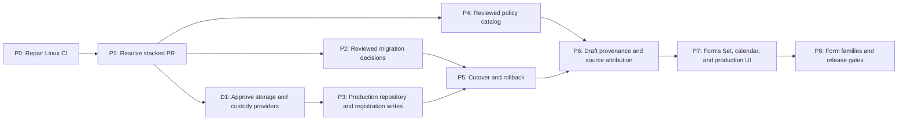

# TIN/branch findings remediation and productionization plan

- **Status:** execution-ready follow-up to PR #23
- **Date:** 2026-08-10
- **Implementation baseline:** `codex/tin-branch-filing-scope` at `5337b43`
**Dependency:** documentation PR #22 and implementation PR #23

## Objective

Close the two PR #23 Linux defects without expanding that pull request, then
deliver production multi-branch identity and filing scope through small,
dependency-ordered pull requests. The final result must preserve evidence-gated
Branch Codes, fail-closed filing decisions, immutable draft provenance, and the
separation between workspace preference, legal obligation, fileability, and
release readiness.

PR #23 remains a session-only fixture-preview slice until every production gate
below passes. Green CI alone must not promote it to production, fileable, or
release-ready.

## Current truth

- PR #23 implements canonical `Tin9`, Registration Units, reviewed evidence,
  source filtering, fail-closed 2550Q planning, transient scope provenance, and
  a read-only non-fileable preview.
- The macOS quality gate and both setup jobs pass. The Linux quality gate fails
  because of two deterministic cross-platform test defects.
- Normal application execution has no production registration-write authority.
  The writable path is limited to the explicitly owned fixture-preview store.
- The production filing-policy catalog is empty. Only a non-production 2550Q
  fixture policy exists.
- The migration inventory is deliberately read-only; there is no authorized
  decision ledger, cutover, reconciliation, or rollback implementation.
- Production local storage is a separate prerequisite. ADR-0001 keeps it
  unavailable until an authenticated storage backend and operating-system key
  custody provider are selected, implemented, and qualified.

## Non-negotiable invariants

1. One Taxpayer owns one nine-digit TIN Root; Registration Units are not legal
   taxpayer duplicates.
2. `00000` and suggested branch codes are not filing-capable until confirmed by
   accepted registration evidence.
3. Forms Set remains a workspace preference and never creates, suppresses, or
   proves a Filing Obligation.
4. Source Unit, workspace selection, Filing Unit, Return Coverage, venue, and
   deadline remain separate decisions.
5. Unknown, conflicting, stale, or incomplete evidence returns ordered
   `Review Required` issues. No fallback may guess.
6. Existing drafts and artifacts retain their original bytes and provenance.
7. Migration uses a reviewed, write-frozen transactional cutover. No dual
   writes and no silent merge are allowed.
8. Editor support, preview fidelity, fileability, submission authority, and
   release readiness remain independent gates.
9. Production storage cannot be enabled through a runtime flag, environment
   variable, plaintext fallback, or unqualified provider.

## Delivery strategy

Use the existing seams rather than creating parallel production logic:

- `RegistrationLedger` remains the deep module for registration history and
  coherent planning snapshots.
- `FilingPlanner` remains the only public planning interface.
- `FilingProjectionContext` and immutable scope provenance remain the only
  route from a resolved obligation into a form draft.
- `ProductionRepositoryFactory` remains the production repository-opening
  interface. A selected authenticated adapter and a fault-injection test adapter
  must exercise the same interface.
- One obligation-projection module should feed form launch, Forms Set
  presentation, taxpayer calendar, and export. Do not duplicate obligation
  logic in four callers.
- Tests assert observable results through these interfaces. Internal helper
  tests may remain only where filesystem or SQLite fault behavior cannot be
  observed cleanly through the public interface.



Policy research and zero-write migration analysis may run in parallel with the
storage decision. No production write, cutover, or fileable draft may bypass
its incoming dependency.

### Proposed pull-request breakdown

| Phase | Suggested branch | Review boundary |
| --- | --- | --- |
| P0 | current `codex/tin-branch-filing-scope` | Linux portability fixes only |
| P2 | `codex/tin-branch-migration-decisions` | deterministic inventory and reviewed decisions, zero writes |
| P3 | `codex/production-registration-repository` | approved authenticated repository and durable ledger authority |
| P4 | `codex/filing-policy-catalog` | generated evidence-linked policies, starting with exact 2550Q |
| P5 | `codex/tin-branch-reviewed-cutover` | backup, write freeze, cutover, reconciliation, rollback |
| P6 | `codex/filing-scope-draft-provenance` | immutable drafts and source-attributed schedules |
| P7 | `codex/tin-branch-obligation-ui` | Forms Set/calendar projection and production UI/UX |
| P8 | one `codex/<form>-filing-scope` branch per exact revision/family | form-specific policy through release evidence |

P2 and P4 may branch independently after PR #23. P5 must integrate reviewed
P2 and P3 results; P6 must integrate P4 and P5. Do not create a long-lived
stack whose base contains unapproved storage or policy work.

## P0 — repair PR #23 Linux CI

**Pull-request scope:** amend PR #23 only. Prefer one small fix commit.

**Expected files:** `src/tax_profile/store.zig` and
`src/tax_profile/registration_evidence_store.zig`.

### Work

1. In `syncRegistrationFixtureDirectory`, do not wrap an arbitrary
   `std.Io.Dir.handle` and call `File.sync` directly. On Linux the supplied
   test directory may be opened with `O_PATH`, so `fsync` returns `EBADF`.
2. Reopen `"."` handle-relatively from the supplied directory with iteration
   enabled and symlink following disabled. Sync that descriptor, close it, and
   preserve the current Windows-specific behavior. Do not skip Linux durability
   and do not swallow `EBADF`.
3. Keep fixture ownership, marker ordering, claim identity, and descriptor-
   relative confinement unchanged.
4. Make the evidence-store `PathTooLong` test construct a path strictly longer
   than `protected_path_buffer.len - protected_suffix_len`. Do not depend on
   macOS versus Linux `PATH_MAX` values.
5. Preserve the assertion that rejection occurs before any destination
   mutation.

### Verification

```sh
rtk zig build test-storage-linked --summary all
rtk npx native test . --yes -Dplatform=null
rtk just verify
rtk git diff --check
rtk git status --short
```

Run the GitHub macOS and Linux quality gates after pushing the focused fix.

### Acceptance

- All fixture-directory cases pass in the standard and both linked test roots.
- Zero tests fail or crash; Linux contains no `EBADF` panic.
- The path-length test returns `PathTooLong` on both macOS and Linux.
- No generated output, dependency, UI, policy, or domain behavior changes.
- All four PR checks are green at the PR tip.

### Stop conditions

- Stop if reopening `"."` changes directory identity, claim ordering, or
  descriptor-relative confinement.
- Stop and diagnose any remaining filesystem error; do not add an error catch
  merely to turn CI green.
- Do not combine productionization work with this fix.

## P1 — resolve the stacked pull request safely

1. Merge PR #22 first and fetch the resulting `main`.
2. If `3f530be` is an ancestor of `origin/main`, retarget PR #23 to `main`.
3. If PR #22 was squash-merged or rebased, transplant only PR #23's
   implementation and P0 fix commits onto the updated `main`. Compare the
   resulting diff with the stacked diff before any force push; use
   `--force-with-lease`, never an unconditional force.
4. Rename the PR to make the ceiling explicit, for example:
   `Add fixture-preview multi-branch TIN and filing-scope slice`.
5. Keep it draft until the dependency is resolved, CI is green, and the final
   diff contains only the intended fixture-preview implementation.

### Acceptance

- The PR base is `main` and the documentation diff is not duplicated.
- `git diff origin/main...HEAD` matches the intended implementation scope.
- CI is green on the retargeted tip.
- The PR body still says `fixture-preview-ready only`.

## D1 — approve production storage and key custody

This is an external authority gate, not a code default. The current decision
packet recommends a technical baseline but deliberately selects no provider.

### Required decisions

- authenticated SQLite backend and exact licensed/versioned artifact;
- operating-system custody provider and user/machine/application binding;
- recovery, rotation, backup, restore-lineage, and legacy-plaintext transition
  policy;
- supported production architectures and qualification evidence;
- handling of database, WAL, shared-memory, journals, temporary spill,
  backups, migration copies, and wrapped-key metadata.

### Acceptance

- Security/product/procurement owners approve one source-pinned provider and
  custody design.
- ADR-0001 and the decision packet are updated through a dedicated reviewed PR.
- No runtime provider selector or plaintext fallback is introduced.

### Stop condition

Do not start P3 or claim production persistence until this decision is approved.
P2 and P4 may continue because they remain zero-write or fail-closed.

## P2 — reviewed migration decisions, still zero-write

**Primary anchors:**
`src/tax_profile/registration_migration_inventory.zig`,
`src/tax_profile/store.zig`, and the existing profile/draft adapters.

### Work

1. Deepen the current inventory module into one deterministic interface that
   produces a masked inventory, a complete stream disposition, and a proposed
   decision bundle without modifying the repository.
2. Add a versioned `MigrationDecision` format with reviewer identity, evidence
   references, source/target identities, reason, and explicit blocked state.
3. Inventory every legacy profile, revision, Forms Set history, taxpayer-year
   record, relationship, COR reference, generic draft, exact draft, calendar
   mapping, and existing v28 target row.
4. Validate that no Forms Set checkbox becomes a Tax-Type Registration and no
   short suffix is padded into a Branch Code.
5. Produce deterministic masked reports and review queues for conflicts.

### Acceptance

- Two runs over each schema fixture are byte-identical and perform zero writes.
- Every persisted stream and runtime caller has a disposition.
- Conflicting taxpayer facts, legacy suffixes, or pre-existing target rows are
  blocked visibly rather than merged.
- Evidence/document contents are not exposed in reports.

### Stop conditions

- Any unclassified stream blocks P5.
- Any non-deterministic report or observed write blocks review approval.

## P3 — production repository and registration-write authority

**Primary anchors:** `src/security/repository_opening.zig`,
`src/security/key_custody.zig`, `src/tax_profile/store.zig`,
`src/tax_profile/registration_ledger.zig`,
`src/tax_profile/registration_evidence_store.zig`, and `src/main.zig`.

### Work

1. Implement the approved authenticated repository adapter behind the existing
   `ProductionRepositoryFactory` interface. Add a fault-injection test adapter;
   development plaintext is not a production adapter.
2. Cover the full shared calendar/tax-profile repository and all sidecars and
   copies named by ADR-0001 before SQL or PRAGMA access.
3. Mint production registration-write authority only after repository
   authentication, schema qualification, recovery/transition reconciliation,
   and operational-readiness checks pass.
4. Reuse the existing `RegistrationLedger` command interface for fixture and
   production storage. Do not create a second production ledger.
5. Keep evidence copies handle-relative and bind their verified digest/reference
   to accepted evidence records atomically.
6. Preserve fail-closed startup for missing, corrupt, swapped, replayed,
   unsupported, or revoked custody/repository state.

### Acceptance

- Production opens only through the source-selected authenticated adapter.
- Each failure stage proves that later callbacks and SQL are not reached.
- Create/reopen, crash recovery, tamper, swap, replay, rotation, backup, and
  restore-lineage scenarios pass on every supported architecture.
- No production path can obtain the development plaintext capability.

## P4 — generated, evidence-linked production filing policies

**Primary anchors:** `src/filing/policy.zig`, `src/filing/planner.zig`, the tax
catalog generator, and the guide's source register.

### Work

1. Define a generated policy-source register with exact form revision, civil
   period, effective interval, issuance/effectivity evidence, review status,
   lifecycle, and expiry/revalidation metadata.
2. Make generation reject missing form codes, overlapping intervals, stale or
   unreviewed evidence, and actionable candidate policies.
3. Promote the exact 2550Q revision only after tax/legal review; keep the
   isolated fixture policy separate.
4. Add sourced policies incrementally for income/VAT, percentage tax,
   withholding/LTS overrides, and parent-artifact inheritance. Unsupported or
   unresolved families remain explicit `Review Required` entries.
5. Exercise policy selection only through the `FilingPlanner` interface.

### Acceptance

- Production catalog entries are generated and evidence-linked; test fixtures
  cannot enter the production catalog.
- Planner tests cover consolidated, per-unit, LTS, mid-period, missing-policy,
  duplicate-coverage, special-context, and deterministic-hash cases.
- Exact open evidence gaps remain blocked and visible.

## P5 — reviewed transactional cutover and rollback

**Dependencies:** D1, P2, and P3.

### Work

1. Add protected backup and repository identity verification before write
   freeze.
2. Add an explicit write-freeze UI/state and reject legacy and target writes
   outside the cutover transaction.
3. Apply only approved decisions in one idempotent transaction, recording
   immutable old-to-new mappings and reconciliation totals.
4. Preserve blocked groups unchanged and visible.
5. Inject failures at every checkpoint and rehearse rollback/restore before any
   post-cutover write is allowed.
6. Remove the old write path when cutover is accepted; do not add dual writes.

### Acceptance

- Safe records reconcile exactly; blocked records remain untouched.
- Old generic and exact drafts reopen byte-for-byte unchanged.
- Re-running cutover is idempotent.
- Every injected crash produces either the old coherent state or the new
  coherent state, never a mixture.
- Rollback is proven before the point where new-only writes are enabled.

## P6 — immutable filing drafts and source-attributed transactions

**Primary anchors:** `src/filing/projection_context.zig`,
`src/filing/scope_provenance.zig`, `src/tax_profile/source_attribution.zig`,
`src/forms/draft_provenance*.zig`, generic draft persistence, and exact 1701Q
persistence.

### Work

1. Permit draft creation only from one resolved, fileability-qualified
   obligation.
2. Copy exact taxpayer, filing-unit, coverage, registration, policy, evidence,
   venue, period, and resolution-hash revisions into an immutable snapshot.
3. Add source attribution to actual monetary facts and schedule rows; filtering
   may change visibility but never origin.
4. Reopen saved drafts from their stored scope, not current navigation or
   current policy. Amendments create a new plan linked to the predecessor.
5. Prove exact five-digit representation for each supported editor. Keep 1701Q
   fail-closed until its three-character artifact conflict is resolved.
6. Preserve legacy unknown coverage/source as explicit unknown provenance.

### Acceptance

- Bare `ProfileId` or selected workspace cannot open a new scoped draft.
- Closing/transferring a unit does not rewrite a saved draft.
- Source rows partition coverage without duplication or loss.
- Unsupported representation, unresolved venue, or non-fileable capability
  fails before draft allocation or persistence.

## P7 — obligation projection, Forms Set/calendar, and production UI

### Obligation projection

1. Add one projection module whose interface returns required, optional,
   covered, unsupported, historical, and Review Required states.
2. Use that interface in form library/launch, taxpayer calendar, and export.
3. Preserve Forms Set decision history as preference only; a disabled preference
   cannot hide a required obligation and an enabled preference cannot create one.
4. Invalidate derived caches when any governing identity, registration, policy,
   period, or evidence revision changes.

### Production UI/UX

1. Enable taxpayer-first create/review flows only when production write
   authority is present.
2. Provide distinct actions and audit explanations for evidence confirmation,
   rejection/supersession, Branch Code correction, RDO transfer, contact change,
   unit closure, and taxpayer correction.
3. Keep branch suggestion copy explicitly non-authoritative.
4. Show source workspace separately from Filing Unit and exact covered units on
   every actionable form.
5. Turn ordered `Review Required` issues into repair actions that navigate to
   the missing/conflicting evidence without silently changing state.
6. Add explicit dirty-draft confirmation before workspace switching and keep
   saved drafts bound to their immutable scope.
7. Validate empty, pending, confirmed, closed, legacy-unresolved, conflict,
   migration-blocked, resolved-not-fileable, and storage-unavailable states.
8. Use a white-canvas hierarchy with typography, whitespace, rows, and dividers;
   do not reintroduce nested grey containers as the primary organization.

### UI acceptance

- Keyboard order, focus restoration, screen-reader labels, contrast, and scaling
  pass for representative flows.
- After a fresh rebuild and relaunch, automation captures representative
  1225x768 desktop, approximately 700px compact, and 390x844 phone states.
- Automation reports ready state, nonblank output, and zero dispatch/domain
  errors for both Review Required and resolved flows.
- No normal-mode control appears writable when production authority is absent.
- Calendar/export and form launch show the same obligation identity and coverage.

## P8 — form-family expansion and independent release gates

Integrate one exact form revision/family per reviewable PR in this order:

1. income tax and VAT;
2. percentage tax and withholding;
3. annual information returns, certificates, and attachments;
4. payment forms inheriting exact liabilities;
5. ONETT, capital-gains, donor, and estate flows;
6. DST where exact evidence is complete;
7. excise/site/product forms after premises and product models exist.

Each PR requires sourced policy, planner, projection, immutable draft,
source-attribution where applicable, calendar, UI, and artifact tests. One
family passing never certifies another.

Keep separate release gates for:

- editor/computation completeness;
- exact official PDF/XML and print representation;
- validation and attachments;
- submission authorization and transport;
- payment, status, retry, and amendment behavior;
- authenticated production storage and recovery;
- signed, qualified distribution on every supported platform.

Only an exact revision that passes every applicable gate may be called
fileable. Only the complete signed product may be called release-ready.

## Verification matrix for every implementation PR

Run the smallest relevant interface tests first, then the complete repository
gates:

```sh
rtk npm run generate
rtk npm run check:tax-catalog
rtk npx native check . --strict
rtk zig build test-storage-linked --summary all
rtk npx native test . --yes -Dplatform=null
rtk just build
rtk just build-automation
rtk just verify
rtk git diff --check
```

Additional gates by scope:

- migration: deterministic zero-write reports, idempotence, reconciliation,
  checkpoint fault injection, protected backup, restore rehearsal;
- storage/security: tamper/swap/replay/recovery/rotation qualification on every
  supported architecture and negative tests proving no plaintext fallback;
- policy: exact official-source review, generator rejection cases, and stale
  evidence handling;
- drafts/artifacts: byte-stable reopen, amendment lineage, exact revision
  representation, PDF/XML/print comparison as applicable;
- UI: rebuild, relaunch, desktop/phone screenshots, keyboard/focus/screen-reader
  checks, and no domain validation errors in automation traces;
- publication: generated-output drift check, clean intended diff, green GitHub
  checks, and explicit readiness wording in the PR body.

## Human approval gates

| Gate | Required owner or evidence | Blocks |
| --- | --- | --- |
| Storage/backend selection | Security, product, procurement, pinned vendor artifacts | P3 and all production writes |
| Key custody/recovery policy | Security/product approval and platform qualification | P3 and production release |
| Migration decisions | Human-reviewed disposition and evidence per legacy group | P5 cutover |
| Filing-policy promotion | Current official issuance, exact form revision, period, tax/legal review | P4 production obligation |
| Form fileability | Exact artifact, validation, attachment, print/PDF/XML and filing evidence | P6/P8 fileable label |
| Product release | Production storage, submission, retry/payment, signed distribution and operations | Release-ready label |

## Definition of done

### PR #23 done

- P0 and P1 pass.
- PR #23 is green, based on `main`, reviewable, and still described as
  fixture-preview-ready only.

### Production multi-branch identity done

- D1 and P2-P5 pass.
- Real repositories can safely create, migrate, reconcile, recover, and audit
  Taxpayer/Registration Unit data without dual writes or silent merges.

### Production filing-scope integration done

- P4, P6, and P7 pass for each supported exact revision.
- Drafts bind immutable resolved scope; library, calendar, export, and UI agree.

### Fileable/release-ready done

- The applicable P8 gates pass for the exact revision and platform.
- No open mandatory evidence stop condition affects the claimed capability.
- Readiness language is updated only after the real gate passes.
