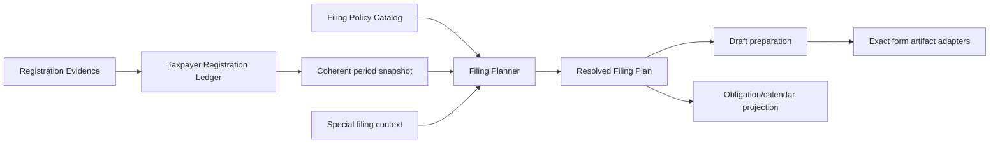
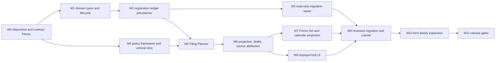

# TIN Root, Registration Units, and Filing Scope — Revised Implementation Plan

**Status:** proposed architecture and dependency-ordered execution plan, revision 2\
**As of:** 2026-08-07\
**Implementation state:** documentation only; no application code or schema has been changed\
**Repository baseline:** `main` at `8b2cd914e5ae3cd8009f0a6a3e2fff81f28d9d83`\
**Research companion:** [TIN, Branch Code, and Multi-Branch Filing Guide](TIN_BRANCH_PROFILE_AND_FILING_GUIDE_2026-08-07.md)\
**Canonical vocabulary:** [BIR Taxpayer, Registration, and Filing Context](../../CONTEXT.md)

This plan translates the companion guide's official-source findings into a safe
change sequence for the Native/Zig application. It is a product and software
architecture plan, not legal or tax advice. A taxpayer's effective BIR
registration records, the applicable official rule, the exact form revision,
and the filing period remain controlling.

The companion guide owns regulatory findings, the form-family policy inventory,
and unresolved research. This document owns application seams, migration,
sequencing, and verification. Detailed screen composition belongs in a later UX
specification. A separate repository must produce its own execution plan after
mapping these domain decisions to its actual code and schema.

If this plan conflicts with a current official issuance or exact form
instruction, the application must stop at **Review Required** until the policy
record is corrected and tested. A catalog entry or working editor is never proof
that a taxpayer must or may file a form.

---

## Executive decision

The current profile-per-branch implementation must not be extended with a simple
auto-increment button. The target model is:

1. One `Taxpayer` owns one canonical nine-digit `Tin9` root.
2. A Taxpayer owns one or more effective-dated `RegistrationUnit` records.
3. The principal/head-office Registration Unit has Branch Code `00000`.
4. Creating a Taxpayer creates a **pending-evidence** head-office unit with
   candidate code `00000`; it is not filing-capable until registration evidence
   confirms it.
5. A branch is another Registration Unit, not another legal taxpayer profile.
6. The UI may suggest `00001` or another lowest unused value, but a suggestion is
   not durable BIR identity and is never a Branch Code Confirmation.
7. Registered facilities and Facility Codes remain a separate domain linked to
   a responsible Registration Unit only through evidence.
8. Tax-Type Registrations and Large Taxpayer Service Registration are
   effective-dated, evidence-backed facts, not form checkboxes.
9. A deep `FilingPlanner` produces a Resolved Filing Plan for an exact Taxpayer,
   form revision, and period.
10. A filing draft can be created only from one resolved Filing Obligation and
    must copy its exact taxpayer, filing-unit, coverage, registration, policy,
    and evidence revisions without re-querying current state.
11. Source Unit and Filing Unit remain separate. Consolidation changes the filer
    and coverage; it never rewrites where a reportable fact originated.

The displayed filing identifier is a composition:

```text
TIN root:             000-000-000
Registration unit:   00000
Filing display:       000-000-000-00000
```

It is not a second taxpayer identity.

---

## Decision supersession and compatibility

This initiative deliberately changes several current assumptions:

| Current assumption | Revised decision |
| --- | --- |
| One `ProfileId` and combined TIN identify one legal taxpayer. | One `TaxpayerId` and `Tin9` identify the taxpayer; a legacy `ProfileId` may map to one Taxpayer plus one Registration Unit. |
| RDO, registered address, and branch suffix are one profile identity. | RDO, registered address, ZIP, and Branch Code belong to an effective Registration Unit revision. |
| Forms Set activation implies the profile should file a form. | A Forms Set becomes a Form Workspace Preference. It cannot establish a Tax-Type Registration or Filing Obligation. |
| Selecting a branch profile chooses the filer. | Selection is a workspace/source filter. The Filing Planner determines the Filing Unit. |
| A combined `Tin` is projected to every form. | Form projection composes the taxpayer TIN root with the resolved Filing Unit's Branch Code using an exact form-revision representation adapter. |
| Two different branch `ProfileId` values are different people. | Named-role distinctness compares `TaxpayerId`; two Registration Units of one natural person cannot satisfy filer/spouse distinctness. |

The following remain valid and must be preserved:

- canonical field definitions and named role bindings;
- taxpayer-wide effective revisions;
- transaction-owned amounts, schedules, calculations, and elections;
- append-only history and immutable draft provenance;
- explicit Forms Set user decisions as workspace preferences;
- exact catalog, setup-spec, and form-revision hashes;
- current fileability and production-readiness warnings.

Existing drafts and filed/prepared artifacts are historical records. Migration
may link them to new identities, but it must never invent coverage or reinterpret
their bytes.

### Non-goals

- Do not make all 51 catalog forms editable or fileable.
- Do not implement tax-law inference from free text, OCR, or ChatGPT output.
- Do not treat a branch suggestion as BIR assignment.
- Do not merge legacy profiles merely because their first nine digits match.
- Do not move transaction values into taxpayer or registration-unit records.
- Do not combine deadline, filing venue, filing scope, and artifact
  representation into one policy.
- Do not make the same source-specific execution plan authoritative in another
  repository.

---

## Current repository disposition contract

The current schema is already an append-only, versioned system through tax
profile schema v27. The implementation must classify every existing stream
before adding a mutating migration.

### Existing stream disposition

| Existing stream | Required disposition |
| --- | --- |
| `tax_profiles`, local labels, archive state | Create or link a Taxpayer shell. Preserve branch-specific labels as Registration Unit labels or legacy aliases; never pick a legal name from a label. |
| `tax_profile_revisions` | Split fields using the field-ownership matrix below. Keep original rows readable as migration evidence. |
| identity anchors and identity corrections | Re-express TIN-root correction and Branch Code correction as separate audited decisions. Block ambiguous historical corrections. |
| civil-status revisions | Re-key to `TaxpayerId`; conflicting branch histories block automatic merge. |
| profile relationships | Re-key endpoints to `TaxpayerId`; duplicate branch endpoints collapse only after identity review. |
| COR document records | Preserve file name, path, digest, size, and attachment provenance. Bind evidence to Taxpayer, Registration Unit, Facility, or Tax-Type Registration only through a reviewed Migration Decision. |
| business-activity and registration streams, including retained legacy tables | Classify each anchor/revision as taxpayer-wide, unit-specific, facility-specific, or legacy-only. Do not revive rejected pilot semantics automatically. |
| taxpayer-year settings | Merge only when branch histories are identical or one reviewed decision selects the authoritative stream. Conflicts remain blocked. |
| Tax Form Profile revisions | Re-key to Taxpayer/form/year only after role and setup ownership are reviewed. Branch-specific conflicting values remain separate legacy evidence. |
| Forms Set baselines, intervals, and decisions | Preserve decisions as Form Workspace Preferences and migration evidence. Never promote them to Tax-Type Registrations. |
| calendar selections and exports | Preserve user preferences. Rebuild taxpayer obligation projections from resolved filing plans. |
| generic/coarse drafts and provenance | Preserve exact revision bindings and mark unrecorded coverage `legacy_unknown`. |
| exact-form draft streams, revisions, occurrences, and provenance sidecars | Preserve workspace identity and bytes. Map the historical filer `ProfileId` without changing the artifact identity or claiming missing coverage. |
| on-demand occurrence counters and business keys | Re-key only when the resulting taxpayer, filing unit, form, period, and occurrence identity are provably equivalent. Otherwise keep the legacy key. |

Milestone 0 must turn this table into a machine-readable inventory of actual
tables, foreign keys, triggers, exported structures, and runtime callers. Every
entry must end in one of: `reuse`, `rekey`, `split`, `legacy_read_only`,
`supersede`, or `blocked`.

### Field ownership matrix

| Fact | Revised owner | Migration rule |
| --- | --- | --- |
| Nine-digit TIN root | Taxpayer identity revision | All legacy combined TINs in one candidate group must agree on the root. |
| Legal-person class and legal/registered name | Taxpayer revision | Conflicts block merge; a branch label is not legal-name evidence. |
| Date of birth, citizenship, foreign tax number | Natural-person Taxpayer revision | Never copied from one branch profile over a conflicting value. |
| Civil status and spouse relationship | Taxpayer revision/relationship | Compare `TaxpayerId`, not Registration Unit or legacy `ProfileId`. |
| Branch Code and head-office/branch kind | Registration Unit revision | Candidate code is separate from evidence-backed confirmation. |
| RDO, registered address, ZIP | Registration Unit revision | Differences are expected between units and are not taxpayer conflicts. |
| Phone, email, trade name, line of business | Evidence-reviewed allocation | Do not assume taxpayer-wide or unit-specific during migration; unresolved values remain review-required. |
| Unit open/close/transfer state | Registration Unit revision | Preserve effective history and evidence. |
| Facility Code, facility type, premises | Registered Facility revision | Never parse or generate as Branch Code. |
| Accounting-period basis and EOPT tier | Taxpayer revision | Preserve current effective history; EOPT tier is not LTS status. |
| Tax type, ATC, registration activity, registration interval | Tax-Type Registration revision | Must bind to the responsible Registration Unit and evidence. |
| Large Taxpayer Service status/office | Taxpayer LTS revision | Never infer from EOPT tier. |
| Income-tax regime and deduction election | Taxpayer-year settings | Branch count does not choose the annual or quarterly ITR variant. |
| Genuine form/year setup value | Tax Form Profile | Preserve exact generated setup contract and provenance. |
| Amounts, schedules, amendment state, payments, penalties | Filing transaction/draft | Never migrate into taxpayer or unit facts. |
| Reportable fact origin | Source Attribution | Legacy missing origin becomes `legacy_unknown`, never head office by default. |
| Local display label | Local metadata | May be copied to Taxpayer or Registration Unit display metadata, never tax facts. |

No persistence or UI milestone may proceed until every currently persisted
field and generated reusable key has one reviewed row in this matrix.

---

## Target ownership model



### `TaxpayerRegistrationLedger`

This is one deep module whose small interface owns registration invariants:

```text
apply(RegistrationCommand) -> RegistrationWriteResult
snapshot(TaxpayerId, FilingPeriod) -> RegistrationSnapshotResult
```

Commands include taxpayer creation, evidence recording, unit confirmation,
unit closure/transfer, tax-registration revision, LTS revision, and reviewed
identity correction. Callers do not write individual tables or reconstruct
effective state themselves.

The SQLite implementation is the production adapter. Tests may use the same
module with an in-memory SQLite database; no separate public repository
interface is required solely for mocking.

### `FilingPolicyCatalog`

Owns reviewed, effective-dated policy data:

- exact form code and revision applicability;
- filing-period semantics;
- return-scope policy;
- LTS overrides where sourced;
- required special context;
- primary-source identifiers and review state;
- supersession and effective intervals.

It does not load taxpayer records, create drafts, or calculate deadlines.

### `FilingPlanner`

This is the single interface used by form launch, Forms Set reconciliation,
taxpayer calendar projection, and draft creation:

```text
plan(PlanningRequest) -> ResolvedFilingPlan
```

The module obtains one coherent registration snapshot and one exact policy
revision, then runs pure internal applicability and scope stages. Callers cannot
provide an arbitrary mix of revisions.

Expected domain outcomes are values, not infrastructure errors:

- obligations;
- not applicable;
- Review Required with ordered issues.

SQLite, allocation, and corrupted-storage failures remain implementation errors.

### Draft preparation

Draft preparation accepts one resolved Filing Obligation plus the exact form
composition contract. It copies the complete revision bindings from the
obligation. It must reject a selected profile, selected branch, or manually
constructed filing identifier as insufficient authority.

### Calendar and library projection

Calendar and library views consume resolved filing plans but do not own filing
scope. The deadline resolver remains a separate module: it combines an
obligation with exact calendar rules and overrides without changing Filing Unit
or Return Coverage.

---

## Domain types and lifecycle

Implementation introduces separate opaque types before persistence or UI
changes:

```zig
pub const TaxpayerId = OpaqueId(.taxpayer);
pub const TaxpayerRevisionId = OpaqueId(.taxpayer_revision);
pub const RegistrationUnitId = OpaqueId(.registration_unit);
pub const RegistrationUnitRevisionId = OpaqueId(.registration_unit_revision);
pub const RegisteredFacilityId = OpaqueId(.registered_facility);
pub const TaxTypeRegistrationRevisionId = OpaqueId(.tax_type_registration_revision);
pub const RegistrationEvidenceId = OpaqueId(.registration_evidence);

pub const Tin9 = struct {
    digits: [9]u8,
};

pub const BranchCode5 = struct {
    digits: [5]u8,
};

pub const RegistrationUnitKind = enum {
    head_office,
    branch,
};

pub const BranchCodeEvidenceState = union(enum) {
    unconfirmed: BranchCode5,
    confirmed: struct {
        code: BranchCode5,
        evidence_id: RegistrationEvidenceId,
    },
    legacy_unresolved: OwnedLegacySuffix,
};

pub const RegistrationUnitStatus = union(enum) {
    pending_evidence,
    confirmed_active,
    confirmed_closed,
    legacy_unresolved,
};
```

The exact Zig shape may follow repository conventions, but code evidence and
unit lifecycle must remain independent.

### Time semantics

- Reuse the repository's civil `Date` and inclusive `EffectivePeriod` model.
- All policy and registration comparisons use Philippine civil filing dates,
  not device-local instants.
- A `FilingPeriod` must distinguish calendar month, calendar quarter, taxable
  year, fiscal period, date range, and event/transaction period.
- The planner must inspect every effective change inside the filing period.
- A mid-period change returns Review Required unless the exact policy defines
  split coverage or a controlling as-of rule.
- Deadline calendar year remains separate from taxable period year.

### Registration-unit commands

The lifecycle must support:

- create Taxpayer plus pending `00000` unit atomically;
- enter or replace an unconfirmed candidate Branch Code;
- confirm code and unit facts from reviewed evidence;
- append RDO/address/contact revisions;
- close or transfer a unit with effective date and evidence;
- correct a Branch Code without changing the TIN root;
- correct a TIN root through a distinct audited taxpayer-identity decision;
- reject duplicate effective codes and multiple effective head offices;
- preserve historical units and codes after closure.

The UI may derive a lowest-unused suggestion, but the suggestion is not a
RegistrationCommand until the user explicitly enters it, and it remains
unconfirmed until evidence review.

### Core invariants

1. One canonical `Tin9` belongs to at most one Taxpayer in the active registry.
2. One Taxpayer has at most one effective head-office unit for a date.
3. `00000` is reserved for the head-office unit.
4. A non-`00000` code cannot identify a head-office unit.
5. A confirmed Branch Code contains exactly five digits and cites evidence.
6. A candidate or suggested code cannot identify a Filing Unit.
7. Branch Code lineage is not recycled merely because a unit closed.
8. A Facility Code is never accepted as a Branch Code.
9. A legacy three- or four-digit suffix remains unresolved until reviewed.
10. Tax-Type Registrations are append-only, effective-dated, and evidence-backed.
11. LTS status is independent of EOPT tier.
12. Filing Unit and Source Unit remain distinct.
13. Return Coverage is an explicit, deterministic, non-empty set for every
    obligation that covers units.
14. Obligations for one taxpayer, family, and period cannot overlap Source Unit
    coverage unless the policy explicitly models a legal overlap.
15. Named-role distinctness compares Taxpayer IDs.
16. Draft creation requires an obligation from a Resolved Filing Plan.
17. Existing immutable drafts and artifacts are never reinterpreted.
18. Correcting a TIN root, correcting a Branch Code, transferring an RDO, and
    closing a unit are separate audited operations.
19. Every persisted Source Attribution records provenance or `legacy_unknown`.
20. Derived obligation caches are never authoritative over ledger and policy
    revisions.

---

## Evidence lifecycle

Registration Evidence stores metadata and review decisions separately from tax
facts:

- evidence ID, source kind, digest, display name, byte size, and capture date;
- local path or encrypted-blob reference governed by existing storage policy;
- Taxpayer/Registration Unit/Facility subjects proposed by the evidence;
- reviewer decision, actor identity available to the local-owner model,
  timestamp, and reason;
- supersession or contradiction links;
- exact facts accepted from the evidence.

An attached file is not itself an accepted fact. Missing, moved, or changed files
remain detectable through the stored digest. Migration reports and backups must
not create unprotected plaintext evidence copies or expose full TIN/name data by
default.

Policy Evidence has a separate promotion lifecycle:

```text
candidate -> reviewed -> effective -> superseded
```

Generated policy data must fail when an evidence ID is missing, an effective
interval overlaps, a form revision is unclassified, or a candidate policy would
become actionable. Updating a policy revision invalidates derived obligations
but never mutates existing draft snapshots.

---

## Filing-policy contract

Do not add `form.is_consolidated: bool`. Do not use an undefined
`taxpayer_level` policy that still leaves the Filing Unit unknown.

The companion guide's `TaxpayerLevel` entries are research/catalog
classifications, not executable policies. Before a form becomes actionable,
each entry must be refined to an exact return, payment, artifact, or
administrative policy below, or remain Review Required.

Use distinct policy categories:

```zig
pub const FilingPolicy = union(enum) {
    periodic_return: ReturnScopePolicy,
    transaction_return: TransactionScopePolicy,
    payment: LiabilityScopePolicy,
    supporting_artifact: ArtifactScopePolicy,
    administrative_registration: AdministrativePolicy,
    historical_only,
    review_required: ReviewReason,
};

pub const ReturnScopePolicy = union(enum) {
    head_office_consolidated,
    registration_driven: RegistrationDrivenPolicy,
};

pub const ArtifactScopePolicy = union(enum) {
    inherit_parent: ParentArtifactKind,
    source_recipient_document: SourceRecipientKind,
};
```

Transaction-specific returns receive their Filing Unit and jurisdiction from the
required transaction/property/instrument/facility context. Payment forms inherit
the exact underlying liability. Supporting artifacts cannot broaden the parent
return's coverage.

Every exact catalog form revision must have one explicit capability state and
one policy state. An unreviewed form remains `review_required`; it does not block
identifier or ledger foundations, but it cannot become actionable.

### Planning interface

```zig
pub const PlanningRequest = struct {
    taxpayer_id: TaxpayerId,
    form: FormRevisionKey,
    period: FilingPeriod,
    special_context: ?SpecialFilingContextRef,
};

pub const ResolvedFilingObligation = struct {
    taxpayer_id: TaxpayerId,
    taxpayer_revision_id: TaxpayerRevisionId,
    form: FormRevisionKey,
    period: FilingPeriod,
    filing_unit_id: RegistrationUnitId,
    filing_unit_revision_id: RegistrationUnitRevisionId,
    covered_units: []const RegistrationUnitRevisionBinding,
    registration_revision_ids: []const TaxTypeRegistrationRevisionId,
    lts_revision_id: ?LargeTaxpayerServiceRevisionId,
    facility_revision_ids: []const RegisteredFacilityRevisionId,
    source_attribution_requirement: SourceAttributionRequirement,
    policy_revision_id: FilingPolicyRevisionId,
    policy_evidence_ids: []const PolicyEvidenceId,
    special_context_digest: ?[32]u8,
    decision_schema_version: u16,
    resolution_hash: [32]u8,
};

pub const ResolvedFilingPlan = union(enum) {
    obligations: []const ResolvedFilingObligation,
    not_applicable,
    review_required: []const ResolutionIssue,
};
```

The resolution hash uses a versioned canonical encoding, a domain separator,
deterministic list ordering, and the full set of revision/evidence IDs. It is a
reproducibility check, not a substitute for storing the bindings.

The planner must:

1. load one coherent registration snapshot for the requested period;
2. select one exact effective policy revision;
3. determine applicability internally;
4. reject missing, contradictory, or mixed-time evidence;
5. apply a verified LTS override only where policy establishes one;
6. calculate the Filing Unit and exact Return Coverage;
7. validate coverage partition and Source Attribution requirements;
8. require special context for transaction/site/property rules;
9. return ordered, actionable Review Required issues;
10. return exact revision bindings without downstream re-query.

“All branches” means the exact covered Registration Unit revisions selected for
the filing period. It never means whatever units exist when a draft is reopened.

### Separate policy dimensions

- Filing scope decides who files and what units the return covers.
- Applicability decides whether the form/period produces an obligation.
- Filing venue decides where or through which channel filing/payment occurs.
- Deadline policy decides when the obligation is due.
- Artifact representation decides how the resolved identity appears in an exact
  form, XML, print, or other payload.

These stages may be internal to deep modules, but they must not share one
ambiguous boolean or infer one another.

---

## Forms Set, capability, and obligation precedence

The existing Forms Set becomes a Form Workspace Preference and historical user
decision. It remains user-owned, but it cannot erase or manufacture a resolved
obligation.

| Resolution/capability state | Library and calendar behavior | Launch behavior |
| --- | --- | --- |
| Resolved required obligation, editor supported | Always visible as required; an inactive preference cannot hide it. | Opens exact resolved obligation. |
| Resolved required obligation, editor unsupported | Visible with deadline/reference and unsupported-editor label. | Blocked; no false fileability claim. |
| Optional workflow selected by user | Visible as optional, clearly separate from required. | Opens only when policy permits and exact context resolves. |
| Covered by head-office obligation | Visible from a branch/source workspace as covered elsewhere. | Opens the existing head-office obligation without changing global workspace selection. |
| Review Required | Visible with ordered missing/conflicting evidence. | Blocked until repaired and re-resolved. |
| Not applicable but old preference active | Show a reconciliation warning; preserve preference history. | Blocked unless a new reviewed policy/evidence result changes applicability. |
| Historical-only | Visible only for supported historical periods. | Exact historical adapter only. |

Tax-type registration evidence is upstream. The Filing Planner is authoritative
for legal/application scope. Form Workspace Preference is authoritative only for
optional workspace organization.

No screen should use the combined label “Required/eligible.” Required,
conditionally available, optional, covered elsewhere, and blocked are distinct
states.

---

## Projection, draft provenance, and Source Attribution

### Form identity projection

Before changing the canonical `Tin` field, build a representation matrix for all
ten supported editor revisions and every affected artifact adapter:

- TIN root control geometry;
- Branch Code control geometry and accepted length;
- XML or encoded payload representation;
- print/PDF representation;
- spouse/secondary-party behavior;
- historical compatibility;
- blocked behavior when an artifact cannot represent a confirmed five-digit
  code losslessly.

The exact 1701Q three-digit filer control versus five-digit page-2/spouse controls
is the first known blocker, not the complete inventory.

Profile composition must accept a `FilingProjectionContext` containing:

- exact Taxpayer revision;
- exact Filing Unit revision;
- resolved Return Coverage;
- form revision and period;
- named taxpayer roles;
- taxpayer-year and Tax Form Profile bindings;
- transaction-owned values.

It must not reconstruct the filing branch from the legacy combined `Tin`.

### Draft snapshot

A new draft copies at least:

- Taxpayer ID and revision;
- `Tin9` used by the artifact;
- Filing Unit ID, revision, and exact `BranchCode5`;
- all covered Registration Unit revision bindings in deterministic order;
- Tax-Type Registration and LTS revision IDs;
- facility and special-context bindings when applicable;
- policy revision, evidence IDs, decision schema version, and resolution hash;
- Forms Set preference/decision provenance as non-legal workspace evidence;
- generated catalog, form, setup-spec, and projection hashes;
- named profile-role bindings;
- Source Attribution for every reportable fact that requires it.

Reopening shows the saved decision even when current facts now resolve
differently. The UI may warn and offer a new/amended workflow, but it never
mutates the historical snapshot.

### Source Attribution

Introduce an explicit model before claiming coverage partition:

```text
entered(RegistrationUnitRevisionId, evidence/reference)
derived(RegistrationUnitRevisionId, derivation rule/version)
legacy_unknown(reason)
```

Apply it only to forms and schedule rows whose policy requires unit-origin
partitioning. Provide bulk assignment and correction UI for imported facts.
Legacy unknown data blocks filing when the planner cannot prove non-overlap.

---

## Calendar and derived obligation storage

The taxpayer calendar consumes resolved filing plans and separate deadline rules.
It must not generate one card per legacy branch `ProfileId`.

A stable obligation projection key includes:

- Taxpayer ID;
- exact form revision and Filing Period;
- Filing Unit revision;
- policy revision;
- resolution hash.

If `resolved_filing_obligations` or a similar table is retained, it is a derived
cache only. Each row stores its complete input digest, generated-at version,
supersession state, and recomputation reason. Registration, policy, or special-
context changes invalidate the cache. Draft snapshots remain immutable and are
not invalidated.

The Global Tax Calendar may remain a taxpayer-independent reference calendar.
A global taxpayer dashboard must instead display the union of each Taxpayer's
resolved obligations. These are different products and must have different
labels.

Before obligation projection is enabled, reconcile all catalog/global/calendar
codes and aliases. The detailed inventory remains in the companion guide and a
generated coverage report, not duplicated here.

---

## Persistence and transactional guarantees

Logical new records are:

```text
taxpayers
taxpayer_revisions
registration_units
registration_unit_revisions
registered_facilities
registered_facility_revisions
registration_evidence
branch_code_confirmations
tax_type_registrations
tax_type_registration_revisions
taxpayer_lts_revisions
filing_policy_revisions
legacy_profile_unit_mappings
migration_decisions
draft_filing_scope_snapshots
draft_coverage_units
draft_registration_bindings
source_attributions
derived_obligation_cache (optional)
```

Exact table names may reuse or extend existing schema structures. Milestone 0's
disposition matrix decides this; do not add parallel tables merely because this
list uses new logical names.

Required constraints include:

- unique canonical TIN root among active Taxpayers;
- one effective head office per Taxpayer/date;
- durable Branch Code lineage and no effective collisions;
- `00000` only for head office;
- confirmed code requires evidence;
- Facility Code remains a separate type/domain;
- append-only revision and Migration Decision rows;
- deterministic unique coverage membership;
- immutable draft foreign keys use `RESTRICT`;
- no cascade deleting facts/evidence referenced by drafts;
- first Taxpayer plus pending `00000` unit created atomically;
- optimistic sequence checks for concurrent windows;
- code suggestion recalculated inside the confirmation transaction and never
  treated as a reservation.

Do not place filing rules in SQL queries or Native view handlers.

---

## Migration and cutover strategy

### Cutover decision: no dual-write system

This local SQLite application will not maintain two writable identity models.
Dual writes would create a second reconciliation problem and make rollback
semantics harder to prove.

The rollout is:

1. add new schema and read-only inventory while old model remains writable;
2. build and test the new path behind a feature flag using fixtures;
3. review Migration Decisions for real local data;
4. enter a write-frozen maintenance window;
5. create a protected backup using the existing repository storage/key-custody
   policy;
6. migrate reviewed-safe groups in one transaction;
7. run reconciliation before commit and again after reopen;
8. enable the new path;
9. keep old tables read-only for compatibility/export.

Rollback is lossless only before the first post-cutover write. After that point,
rollback requires restoring the protected backup and explicitly discarding
post-cutover work, or shipping a forward repair. A feature flag alone is not a
rollback plan.

### Phase A — deterministic read-only inventory

For every legacy profile and related stream, report:

- old `ProfileId` and parsed TIN root/suffix length;
- candidate Taxpayer group;
- every field/stream disposition row;
- head-office/branch candidate and evidence state;
- RDO/address/contact histories;
- COR/evidence references and digests;
- taxpayer-year, Tax Form Profile, Forms Set, relationship, and civil-status
  histories;
- generic and exact draft references;
- on-demand counters/business keys;
- candidate Migration Decision and every blocking reason.

The report is deterministic, local-only, masked by default, and contains no
evidence file contents. It performs zero database writes.

### Phase B — human-reviewed Migration Decisions

Each candidate group receives an immutable result:

```text
safe_to_map
legacy_read_only
blocked(reason list)
```

Safe mapping requires one root, compatible taxpayer-wide histories, at most one
confirmed head office per interval, no effective code collision, reviewed legacy
suffixes, and a disposition for every dependent stream.

RDO/address differences are expected unit differences. Legal-name, legal-person-
class, civil-status, taxpayer-year, role, or Tax Form Profile conflicts cannot be
silently merged.

### Phase C — schema migration and immutable mappings

Create stable new IDs and record:

```text
old ProfileId
-> TaxpayerId
+ RegistrationUnitId
+ MigrationDecisionId
+ dependent-stream dispositions
```

Do not reuse a legacy full-TIN identity anchor as the new Taxpayer key. Keep old
tables readable.

### Phase D — historical drafts and preferences

- Preserve draft bytes, revisions, workspaces, and artifact keys.
- Map historical filer identity only where proven.
- Mark missing Return Coverage and Source Attribution `legacy_unknown`.
- Treat branch-coded income-tax/VAT drafts as filing-safety findings; do not
  silently reassign them to `00000`.
- Preserve Forms Set decisions as preferences/evidence, never registrations.

### Phase E — reconciliation

Verify before cutover:

- row counts and ID mappings;
- all foreign-key/revision references;
- no unreviewed group changed;
- deterministic planner fixtures;
- old drafts reopen with unchanged provenance;
- profile projection and exact artifact identity remain stable;
- migration rerun produces no new IDs or decisions;
- backup restore rehearsal succeeds on a protected disposable copy;
- crash/fault injection at every migration checkpoint leaves either the old or
  complete new state, never a partial committed identity.

### Mandatory stop conditions

Stop a group when any occurs:

- two legal people appear to share one parsed root;
- legal-person class, legal name, civil status, or relationship history
  conflicts;
- no unique confirmed head-office candidate exists;
- multiple effective `00000` candidates exist;
- Branch Codes collide, are absent, or have unresolved legacy length;
- Facility Code and Branch Code were conflated;
- evidence records conflict or their digests/subjects cannot be preserved;
- taxpayer-year, Tax Form Profile, Forms Set, or role histories cannot be
  dispositioned safely;
- effective histories overlap inconsistently;
- governing policy effectivity is unresolved;
- mid-period registration or LTS state would change the result without a
  controlling rule;
- historical draft references cannot be preserved;
- complete, non-duplicate coverage or required Source Attribution cannot be
  proven.

Migration tests must cover every supported historical schema path through v27,
not merely a fresh database and the latest schema.

---

## UI behavior requirements

Detailed layout belongs in a separate UX specification. The domain behavior is:

### Taxpayer-first navigation

```text
ACME CORPORATION                    123-456-789
  Head office                       00000 · RDO 047
  Cebu branch                       00001 · RDO 081
  Davao branch                      00004 · RDO 113
```

The selected Registration Unit is a workspace/source filter, not a legal filing
decision. Opening a head-office-consolidated return must not mutate the global
selection; the form-local header shows the resolved Filing Unit and coverage.

### Setup

Separate taxpayer identity, registration units, facilities, tax registrations,
registration evidence, and taxpayer-year settings. A new Taxpayer displays its
`00000` head-office candidate as **Pending evidence** until confirmed.

### Add branch

The UI may show:

> Suggested: `00001`
>
> Confirm the actual code from the branch's BIR registration record. This
> suggestion is not a BIR assignment.

The user may enter a different confirmed code or a code with gaps. Collision
checks run at save/confirmation time. A pending branch cannot produce an invoice
identity, obligation, or filing draft.

### Filing scope visibility

Every actionable form view shows:

- masked Taxpayer TIN root;
- current source-unit workspace/filter;
- resolved Filing Unit and Branch Code;
- scope category and exact covered-unit list;
- policy/evidence explanation;
- separate editor/fileability status.

Review Required lists ordered repair actions. Switching workspaces with unsaved
transaction data requires explicit confirmation. Saved drafts always reopen
their immutable scope, not the current navigation state.

---

## Dependency graph and milestones



Read-only policy research and migration-fixture work may run in parallel. A
write path cannot bypass its dependency gates.

### Milestone 0 — disposition and contract freeze

Deliver:

- complete table/field/runtime-caller disposition matrix;
- explicit supersession map for current tax-profile documents and behavior;
- exact form identity representation inventory for all supported editors;
- versioned policy schema and evidence-source register shape;
- representative fixture: one Taxpayer, pending/confirmed `00000`, one confirmed
  branch, one legacy short suffix, and old generic/exact drafts.

**Exit gate:** every persisted stream and reusable field has an owner and
disposition; no implementation relies on an undefined “taxpayer level,” selected
branch, or combined-TIN assumption.

### Milestone 1 — domain types and lifecycle

Deliver `Tin9`, `BranchCode5`, opaque IDs, code confirmation, unit status,
effective intervals, audited correction commands, and Source Attribution types.

**Exit gate:** pure tests cover parsing, formatting, pending versus confirmed,
`00000`, collisions, lifecycle transitions, corrections, legacy non-padding,
and suggestion non-authority.

### Milestone 2 — registration ledger and evidence persistence

Deliver append-only ledger records, constraints, evidence metadata/review
states, protected storage references, optimistic sequence checks, and coherent
period snapshots.

**Exit gate:** transactional tests prove atomic taxpayer/`00000` creation,
revision lookup, concurrency conflicts, evidence binding, code lineage,
foreign-key preservation, and no cascade loss.

### Milestone 3 — deterministic migration report

Deliver the zero-write inventory, Migration Decision format, masking/privacy
rules, schema-version fixtures, and human-review workflow.

**Exit gate:** two runs against every fixture produce byte-identical reports and
zero writes. No data migration is authorized yet.

### Milestone 4 — policy framework and representative families

Deliver generated, evidence-linked policy records. Every catalog form revision
has an explicit state; forms without reviewed policy remain Review Required.

Implement sourced fixtures first for:

- head-office-consolidated income tax and VAT;
- percentage-tax consolidated and per-registered-unit outcomes;
- verified LTS override behavior;
- at least one parent-artifact inheritance case;
- explicit transaction/excise Review Required cases.

**Exit gate:** generator rejects missing codes, stale evidence, overlapping
intervals, and actionable candidate policies. Identifier work is not blocked by
unresearched families; form launch is.

### Milestone 5 — deep Filing Planner

Deliver the one public planning interface, coherent snapshot assembly, internal
applicability/scope stages, exact revision output, ordered issues, coverage
partition checks, and canonical resolution hashing.

**Exit gate:** interface-level tests cover head-office consolidation, per-unit
plural obligations, LTS overrides, mid-period changes, missing evidence,
duplicate coverage, special context, and deterministic hashes.

### Milestone 6 — projection, draft provenance, and Source Attribution slice

Deliver:

- `FilingProjectionContext` and form identity adapters;
- immutable scope snapshots for generic and exact drafts;
- draft creation only from a resolved obligation;
- source-attributed schedule/fact model for the representative slice;
- legacy draft compatibility;
- exact 1701Q representation proof or fail-closed route.

**Exit gate:** no new editor can open from a bare `ProfileId`; all supported
vertical-slice artifacts preserve five-digit code losslessly or block; old drafts
reopen unchanged.

### Milestone 7 — Forms Set and calendar projection

Deliver preference/obligation reconciliation, distinct required/optional/covered
states, obligation-based taxpayer calendar, separate deadline projection, code
inventory reconciliation, and derived-cache invalidation.

**Exit gate:** library, launch, calendar, and export consume the same obligation
identity and coverage while preserving user preference history.

### Milestone 8 — taxpayer and registration-unit UI

Deliver taxpayer-first navigation, pending/confirmed evidence flows, branch
suggestion, source-workspace filters, scope banners, Review Required repair,
dirty-draft guards, accessibility, and representative desktop/phone states.

Edit Native fragments, regenerate `src/app.native`, rebuild, and relaunch before
trusting automation screenshots.

**Exit gate:** representative flows pass model-contract, keyboard, screen-reader,
focus, responsive, and interaction tests before broad conversion.

### Milestone 9 — reviewed migration and cutover

Deliver protected backup, approved Migration Decisions, idempotent transactional
migration, immutable old-to-new mappings, reconciliation, fault injection,
restore rehearsal, write-freeze UI, and explicit rollback point.

**Exit gate:** every safe record reconciles, every blocked group remains
untouched and visible, old drafts reopen unchanged, and no post-cutover write can
be lost through a feature-flag rollback.

### Milestone 10 — form-family expansion

Integrate independently in risk order:

1. income tax and VAT;
2. percentage tax and withholding;
3. annual information returns, certificates, and attachments;
4. payment forms inheriting exact liabilities;
5. ONETT, capital-gains, donor, and estate flows;
6. periodic DST where exact evidence is complete;
7. excise/site/product forms after premises and product models exist.

Each family needs sourced policy fixtures, planner tests, projection/artifact
tests, draft provenance, Source Attribution where applicable, calendar behavior,
and UI scope tests. One family passing does not certify another.

### Milestone 11 — fileability and release separation

Keep independent gates for editor/computation completeness, exact form/PDF/XML
representation, validation/attachments, submission authorization/transport,
payment/status/retry, and signed distribution/production operations.

**Exit gate:** only exact form revisions that pass all applicable gates may be
called fileable. Identity and scope correctness alone never proves release
readiness.

---

## Acceptance test matrix

### Identity and registration

- Creating a Taxpayer atomically creates one pending `00000` unit.
- Pending `00000` cannot identify a Filing Unit.
- Evidence confirmation activates `00000` without changing Taxpayer identity.
- A second effective head office is rejected.
- Add branch suggests but does not reserve or confirm a code.
- Evidence-backed gaps such as `00001` then `00004` are accepted.
- Duplicate effective code is rejected transactionally.
- Closure preserves history and does not recycle code automatically.
- A legacy short suffix cannot file.
- Facility Code cannot satisfy Branch Code requirements.
- Two units of one natural person cannot satisfy filer/spouse distinctness.
- TIN correction, Branch Code correction, RDO transfer, and closure produce
  different audit events.

### Planning and policy

- Three-unit income-tax/VAT cases resolve one confirmed `00000` obligation with
  exact coverage.
- Percentage tax resolves consolidated or exact per-unit obligations from
  registrations and policy.
- Verified LTS status applies only a sourced override.
- Mid-period changes fail closed unless policy defines the outcome.
- Transaction/property forms never inherit selected workspace without context.
- Filing venue changes do not alter Filing Unit or coverage.
- Supporting artifacts exactly inherit parent scope.
- No Source Unit occurs in overlapping obligations for the same family/period.
- Unknown policy always returns Review Required, never a fallback obligation.
- Resolution hash is deterministic and changes when any governing revision
  changes.

### Forms Set and UI

- Inactive preference cannot hide a resolved required obligation.
- Active preference cannot make a not-applicable form actionable.
- Required, optional, covered, unsupported, historical, and Review Required are
  visibly distinct.
- Opening a consolidated form does not change global source-workspace selection.
- Scope header shows Filing Unit and exact coverage.
- Review Required exposes precise repair actions.

### Projection and drafts

- Every supported editor has an identity representation fixture.
- Draft creation without a resolved obligation fails.
- Draft copies exact taxpayer/unit/coverage/registration/policy/evidence
  revisions without re-query.
- Reopening after closure retains saved scope.
- Amendment creates a new plan and links its predecessor.
- Legacy unknown coverage/source attribution remains explicit.
- Exact 1701Q never truncates a confirmed five-digit code.

### Migration

- Existing profile streams all receive a disposition.
- A safe `00000`/`00001`/`00004` fixture maps one Taxpayer and three units.
- Conflicting taxpayer-wide facts block merge.
- Unit-specific RDO/address differences do not create taxpayer conflicts.
- Taxpayer-year, Tax Form Profile, relationship, Forms Set, generic draft, and
  exact draft histories remain referentially complete.
- Old checkboxes never become Tax-Type Registrations.
- Reports are deterministic, migrations idempotent, and crash checkpoints
  atomic.
- Rollback is tested before post-cutover writes; restore behavior after that
  point is explicit.

---

## Rejected designs

### One profile per branch plus `parent_profile_id`

Rejected because taxpayer-wide facts and role identity remain duplicated and
every caller must remember when to climb to a parent.

### Branch list inside one taxpayer revision

Rejected because units need independent histories, evidence, registrations,
closure state, and draft references.

### Static `is_consolidated` flag

Rejected because scope depends on form revision, period, registrations, LTS,
and special context.

### Selected branch chooses Filing Unit

Rejected because workspace selection cannot override policy.

### App assigns sequential Branch Codes

Rejected. The UI may suggest; BIR evidence confirms.

### Silently pad legacy suffixes

Rejected because padding manufactures identity.

### Dual-write old and new identity models

Rejected for this local SQLite application. Use a write-frozen, protected,
transactional cutover with an explicit rollback point.

### Persist resolved obligations as source truth

Rejected. Obligations are derived from ledger, policy, period, and context.
Only immutable draft snapshots become historical truth; other persisted results
are invalidatable caches.

### One cross-repository implementation plan

Rejected. The guide and vocabulary are shareable; schema, module, migration, UI,
and verification plans must be repository-specific.

---

## Verification commands for future implementation

Run from the isolated implementation worktree after editing source files:

```sh
rtk npm run generate
rtk npm run check:tax-catalog
rtk just check
rtk just test
rtk just build
rtk git diff --check
```

Add dedicated commands for the schema-disposition report, read-only migration
report, policy coverage generator, migration fault tests, and obligation-plan
fixture suite before their milestones can pass.

For UI changes, rebuild and relaunch before trusting screenshots. Inspect both
desktop and phone representative states. Generated files must match source
fragments; do not edit `src/app.native` directly.

For migration work, use a protected disposable database copy created through
the repository's storage policy. Never test against the user's only profile
database, copy evidence into an unprotected temporary directory, or claim a
feature flag is a complete rollback.

---

## Definition of done

This initiative is complete only when:

- `Tin9` and `BranchCode5` are separate in domain and persistence;
- pending versus confirmed unit identity cannot be confused;
- every persisted legacy stream has a reviewed disposition;
- every actionable form revision has an evidence-linked policy;
- all launch, calendar, library, and draft creation use one Filing Planner;
- resolved obligations carry exact revision bindings and reproducible hashes;
- form projections compose Taxpayer and Filing Unit facts losslessly;
- required Source Attribution is explicit and non-overlapping;
- Forms Set preferences cannot manufacture or hide legal obligations;
- migration is reviewed, idempotent, transactional, and recoverable at its
  documented rollback point;
- exact form representation and all acceptance gates pass;
- fileability and production-readiness claims remain separately gated.

Until then, safe behavior is to block ambiguous filing scope. The application
must never use the currently selected branch, a suggested code, an enabled form,
or a legacy combined TIN as a substitute for a Resolved Filing Plan.
